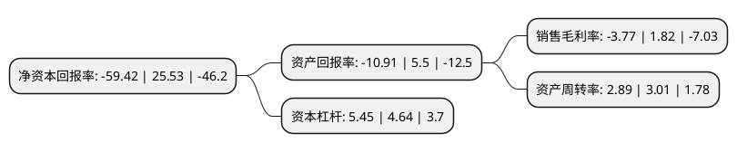

> 本页面由自动化程序生成于 2022年5月20日 01:34
> 内容可能存在错误，如有bug请提交issue至：https://github.com/Eroleice/doc-pi/issues
{.is-warning}

# 上市公司基本情况

## 基本资料

引力传媒股份有限公司（以下简称“引力传媒”）成立于2005年08月10日，北京市。于2015年05月27日在上交所主板上市。

引力传媒注册资本26,786.29万元，主营业务:公司的主营业务是对市场与媒体进行研究，为客户提供以电视及互联网媒体为主的传播策略与媒介代理服务，以及数据策略与咨询，内容营销，互联网公关，品牌管理等专项广告服务。以下是详细信息：

- 公司名称: 引力传媒股份有限公司
- 股票代码: 603598.SH
- 所在地: 北京 - 北京市
- 成立日期: 2005年08月10日
- 注册资本: 26,786.29万元
- 法定代表人: 罗衍记
- 主营业务: 主营业务:公司的主营业务是对市场与媒体进行研究，为客户提供以电视及互联网媒体为主的传播策略与媒介代理服务，以及数据策略与咨询，内容营销，互联网公关，品牌管理等专项广告服务
- 公司官网: www.yinlimedia.com
- 公司介绍: 公司是一家以数字营销及娱乐营销为鲜明特征，以数据为基础、以内容为导向、以技术为驱动的整合营销传播集团。公司以市场洞察与品牌咨询为引领，为客户提供基于媒体与消费者洞察、传播策略、多屏媒介代理、内容定制与发行、社会化传播等综合传播服务。公司与众多头部品牌客户保持着长期深度合作，如唯品会、养元饮品、蒙牛、君乐宝、美的、九阳电器等；公司与携程、美团、拼多多、优信二手车、VIPKid、快手、腾讯互娱、掌门1对1等互联网独角兽企业也建立起合作。同时，公司还积累了良好的媒体网络，与央视、省级卫视(如浙江、湖南、东方、江苏、北京等)、互联网视频媒体(如爱奇艺、腾讯、优酷、芒果TV等)、社交媒体(如微博、微信、抖音等)均保持良好合作关系。旗下子公司亦取得多家优质移动媒体的独家代理或核心代理权，与知乎、网易云音乐、课程格子、雪球、携程、马蜂窝、懂球帝等超过两百家的优质移动媒体保持长期渠道合作。公司已实现向数字化、内容化的新型整合营销传播公司转型，并形成电视、网络视频、OTT、移动终端、户外LED等多屏资源的整合传播体系。

## 股东及高管情况

上市公司第一大股东为罗衍记，持股113,376,000股，占比42.33%，为上市公司实际控制人。

截至2022年03月31日，上市公司的前十大股东中，共有5名自然人股东，3名机构股东，1个产品账户，1个海外主体，其中5%以上大股东共有3名。上市公司前十大股东明细如下：

> 截至2022年03月31日，上市公司前十大股东信息如下：

| 股东名称 | 持股数量（股） | 持股比例 |
| --- | --- | --- |
| 罗衍记 | 113,376,000 | 42.33% |
| 北京合众创世管理咨询合伙企业(有限合伙) | 20,000,000 | 7.47% |
| 蒋丽 | 15,000,000 | 5.6% |
| 富诚海富资管-海通证券资管1号FOF单一资产管理计划-证券行业支持民企发展系列之富诚海富通海富十五号单一资产管理计划 | 5,000,000 | 1.87% |
| 香港中央结算有限公司(陆股通) | 1,503,250 | 0.56% |
| 王兴华 | 870,500 | 0.32% |
| 国金证券股份有限公司 | 693,200 | 0.26% |
| 周海晓 | 580,800 | 0.22% |
| 华泰证券股份有限公司 | 578,516 | 0.22% |
| 洪玲 | 407,200 | 0.15% |

## 利润表分析

上市公司2021年总收入为54.96亿元，净利润为-2.08亿元，**未实现盈利**。

## 杜邦分析

> 数据列示周期：2021年 | 2020年 | 2019年
{.is-info}

上市公司的净资产收益率在近一年有所下降，下降幅度为-332.75%，其变化情况分解如下：
- 上市公司的销售毛利率在近一年下降了-307.14%，可能是生产效率的下降、商品原材料价格上涨或商品价格的下跌所致。
- 上市公司的资产周转率在近一年下降了-3.99%，可能是源自于更慢的销售回款或库存管理效果下降。
- 上市公司的财务杠杆比率在近一年上升了17.46%，可能是增加负债扩大生产规模。

