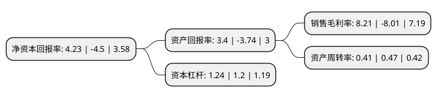

> 本页面由自动化程序生成于 2022年5月20日 01:35
> 内容可能存在错误，如有bug请提交issue至：https://github.com/Eroleice/doc-pi/issues
{.is-warning}

# 上市公司基本情况

## 基本资料

中广天择传媒股份有限公司（以下简称“中广天择”）成立于2007年04月13日，长沙市。于2017年08月11日在上交所主板上市。

中广天择注册资本13,000万元，主营业务是电视，互联网和移动互联网等视频内容的制作，发行和营销;电视剧版权运营。公司主要制作了《情动八点》，《观点致胜》，《X档案》等二十多档日播，周播类节目和《火线英雄》，《超级女兵》，《好爸爸坏爸爸》等二十多档大型季播节目。以下是详细信息：

- 公司名称: 中广天择传媒股份有限公司
- 股票代码: 603721.SH
- 所在地: 湖南 - 长沙市
- 成立日期: 2007年04月13日
- 注册资本: 13,000万元
- 法定代表人: 曾雄
- 主营业务: 主营业务是电视，互联网和移动互联网等视频内容的制作，发行和营销;电视剧版权运营公司主要制作了《情动八点》，《观点致胜》，《X档案》等二十多档日播，周播类节目和《火线英雄》，《超级女兵》，《好爸爸坏爸爸》等二十多档大型季播节目
- 公司官网: www.tvzone.cn
- 公司介绍: 公司系长沙广播电视集团绝对控股的国有文化企业，公司的主营业务是电视、互联网和移动互联网视频等内容的制作、发行和营销；电视剧版权运营。公司自成立以来始终秉承“专注于优质视频内容生产”的经营理念，坚持社会主义先进文化前进的方向，紧紧把握时代脉搏和电视观众的主流价值观需求，投资制作了大量群众喜闻乐见的优质视频节目。公司制作的视频节目主要为日、周播类节目和大型季播节目，涵盖综艺、纪实故事、栏目剧等多种类型。此外，公司依托强大的节目制作实力，为客户提供日、周播节目、大型季播节目和活动型节目的专业化制作服务。

## 股东及高管情况

上市公司第一大股东为长沙广播电视集团，持股65,494,785股，占比50.38%，为上市公司实际控制人。

截至2022年03月31日，上市公司的前十大股东中，共有7名自然人股东，2名机构股东，1名其他股东，其中5%以上大股东共有1名。上市公司前十大股东明细如下：

> 截至2022年03月31日，上市公司前十大股东信息如下：

| 股东名称 | 持股数量（股） | 持股比例 |
| --- | --- | --- |
| 长沙广播电视集团 | 65,494,785 | 50.38% |
| 龚建强 | 2,266,900 | 1.74% |
| 海南慧丰网络科技有限公司 | 1,451,907 | 1.12% |
| 邢立新 | 1,005,000 | 0.77% |
| 施妙芬 | 973,700 | 0.75% |
| 长沙先导产业投资有限公司 | 900,000 | 0.69% |
| 倪少娟 | 383,700 | 0.3% |
| 顾守杰 | 354,200 | 0.27% |
| 叶全银 | 309,134 | 0.24% |
| 王遵 | 309,000 | 0.24% |

## 利润表分析

上市公司2021年总收入为2.73亿元，净利润为0.22亿元，实现盈利。

## 杜邦分析

> 数据列示周期：2021年 | 2020年 | 2019年
{.is-info}

上市公司的净资产收益率在近一年有所下降，下降幅度为-194%，其变化情况分解如下：
- 上市公司的销售毛利率在近一年下降了-202.5%，可能是生产效率的下降、商品原材料价格上涨或商品价格的下跌所致。
- 上市公司的资产周转率在近一年下降了-12.77%，可能是源自于更慢的销售回款或库存管理效果下降。
- 上市公司的财务杠杆比率在近一年上升了3.33%，可能是增加负债扩大生产规模。

