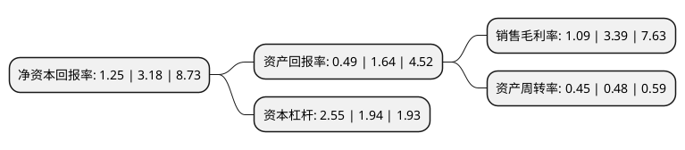

> 本页面由自动化程序生成于 2022年5月20日 01:02
> 内容可能存在错误，如有bug请提交issue至：https://github.com/Eroleice/doc-pi/issues
{.is-warning}

# 上市公司基本情况

## 基本资料

我爱我家控股集团股份有限公司（以下简称“我爱我家”）成立于1992年11月30日，昆明市。于1994年02月02日在深交所主板上市。

我爱我家注册资本235,550.085万元，主要业务:房地产经纪服务(二手房，新房，租赁，海外)，住宅资产管理，商业地产运营及居住衍生业务等以下是详细信息：

- 公司名称: 我爱我家控股集团股份有限公司
- 股票代码: 000560.SZ
- 所在地: 云南 - 昆明市
- 成立日期: 1992年11月30日
- 注册资本: 235,550.085万元
- 法定代表人: 谢勇
- 主营业务: 房地产经纪服务(二手房，新房，租赁，海外)，住宅资产管理，商业地产运营及居住衍生业务等
- 公司官网: www.5i5j.com/000560.5i5j.com
- 公司介绍: 公司是全国领先的以数字驱动的房产居住服务平台运营商，基于二十余年的锐意进取，以专业、安全、高效的运营管理体系为支撑，为客户提供高品质、一站式的居住全生命周期综合服务，“我爱我家”相关商标被认定为不动产经纪行业全国驰名商标。以互联网和大数据等技术驱动的数字化转型作为首要战略，重塑业务模式，从标准化到线上化，再到智能化，现已具备业内领先的地产经纪业务全价值链数字化运营、端到端闭环交付能力。公司在核心城市实现签约交易服务全线上化、贷款申请服务全线上化、租房业务流程全移动化、客户及业主服务自助化，同时实现经纪人学习成长和作业过程由机器人助手个性化赋能，可基于实时的客户画像为客户提供专业的个性化服务。2020年，我爱我家IT团队获得计世传媒评选的中国年度杰出数字化团队，“i+经纪人”获得中国年度杰出数字化项目大奖，该平台已陆续对外服务5万多名经纪人、4000多位付费会员用户，依托我爱我家数字化能力面向合作伙伴赋能。公司凭借优秀的经营表现与良好的行业代表性，先后入选深股通和深证成指样本股，富时罗素全球股票指数系列、标普道琼斯新兴市场全球基准指数A股名单。

## 股东及高管情况

上市公司第一大股东为西藏太和先机投资管理有限公司，持股411,028,689股，占比17.45%，**疑似为**上市公司实际控制人。

截至2022年03月31日，上市公司的前十大股东中，共有2名自然人股东，7名机构股东，1个产品账户，其中5%以上大股东共有4名。上市公司前十大股东明细如下：

> 未能通过持股比例判定出上市公司实际控制人（持股30%以上）
> 可能存在通过间接持股、联合持股、协议控制等方式拥有实际控制权的主体，具体请参考上市公司定期公告！
{.is-warning}

> 截至2022年03月31日，上市公司前十大股东信息如下：

| 股东名称 | 持股数量（股） | 持股比例 |
| --- | --- | --- |
| 西藏太和先机投资管理有限公司 | 411,028,689 | 17.45% |
| 五八有限公司 | 195,000,000 | 8.28% |
| 天津东银玉衡企业管理咨询中心(有限合伙) | 175,073,202 | 7.43% |
| 谢勇 | 130,000,000 | 5.52% |
| 天津海立方舟投资管理有限公司 | 73,033,706 | 3.1% |
| 我爱我家控股集团股份有限公司-第二期员工持股计划 | 66,439,073 | 2.82% |
| 青岛中建新城投资建设有限公司 | 52,417,869 | 2.23% |
| 刘田 | 46,407,461 | 1.97% |
| 桐庐岩泰投资管理合伙企业(有限合伙) | 33,754,113 | 1.43% |
| 上海福翌投资咨询有限公司-赣州瑞德投资管理合伙企业(有限合伙) | 33,619,642 | 1.43% |

## 利润表分析

上市公司2021年总收入为119.62亿元，净利润为1.3亿元，实现盈利。

## 杜邦分析

> 数据列示周期：2021年 | 2020年 | 2019年
{.is-info}

上市公司的净资产收益率在近一年有所下降，下降幅度为-60.69%，其变化情况分解如下：
- 上市公司的销售毛利率在近一年下降了-67.85%，可能是生产效率的下降、商品原材料价格上涨或商品价格的下跌所致。
- 上市公司的资产周转率在近一年下降了-6.25%，可能是源自于更慢的销售回款或库存管理效果下降。
- 上市公司的财务杠杆比率在近一年上升了31.44%，可能是增加负债扩大生产规模。

