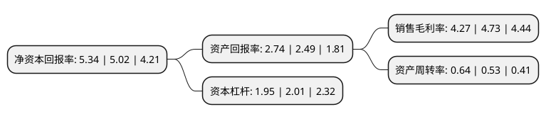

> 本页面由自动化程序生成于 2022年5月20日 01:05
> 内容可能存在错误，如有bug请提交issue至：https://github.com/Eroleice/doc-pi/issues
{.is-warning}

# 上市公司基本情况

## 基本资料

招商局积余产业运营服务股份有限公司（以下简称“招商积余”）成立于1985年05月29日，深圳市。于1994年09月28日在深交所主板上市。

招商积余注册资本106,034.606万元，主营业务:地产开发业务。以下是详细信息：

- 公司名称: 招商局积余产业运营服务股份有限公司
- 股票代码: 001914.SZ
- 所在地: 广东 - 深圳市
- 成立日期: 1985年05月29日
- 注册资本: 106,034.606万元
- 法定代表人: 聂黎明
- 主营业务: 主营业务:地产开发业务
- 公司官网: www.cmpo1914.com
- 公司介绍: 公司是一家集地产开发、物业经营与管理、酒店经营与管理为一体的综合性集团公司，连续多年进入深圳百强企业榜。公司以“打造特色鲜明、值得社会信赖的商业地产投资、发展和运营商”为愿景，凭借上市公司的有利平台，整合资源、扩大规模、突出主业，着力打造城市综合体，发展“中航城”核心产品品牌，形成以深圳为基地并辐射珠三角的业务核心，同时强势挺进中国西南、西北、中南、长三角和环渤海区域，进而形成全国战略发展布局。

## 股东及高管情况

上市公司第一大股东为招商局蛇口工业区控股股份有限公司，持股503,134,000股，占比47.45%，为上市公司实际控制人。

截至2022年03月31日，上市公司的前十大股东中，共有5名机构股东，4个产品账户，1名其他股东，其中5%以上大股东共有2名。上市公司前十大股东明细如下：

> 截至2022年03月31日，上市公司前十大股东信息如下：

| 股东名称 | 持股数量（股） | 持股比例 |
| --- | --- | --- |
| 招商局蛇口工业区控股股份有限公司 | 503,134,000 | 47.45% |
| 中国航空技术深圳有限公司 | 120,005,789 | 11.32% |
| 深圳招商房地产有限公司 | 39,338,464 | 3.71% |
| 西藏赢悦投资管理有限公司 | 21,206,920 | 2% |
| 中国建设银行股份有限公司-汇添富消费行业混合型证券投资基金 | 16,000,053 | 1.51% |
| 阿布达比投资局 | 14,955,945 | 1.41% |
| 中国工商银行股份有限公司-广发多因子灵活配置混合型证券投资基金 | 14,042,593 | 1.32% |
| 交通银行股份有限公司-汇添富中盘价值精选混合型证券投资基金 | 12,500,030 | 1.18% |
| 深圳中航城发展有限公司 | 10,862,958 | 1.02% |
| 上海景林资产管理有限公司-景林全球基金 | 9,885,300 | 0.93% |

## 利润表分析

上市公司2021年总收入为105.9亿元，净利润为4.52亿元，实现盈利。

## 杜邦分析

> 数据列示周期：2021年 | 2020年 | 2019年
{.is-info}

上市公司的净资产收益率在近一年有所上升，上升幅度为6.37%，其变化情况分解如下：
- 上市公司的销售毛利率在近一年下降了-9.73%，可能是生产效率的下降、商品原材料价格上涨或商品价格的下跌所致。
- 上市公司的资产周转率在近一年上升了20.75%，可能是源自于更快的销售回款或库存管理效果提升。
- 上市公司的财务杠杆比率在近一年下降了-2.99%，可能是减少负债降低财务费用。

