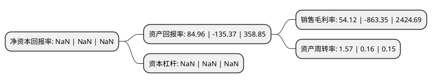

> 本页面由自动化程序生成于 2022年5月20日 01:06
> 内容可能存在错误，如有bug请提交issue至：https://github.com/Eroleice/doc-pi/issues
{.is-warning}

# 上市公司基本情况

## 基本资料

巴士在线股份有限公司（以下简称“*ST巴士”）成立于2002年11月20日，嘉兴市。于2007年11月22日在深交所中小板上市。

*ST巴士注册资本29,253.858万元，主要产品:受话器，微型扬声器等微电声器件产品。主营业务:通讯终端产品及便携式数码电子产品用微电声器件的研发，生产和销售。以下是详细信息：

- 公司名称: 巴士在线股份有限公司
- 股票代码: 002188.SZ
- 所在地: 浙江 - 嘉兴市
- 成立日期: 2002年11月20日
- 注册资本: 29,253.858万元
- 法定代表人: 顾时杰
- 主营业务: 主要产品:受话器，微型扬声器等微电声器件产品主营业务:通讯终端产品及便携式数码电子产品用微电声器件的研发，生产和销售
- 公司官网: www.busonline.com
- 公司介绍: 公司专业从事微型扬声器、受话器等微电声元器件产品的研发、生产、销售，为国家级高新技术企业，拥有现代化先进的厂房设施，生产规模大、技术能力强，拥有根据工艺的需要进行开发制造自动化专用生产设备的能力。公司研发团队是市级重点企业技术创新团队，主要技术人员具有多年的电声元器件研发和生产制造经验。公司也是市级专利示范性企业。

## 股东及高管情况

上市公司第一大股东为上海天纪投资有限公司，持股60,013,002股，占比20.51%，**疑似为**上市公司实际控制人。

截至2022年03月31日，上市公司的前十大股东中，共有4名自然人股东，6名机构股东，其中5%以上大股东共有2名。上市公司前十大股东明细如下：

> 未能通过持股比例判定出上市公司实际控制人（持股30%以上）
> 可能存在通过间接持股、联合持股、协议控制等方式拥有实际控制权的主体，具体请参考上市公司定期公告！
{.is-warning}

> 截至2022年03月31日，上市公司前十大股东信息如下：

| 股东名称 | 持股数量（股） | 持股比例 |
| --- | --- | --- |
| 上海天纪投资有限公司 | 60,013,002 | 20.51% |
| 周旭辉 | 16,390,777 | 5.6% |
| 中麦控股有限公司 | 11,306,115 | 3.86% |
| 武汉睿福德投资管理中心(有限合伙) | 10,086,591 | 3.45% |
| 深圳市佳银资产管理有限公司 | 8,260,685 | 2.82% |
| 深圳市盛世景投资有限公司-深圳前海盛世轩金投资企业(有限合伙) | 7,500,000 | 2.56% |
| 上海瑞点投资管理有限公司 | 4,560,000 | 1.56% |
| 葛伟 | 4,126,666 | 1.41% |
| 胡兴航 | 3,700,000 | 1.26% |
| 罗蓓文 | 3,010,039 | 1.03% |

## 利润表分析

上市公司2021年总收入为2.73亿元，净利润为1.48亿元，实现盈利。

## 杜邦分析

> 数据列示周期：2021年 | 2020年 | 2019年
{.is-info}

上市公司的净资产收益率在近一年有所下降，下降幅度为NaN%，其变化情况分解如下：
- 上市公司的销售毛利率在近一年下降了-106.27%，可能是生产效率的下降、商品原材料价格上涨或商品价格的下跌所致。
- 上市公司的资产周转率在近一年上升了881.25%，可能是源自于更快的销售回款或库存管理效果提升。
- 上市公司的财务杠杆比率在近一年下降了NaN%，可能是减少负债降低财务费用。

