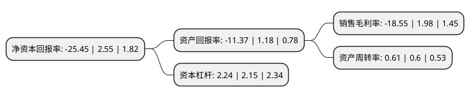

> 本页面由自动化程序生成于 2022年5月20日 01:07
> 内容可能存在错误，如有bug请提交issue至：https://github.com/Eroleice/doc-pi/issues
{.is-warning}

# 上市公司基本情况

## 基本资料

深圳世联行集团股份有限公司（以下简称“世联行”）成立于1993年04月13日，深圳市。于2009年08月28日在深交所中小板上市。

世联行注册资本203,357.907万元，本公司是一家专业从事房地产营销的顾问代理机构。公司服务的主要对象包括相关政府部门，房地产开发商，机构及个人业主;主要从事房地产顾问策划，代理销售和经纪业务。以下是详细信息：

- 公司名称: 深圳世联行集团股份有限公司
- 股票代码: 002285.SZ
- 所在地: 广东 - 深圳市
- 成立日期: 1993年04月13日
- 注册资本: 203,357.907万元
- 法定代表人: 胡嘉
- 主营业务: 本公司是一家专业从事房地产营销的顾问代理机构公司服务的主要对象包括相关政府部门，房地产开发商，机构及个人业主;主要从事房地产顾问策划，代理销售和经纪业务
- 公司官网: www.worldunion.com.cn
- 公司介绍: 公司是中国最具规模的房地产顾问公司之一，是境内首家登陆A股的房地产综合服务提供商。经过多年的发展，公司已成为全国性的房地产服务提供商，拥有66家分支机构，业务已覆盖全国30多个省、市、自治区，布局达164个城市，为超2万个楼盘提供专业的营销代理及顾问咨询服务。公司从成立初期的专业估价、咨询已经拓展至交易、金融、资产运营等多项业务为一体的房地产全生命周期服务，公司以“服务、入口、开放、平台”为原则，“让更多人享受真正的地产服务”为宗旨，确立泛交易、类金融、大资管、互联网与数据服务四大核心业务板块，在保持传统业务高速增长的同时，积极布局房地产金融及存量市场，以全国领先的房地产综合服务提供商身份，继续领跑市场。

## 股东及高管情况

上市公司第一大股东为世联地产顾问(中国)有限公司，持股603,238,739股，占比29.66%，**疑似为**上市公司实际控制人。

截至2022年03月31日，上市公司的前十大股东中，共有4名自然人股东，4名机构股东，1个产品账户，1个海外主体，其中5%以上大股东共有2名。上市公司前十大股东明细如下：

> 未能通过持股比例判定出上市公司实际控制人（持股30%以上）
> 可能存在通过间接持股、联合持股、协议控制等方式拥有实际控制权的主体，具体请参考上市公司定期公告！
{.is-warning}

> 截至2022年03月31日，上市公司前十大股东信息如下：

| 股东名称 | 持股数量（股） | 持股比例 |
| --- | --- | --- |
| 世联地产顾问(中国)有限公司 | 603,238,739 | 29.66% |
| 珠海大横琴集团有限公司 | 324,077,841 | 15.94% |
| 乌鲁木齐卓群创展股权投资合伙企业(有限合伙) | 51,373,386 | 2.53% |
| 深圳众志联高投资管理合伙企业(有限合伙) | 45,442,857 | 2.23% |
| 陈劲松 | 18,299,610 | 0.9% |
| 香港中央结算有限公司(陆股通) | 17,933,816 | 0.88% |
| 郑桃英 | 16,359,200 | 0.8% |
| 易方达基金-中央汇金资产管理有限责任公司-易方达基金-汇金资管单一资产管理计划 | 14,500,022 | 0.71% |
| 叶峥嵘 | 13,113,415 | 0.64% |
| 沈德虎 | 9,604,400 | 0.47% |

## 利润表分析

上市公司2021年总收入为60.82亿元，净利润为-11.29亿元，**未实现盈利**。

## 杜邦分析

> 数据列示周期：2021年 | 2020年 | 2019年
{.is-info}

上市公司的净资产收益率在近一年有所下降，下降幅度为-1098.04%，其变化情况分解如下：
- 上市公司的销售毛利率在近一年下降了-1036.87%，可能是生产效率的下降、商品原材料价格上涨或商品价格的下跌所致。
- 上市公司的资产周转率在近一年上升了1.67%，可能是源自于更快的销售回款或库存管理效果提升。
- 上市公司的财务杠杆比率在近一年上升了4.19%，可能是增加负债扩大生产规模。

