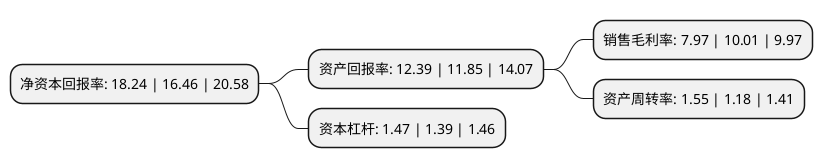

> 本页面由自动化程序生成于 2022年5月20日 01:13
> 内容可能存在错误，如有bug请提交issue至：https://github.com/Eroleice/doc-pi/issues
{.is-warning}

# 上市公司基本情况

## 基本资料

新大正物业集团股份有限公司（以下简称“新大正”）成立于1998年12月10日，重庆市。于2019年12月03日在深交所中小板上市。

新大正注册资本16,271.85万元，主营业务:劳务派遣业务，物业管理服务，物业管理咨询，房地产经纪等。以下是详细信息：

- 公司名称: 新大正物业集团股份有限公司
- 股票代码: 002968.SZ
- 所在地: 重庆 - 重庆市
- 成立日期: 1998年12月10日
- 注册资本: 16,271.85万元
- 法定代表人: 李茂顺
- 主营业务: 主营业务:劳务派遣业务，物业管理服务，物业管理咨询，房地产经纪等
- 公司官网: www.dzwy.com
- 公司介绍: 公司系西南地区具有国家一级资质的专业物业服务供应商，致力于为客户提供优质的基础物业管理服务和多元化的增值服务。其业务立足重庆，精耕西南，适时向全国拓展,公司提供综合物业管理服务和专项物业管理服务,公司的综合物业管理服务包括公共物业、学校物业、园区物业、商业物业、住宅物业五大业态的物业管理，专项物业管理服务则主要包括专项保洁服务和专项保安服务等。公司所管理的项目获得多项国家、省、市级荣誉，公司在行业内获得的主要荣誉如下：中国物业管理协会第五届名誉副会长单位、2019物业服务企业品牌价值50强、2019中国物业服务百强企业、2018年物业服务企业综合实力TOP100等。

## 股东及高管情况

上市公司第一大股东为王宣，持股46,624,590股，占比28.65%，**疑似为**上市公司实际控制人。

截至2022年03月31日，上市公司的前十大股东中，共有5名自然人股东，3名机构股东，2个产品账户，其中5%以上大股东共有3名。上市公司前十大股东明细如下：

> 未能通过持股比例判定出上市公司实际控制人（持股30%以上）
> 可能存在通过间接持股、联合持股、协议控制等方式拥有实际控制权的主体，具体请参考上市公司定期公告！
{.is-warning}

> 截至2022年03月31日，上市公司前十大股东信息如下：

| 股东名称 | 持股数量（股） | 持股比例 |
| --- | --- | --- |
| 王宣 | 46,624,590 | 28.65% |
| 重庆大正商务信息咨询合伙企业(有限合伙) | 28,125,000 | 17.28% |
| 李茂顺 | 11,250,000 | 6.91% |
| 罗渝陵 | 5,434,300 | 3.34% |
| 招商银行股份有限公司-交银施罗德新成长混合型证券投资基金 | 4,438,173 | 2.73% |
| 中国农业银行股份有限公司-交银施罗德精选混合型证券投资基金 | 3,221,630 | 1.98% |
| 陈建华 | 2,812,500 | 1.73% |
| 廖才勇 | 2,700,000 | 1.66% |
| 上海荣巽资产管理中心(有限合伙)-温州荣巽嵩山股权投资合伙企业(有限合伙) | 2,596,300 | 1.6% |
| 深圳市创新投资集团有限公司 | 2,313,750 | 1.42% |

## 利润表分析

上市公司2021年总收入为20.88亿元，净利润为1.66亿元，实现盈利。

## 杜邦分析

> 数据列示周期：2021年 | 2020年 | 2019年
{.is-info}

上市公司的净资产收益率在近一年有所上升，上升幅度为10.81%，其变化情况分解如下：
- 上市公司的销售毛利率在近一年下降了-20.38%，可能是生产效率的下降、商品原材料价格上涨或商品价格的下跌所致。
- 上市公司的资产周转率在近一年上升了31.36%，可能是源自于更快的销售回款或库存管理效果提升。
- 上市公司的财务杠杆比率在近一年上升了5.76%，可能是增加负债扩大生产规模。

