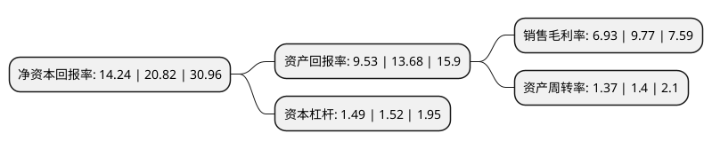

> 本页面由自动化程序生成于 2022年5月20日 01:21
> 内容可能存在错误，如有bug请提交issue至：https://github.com/Eroleice/doc-pi/issues
{.is-warning}

# 上市公司基本情况

## 基本资料

深圳市特发服务股份有限公司（以下简称“特发服务”）成立于1993年05月31日，深圳市。于2020年12月21日在深交所创业板上市。

特发服务注册资本13,000万元，公司所从事的服务内容包括综合设施管理，空间管理，安全保障，环境管理，高端接待，会议服务等，管理的项目涵盖高新科技园区，商业综合体，政府机关，学校，住宅等多种类型。以下是详细信息：

- 公司名称: 深圳市特发服务股份有限公司
- 股票代码: 300917.SZ
- 所在地: 广东 - 深圳市
- 成立日期: 1993年05月31日
- 注册资本: 13,000万元
- 法定代表人: 陈宝杰
- 主营业务: 公司所从事的服务内容包括综合设施管理，空间管理，安全保障，环境管理，高端接待，会议服务等，管理的项目涵盖高新科技园区，商业综合体，政府机关，学校，住宅等多种类型
- 公司官网: www.tefafuwu.com
- 公司介绍: 公司一直以综合设施管理服务为核心业务，致力于成为中国高端物业服务品牌供应商。公司所从事的服务内容包括综合设施管理、空间管理、安全保障、环境管理、高端接待、会议服务等，管理的项目涵盖高新科技园区、商业综合体、政府机关、学校、住宅等多种类型，主要客户包括华为、阿里巴巴、中国移动、国家电网等知名企业。公司相关业务已从珠三角经济圈辐射至国内的环渤海经济圈、长三角经济圈、西南经济圈、华中城市经济圈及海外的非洲等地。近年来，公司在提供物业管理服务的同时，还陆续拓展了政务服务、资产经营等业务，设立了特发楼宇、特发政务、特发商务、特发资产经营等子公司。凭借优质的服务质量，公司与主要客户建立了长期、稳定的服务关系。报告期内，公司多次受到核心客户及行业协会等相关单位的嘉奖，具体情况如下：2018年度深圳市物业管理行业协会优秀企业、2017年物业服务百强企业、中国企业信用评价AAA等。

## 股东及高管情况

上市公司第一大股东为深圳市特发集团有限公司，持股62,107,500股，占比47.78%，为上市公司实际控制人。

截至2022年03月31日，上市公司的前十大股东中，共有4名机构股东，5个产品账户，1个海外主体，其中5%以上大股东共有3名。上市公司前十大股东明细如下：

> 截至2022年03月31日，上市公司前十大股东信息如下：

| 股东名称 | 持股数量（股） | 持股比例 |
| --- | --- | --- |
| 深圳市特发集团有限公司 | 62,107,500 | 47.78% |
| 江苏南通三建集团股份有限公司 | 19,500,000 | 15% |
| 深圳市银坤投资股份有限公司 | 14,625,000 | 11.25% |
| 深圳市特发投资有限公司 | 1,267,500 | 0.98% |
| 中国建设银行股份有限公司-信达澳银新能源产业股票型证券投资基金 | 957,300 | 0.74% |
| 中信证券-招商银行-中信证券特发服务员工参与创业板战略配售集合资产管理计划 | 657,828 | 0.51% |
| UBS AG | 507,657 | 0.39% |
| 平安基金-中国平安人寿保险股份有限公司-平安人寿-平安基金权益委托投资1号单一资产管理计划 | 332,500 | 0.26% |
| 兴业银行股份有限公司-工银瑞信金融地产行业混合型证券投资基金 | 280,346 | 0.22% |
| 上海浦东发展银行股份有限公司-信达澳银领先智选混合型证券投资基金 | 276,200 | 0.21% |

## 利润表分析

上市公司2021年总收入为16.91亿元，净利润为1.17亿元，实现盈利。

## 杜邦分析

> 数据列示周期：2021年 | 2020年 | 2019年
{.is-info}

上市公司的净资产收益率在近一年有所下降，下降幅度为-31.6%，其变化情况分解如下：
- 上市公司的销售毛利率在近一年下降了-29.07%，可能是生产效率的下降、商品原材料价格上涨或商品价格的下跌所致。
- 上市公司的资产周转率在近一年下降了-2.14%，可能是源自于更慢的销售回款或库存管理效果下降。
- 上市公司的财务杠杆比率在近一年下降了-1.97%，可能是减少负债降低财务费用。

