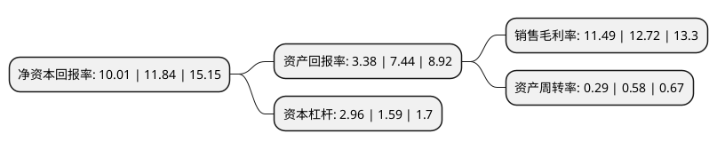

> 本页面由自动化程序生成于 2022年5月20日 01:21
> 内容可能存在错误，如有bug请提交issue至：https://github.com/Eroleice/doc-pi/issues
{.is-warning}

# 上市公司基本情况

## 基本资料

上海德必文化创意产业发展(集团)股份有限公司（以下简称“德必集团”）成立于2011年04月13日，上海市。于2021年02月10日在深交所创业板上市。

德必集团注册资本8,084.4万元，为文化创意产业园区的运营服务商，主营业务为文化创意产业园区的定位，设计，改造，招商和运营管理。以下是详细信息：

- 公司名称: 上海德必文化创意产业发展(集团)股份有限公司
- 股票代码: 300947.SZ
- 所在地: 上海 - 上海市
- 成立日期: 2011年04月13日
- 注册资本: 8,084.4万元
- 法定代表人: 贾波
- 主营业务: 为文化创意产业园区的运营服务商，主营业务为文化创意产业园区的定位，设计，改造，招商和运营管理
- 公司官网: www.dobechina.com
- 公司介绍: 公司主要从事文化创意产业园区的定位、设计、改造、招商和运营管理，以中小微型文化创意企业和科技创新企业的需求为中心，以园区设计和运营管理能力为基础，对各类既有建筑进行重新定位与更新改造，在保护和传承城市历史文化脉络的同时，为文科创企业提供舒适的办公环境和深度的专业化服务。公司作为文化创意产业园区的运营服务商，以服务文科创企业、助力文化创意产业发展为使命，整合城市低效老旧的存量物业资源，通过定位、设计、改造提升其商业价值，实现产业业态集聚，最终促进园区运营服务商、园区所有权/经营权持有方和入驻的文科创企业的协同发展。公司已在国内的上海、北京、杭州、成都、苏州、南京等多个城市，以及意大利、美国等海外地区以承租运营模式管理了40个文化创意产业园区。公司全球文科创企业跨境交流平台已初步形成，为中国企业走向海外、协助国外优秀企业进入中国提供全面服务，促进国内外文科创企业的双向互动。

## 股东及高管情况

上市公司第一大股东为上海中微子投资管理有限公司，持股26,257,500股，占比32.48%，为上市公司实际控制人。

截至2022年04月25日，上市公司的前十大股东中，共有10名机构股东，其中5%以上大股东共有5名。上市公司前十大股东明细如下：

> 截至2022年04月25日，上市公司前十大股东信息如下：

| 股东名称 | 持股数量（股） | 持股比例 |
| --- | --- | --- |
| 上海中微子投资管理有限公司 | 26,257,500 | 32.48% |
| 上海中微子投资管理有限公司 | 26,257,500 | 32.48% |
| 长兴乾悦企业管理咨询合伙企业(有限合伙) | 5,534,328 | 6.8457% |
| 长兴乾润企业管理咨询合伙企业(有限合伙) | 4,406,250 | 5.45% |
| 池州中安招商股权投资合伙企业(有限合伙) | 4,378,148 | 5.42% |
| 阳光财产保险股份有限公司-自有资金 | 3,960,000 | 4.9% |
| 深圳市卓元道成投资管理有限公司-深圳市前海卓元时代投资企业(有限合伙) | 2,160,000 | 2.67% |
| 西藏乾泽企业管理合伙企业(有限合伙) | 1,725,000 | 2.13% |
| 中民创富投资管理有限公司-嘉兴嵩岳叁号投资合伙企业(有限合伙) | 1,440,000 | 1.78% |
| 深圳市达晨财智创业投资管理有限公司-深圳市达晨创坤股权投资企业(有限合伙) | 1,200,000 | 1.48% |

## 利润表分析

上市公司2021年总收入为9.54亿元，净利润为1.09亿元，实现盈利。

## 杜邦分析

> 数据列示周期：2021年 | 2020年 | 2019年
{.is-info}

上市公司的净资产收益率在近一年有所下降，下降幅度为-15.46%，其变化情况分解如下：
- 上市公司的销售毛利率在近一年下降了-9.67%，可能是生产效率的下降、商品原材料价格上涨或商品价格的下跌所致。
- 上市公司的资产周转率在近一年下降了-50%，可能是源自于更慢的销售回款或库存管理效果下降。
- 上市公司的财务杠杆比率在近一年上升了86.16%，可能是增加负债扩大生产规模。

