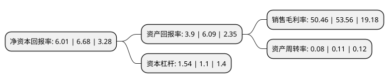

> 本页面由自动化程序生成于 2022年5月20日 01:27
> 内容可能存在错误，如有bug请提交issue至：https://github.com/Eroleice/doc-pi/issues
{.is-warning}

# 上市公司基本情况

## 基本资料

上海汇通能源股份有限公司（以下简称“汇通能源”）成立于1991年01月03日，上海市。于1992年03月27日在上交所主板上市。

汇通能源注册资本20,628.243万元，主营业务:风力发电，有色金属(铜)批发贸易及房产租赁物业管理以下是详细信息：

- 公司名称: 上海汇通能源股份有限公司
- 股票代码: 600605.SH
- 所在地: 上海 - 上海市
- 成立日期: 1991年01月03日
- 注册资本: 20,628.243万元
- 法定代表人: 杨张峰
- 主营业务: 主营业务:风力发电，有色金属(铜)批发贸易及房产租赁物业管理
- 公司官网: www.huitongenergy.com
- 公司介绍: 公司主营业务分为三大板块：风力发电、有色金属(铜)批发贸易及房产租赁物业管理。风力发电业务主要包括项目开发、建设及运营。公司从事的贸易是国内铜批发贸易，主要的经营模式为现款现货业务(即实行日内交易，货物的进出在当日完成)和非现款现货业务。公司房产管理团队负责公司自有房产管理及运营，同时对公司持有的空置房产厂房等重新规划和定位，因地制宜地提出经营方案。

## 股东及高管情况

上市公司第一大股东为西藏德锦企业管理有限责任公司，持股111,727,275股，占比54.16%，为上市公司实际控制人。

截至2022年03月31日，上市公司的前十大股东中，共有8名自然人股东，2名机构股东，其中5%以上大股东共有2名。上市公司前十大股东明细如下：

> 截至2022年03月31日，上市公司前十大股东信息如下：

| 股东名称 | 持股数量（股） | 持股比例 |
| --- | --- | --- |
| 西藏德锦企业管理有限责任公司 | 111,727,275 | 54.16% |
| 郑州通泰万合企业管理中心(有限合伙) | 10,356,918 | 5.02% |
| 余良辉 | 4,170,680 | 2.02% |
| 章安 | 3,289,192 | 1.59% |
| 王坚宏 | 2,311,340 | 1.12% |
| 吴知情 | 2,311,019 | 1.12% |
| 王琳 | 1,234,000 | 0.6% |
| 王秀荣 | 1,176,220 | 0.57% |
| 徐国 | 1,099,980 | 0.53% |
| 卢冬芳 | 1,093,072 | 0.53% |

## 利润表分析

上市公司2021年总收入为1.12亿元，净利润为0.56亿元，实现盈利。

## 杜邦分析

> 数据列示周期：2021年 | 2020年 | 2019年
{.is-info}

上市公司的净资产收益率在近一年有所下降，下降幅度为-10.03%，其变化情况分解如下：
- 上市公司的销售毛利率在近一年下降了-5.79%，可能是生产效率的下降、商品原材料价格上涨或商品价格的下跌所致。
- 上市公司的资产周转率在近一年下降了-27.27%，可能是源自于更慢的销售回款或库存管理效果下降。
- 上市公司的财务杠杆比率在近一年上升了40%，可能是增加负债扩大生产规模。

