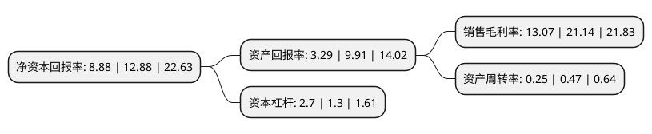

> 本页面由自动化程序生成于 2022年5月20日 01:35
> 内容可能存在错误，如有bug请提交issue至：https://github.com/Eroleice/doc-pi/issues
{.is-warning}

# 上市公司基本情况

## 基本资料

上海锦和商业经营管理股份有限公司（以下简称“锦和商管”）成立于2007年05月09日，上海市。于2020年04月21日在上交所主板上市。

锦和商管注册资本47,250万元，主营业务是产业园区，创意产业园区的定位设计，改造和运营管理。以下是详细信息：

- 公司名称: 上海锦和商业经营管理股份有限公司
- 股票代码: 603682.SH
- 所在地: 上海 - 上海市
- 成立日期: 2007年05月09日
- 注册资本: 47,250万元
- 法定代表人: 郁敏珺
- 主营业务: 主营业务是产业园区，创意产业园区的定位设计，改造和运营管理
- 公司官网: www.iyuejie.com
- 公司介绍: 公司是锦和投资集团专业面向既有物业的改造、运营管理的旗舰企业。公司致力于城市既有物业的改造、运营管理服务,通过对城市既有商用物业提供全价值链一站式服务,延续城市文脉,挖掘并提升城市商用物业价值,使资产得到稳定持续的增值,赢得了合作伙伴和社会各界的一片赞誉。未来,公司将继续致力于中国城市产业升级的深耕细作,将业务触角由长三角向全国一线城市战略延伸。公司自2007年即开始从事创意产业园区的经营，经过多年发展，公司以“越界”品牌为代表的创意产业园区已经逐步得到了政府、文化创意产业类客户等各方的认可，近年来公司陆续获“上海市产业园区品牌开发建设运营机构”、“上海市文化企业十强”、“十大城市更新资产运营机构”等奖项和称号，多个项目被认定为“上海市文化创意产业园区”、“国家文化产业示范基地”、“国家级文化产业试验园区”等，越界商标(注册号：7311701)连续被上海市工商行政管理局认定为上海市著名商标。

## 股东及高管情况

上市公司第一大股东为上海锦和投资集团有限公司，持股274,050,000股，占比58%，为上市公司实际控制人。

截至2022年03月31日，上市公司的前十大股东中，共有3名自然人股东，7名机构股东，其中5%以上大股东共有1名。上市公司前十大股东明细如下：

> 截至2022年03月31日，上市公司前十大股东信息如下：

| 股东名称 | 持股数量（股） | 持股比例 |
| --- | --- | --- |
| 上海锦和投资集团有限公司 | 274,050,000 | 58% |
| 上海锦友投资管理事务所(有限合伙) | 18,900,000 | 4% |
| 无锡华映文化产业投资企业(有限合伙) | 10,500,084 | 2.22% |
| 苏州华映文化产业投资企业(有限合伙) | 8,450,084 | 1.79% |
| 常熟华映光辉投资管理有限公司-常熟华映东南投资有限公司 | 7,399,916 | 1.57% |
| 邵华均 | 4,619,916 | 0.98% |
| 上海同祺文化艺术发展有限公司 | 2,100,168 | 0.44% |
| 周桐宇 | 1,679,832 | 0.36% |
| 王强 | 1,679,832 | 0.36% |
| 华泰证券股份有限公司 | 1,549,809 | 0.33% |

## 利润表分析

上市公司2021年总收入为9.08亿元，净利润为1.18亿元，实现盈利。

## 杜邦分析

> 数据列示周期：2021年 | 2020年 | 2019年
{.is-info}

上市公司的净资产收益率在近一年有所下降，下降幅度为-31.06%，其变化情况分解如下：
- 上市公司的销售毛利率在近一年下降了-38.17%，可能是生产效率的下降、商品原材料价格上涨或商品价格的下跌所致。
- 上市公司的资产周转率在近一年下降了-46.81%，可能是源自于更慢的销售回款或库存管理效果下降。
- 上市公司的财务杠杆比率在近一年上升了107.69%，可能是增加负债扩大生产规模。

