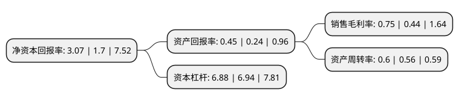

> 本页面由自动化程序生成于 2022年5月20日 01:02
> 内容可能存在错误，如有bug请提交issue至：https://github.com/Eroleice/doc-pi/issues
{.is-warning}

# 上市公司基本情况

## 基本资料

天津泰达股份有限公司（以下简称“泰达股份”）成立于1981年08月20日，天津市。于1996年11月28日在深交所主板上市。

泰达股份注册资本147,557.385万元，主营业务:生态环保，区域开发，能源贸易，洁净材料，股权投资以下是详细信息：

- 公司名称: 天津泰达股份有限公司
- 股票代码: 000652.SZ
- 所在地: 天津 - 天津市
- 成立日期: 1981年08月20日
- 注册资本: 147,557.385万元
- 法定代表人: 张旺
- 主营业务: 主营业务:生态环保，区域开发，能源贸易，洁净材料，股权投资
- 公司官网: www.tedastock.com
- 公司介绍: 公司是按照现代企业制度组建的综合性上市公司。目前投资主要板块包括生态环保、区域开发、能源贸易、洁净材料、股权投资等五大产业。公司垃圾焚烧发电等项目有所在地政府授予的特许经营权，是该产业持续运营模式的重要契约安排。多年的项目运营成功经验、成熟专业的人才队伍，保障收益稳步增长。在区域开发方面，公司的品牌力与公信力较高，资源整合能力较强，能够利用国有上市公司的平台为项目开发提供有利的资金支持及共享资源。

## 股东及高管情况

上市公司第一大股东为天津泰达投资控股有限公司，持股486,659,104股，占比32.98%，为上市公司实际控制人。

截至2022年03月31日，上市公司的前十大股东中，共有5名自然人股东，2名机构股东，2个产品账户，1个海外主体，其中5%以上大股东共有1名。上市公司前十大股东明细如下：

> 截至2022年03月31日，上市公司前十大股东信息如下：

| 股东名称 | 持股数量（股） | 持股比例 |
| --- | --- | --- |
| 天津泰达投资控股有限公司 | 486,659,104 | 32.98% |
| 中央汇金资产管理有限责任公司 | 48,953,000 | 3.32% |
| 香港中央结算有限公司(陆股通) | 7,720,328 | 0.52% |
| 大成基金-农业银行-大成中证金融资产管理计划 | 4,932,862 | 0.33% |
| 张月强 | 3,700,000 | 0.25% |
| 付东 | 3,500,000 | 0.24% |
| 钟宝叶 | 3,026,000 | 0.21% |
| 南方基金-农业银行-南方中证金融资产管理计划 | 2,815,577 | 0.19% |
| 周康 | 2,768,000 | 0.19% |
| 门柯序 | 2,673,400 | 0.18% |

## 杜邦分析

> 数据列示周期：2021年 | 2020年 | 2019年
{.is-info}

上市公司的净资产收益率在近一年有所上升，上升幅度为80.59%，其变化情况分解如下：
- 上市公司的销售毛利率在近一年上升了70.45%，可能是生产效率的提升、商品原材料价格下跌或商品价格的上涨所致。
- 上市公司的资产周转率在近一年上升了7.14%，可能是源自于更快的销售回款或库存管理效果提升。
- 上市公司的财务杠杆比率在近一年下降了-0.86%，可能是减少负债降低财务费用。

