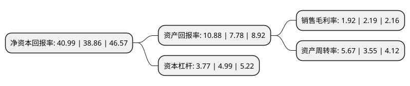

> 本页面由自动化程序生成于 2022年5月20日 01:32
> 内容可能存在错误，如有bug请提交issue至：https://github.com/Eroleice/doc-pi/issues
{.is-warning}

# 上市公司基本情况

## 基本资料

浙江物产环保能源股份有限公司（以下简称“物产环能”）成立于2000年06月29日，杭州市。于2021年12月16日在上交所主板上市。

物产环能注册资本55,795.444万元，主营业务是环保能源综合利用服务，包括煤炭流通业务和热电联产业务，其中热电联产业务在提供蒸汽，电力(含燃煤发电，生物质发电及污泥发电)及压缩空气的同时，可为客户提供污泥处置等服务。以下是详细信息：

- 公司名称: 浙江物产环保能源股份有限公司
- 股票代码: 603071.SH
- 所在地: 浙江 - 杭州市
- 成立日期: 2000年06月29日
- 注册资本: 55,795.444万元
- 法定代表人: 钟国栋
- 主营业务: 主营业务是环保能源综合利用服务，包括煤炭流通业务和热电联产业务，其中热电联产业务在提供蒸汽，电力(含燃煤发电，生物质发电及污泥发电)及压缩空气的同时，可为客户提供污泥处置等服务
- 公司官网: www.zmee.com.cn
- 公司介绍: 公司的主营业务是环保能源综合利用服务，包括煤炭流通业务和热电联产业务，其中热电联产业务在提供蒸汽、电力(含燃煤发电、生物质发电及污泥发电)及压缩空气的同时，可为客户提供污泥处置等服务。公司注重创新发展，公司设有研究院，各电厂设有技术中心，其中新嘉爱斯热电污泥清洁焚烧集成技术获2014年国家科技进步二等奖；专利《污泥处理方法及污泥处理系统》获2017年度浙江省优秀专利奖；生物质焚烧综合利用发电、供汽项目被列入2014年浙江省重点建设项目，几大项目共同推进了公司建设资源节约型和环境友好型企业目标的实现。公司建有新嘉爱斯热电省级企业研究院、省级企业工程技术中心、省级企业工程研究中心。同时公司还设有新嘉爱斯热电省级院士工作站、省级博士后工作站以推进产学研结合、促进高端人才培养，全面提升科技创新能力。新嘉爱斯热电已完成国家863计划子课题一项，省重点科技计划项目一项，省重点技术创新项目一项。目前还有一项国家重点科技计划子课题和一项省重点科技计划项目正在研究实施，被评为“国家知识产权优势企业”。

## 股东及高管情况

上市公司第一大股东为物产中大集团股份有限公司，持股301,968,738股，占比54.12%，为上市公司实际控制人。

截至2022年03月31日，上市公司的前十大股东中，共有1名自然人股东，9名机构股东，其中5%以上大股东共有2名。上市公司前十大股东明细如下：

> 截至2022年03月31日，上市公司前十大股东信息如下：

| 股东名称 | 持股数量（股） | 持股比例 |
| --- | --- | --- |
| 物产中大集团股份有限公司 | 301,968,738 | 54.12% |
| 杭州持瑞投资管理合伙企业(有限合伙) | 29,261,113 | 5.24% |
| 杭州持泰投资管理合伙企业(有限合伙) | 27,048,630 | 4.85% |
| 河北港口集团(天津)投资管理有限公司 | 26,400,000 | 4.73% |
| 宁波持鹏企业管理合伙企业(有限合伙) | 12,005,013 | 2.15% |
| 物产中大国际贸易集团有限公司 | 9,150,453 | 1.64% |
| 物产中大金属集团有限公司 | 9,150,453 | 1.64% |
| 宁波持鹤企业管理合伙企业(有限合伙) | 9,125,142 | 1.64% |
| 宁波持欣企业管理合伙企业(有限合伙) | 6,366,956 | 1.14% |
| 赵守江 | 4,610,364 | 0.83% |

## 利润表分析

上市公司2021年总收入为598.81亿元，净利润为11.47亿元，实现盈利。

## 杜邦分析

> 数据列示周期：2021年 | 2020年 | 2019年
{.is-info}

上市公司的净资产收益率在近一年有所上升，上升幅度为5.48%，其变化情况分解如下：
- 上市公司的销售毛利率在近一年下降了-12.33%，可能是生产效率的下降、商品原材料价格上涨或商品价格的下跌所致。
- 上市公司的资产周转率在近一年上升了59.72%，可能是源自于更快的销售回款或库存管理效果提升。
- 上市公司的财务杠杆比率在近一年下降了-24.45%，可能是减少负债降低财务费用。

