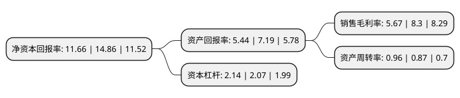

> 本页面由自动化程序生成于 2022年5月20日 01:05
> 内容可能存在错误，如有bug请提交issue至：https://github.com/Eroleice/doc-pi/issues
{.is-warning}

# 上市公司基本情况

## 基本资料

重庆宗申动力机械股份有限公司（以下简称“宗申动力”）成立于1989年03月14日，重庆市。于1997年03月06日在深交所主板上市。

宗申动力注册资本114,502.692万元，主要产品:摩托车发动机及零配件。以下是详细信息：

- 公司名称: 重庆宗申动力机械股份有限公司
- 股票代码: 001696.SZ
- 所在地: 重庆 - 重庆市
- 成立日期: 1989年03月14日
- 注册资本: 114,502.692万元
- 法定代表人: 黄培国
- 主营业务: 主要产品:摩托车发动机及零配件
- 公司官网: www.zsengine.com
- 公司介绍: 公司是宗申产业集团的核心子公司。近年来，公司坚持外延式发展战略，积极向通用航空、汽车零部件、金融服务等产业转型和拓展，现已基本形成了以“摩托车发动机和通用动力”为核心，覆盖“航空动力、汽摩核心零部件、产业链金融、汽车售后服务网络”等新兴业务领域的“产融网”一体化产业布局。是国内拥有大规模及品种齐全的专业化热动力机械产品制造基地。宗申动力产品销售覆盖全国各地，并出口到欧美、中东、东南亚和非洲。公司建立了符合产业发展需求和企业发展战略的生产经营体系，宗申动力产品在质量、技术等方面始终保持国内领先水平。公司被评为“重庆工业企业50强”、“中国机械500强”、“全国质量管理先进企业”，“宗申”商标正式被国家工商总局认定为中国驰名商标，“宗申”牌摩托车及发动机产品荣获中国名牌产品称号。

## 股东及高管情况

上市公司第一大股东为重庆宗申高速艇开发有限公司，持股230,192,114股，占比20.1%，**疑似为**上市公司实际控制人。

截至2022年03月31日，上市公司的前十大股东中，共有6名自然人股东，2名机构股东，1个产品账户，1个海外主体，其中5%以上大股东共有2名。上市公司前十大股东明细如下：

> 未能通过持股比例判定出上市公司实际控制人（持股30%以上）
> 可能存在通过间接持股、联合持股、协议控制等方式拥有实际控制权的主体，具体请参考上市公司定期公告！
{.is-warning}

> 截至2022年03月31日，上市公司前十大股东信息如下：

| 股东名称 | 持股数量（股） | 持股比例 |
| --- | --- | --- |
| 重庆宗申高速艇开发有限公司 | 230,192,114 | 20.1% |
| 西藏国龙实业有限公司 | 207,384,700 | 18.11% |
| 左宗申 | 30,227,200 | 2.64% |
| 周歆焱 | 16,017,768 | 1.4% |
| 付晓瑜 | 6,956,142 | 0.61% |
| 香港中央结算有限公司(陆股通) | 4,731,016 | 0.41% |
| 重庆宗申动力机械股份有限公司-第一期员工持股计划 | 3,901,189 | 0.34% |
| 刘国昌 | 2,639,596 | 0.23% |
| 邹祝春 | 2,605,600 | 0.23% |
| 熊晓华 | 2,556,041 | 0.22% |

## 利润表分析

上市公司2021年总收入为93.64亿元，净利润为5.2亿元，实现盈利。

## 杜邦分析

> 数据列示周期：2021年 | 2020年 | 2019年
{.is-info}

上市公司的净资产收益率在近一年有所下降，下降幅度为-21.53%，其变化情况分解如下：
- 上市公司的销售毛利率在近一年下降了-31.69%，可能是生产效率的下降、商品原材料价格上涨或商品价格的下跌所致。
- 上市公司的资产周转率在近一年上升了10.34%，可能是源自于更快的销售回款或库存管理效果提升。
- 上市公司的财务杠杆比率在近一年上升了3.38%，可能是增加负债扩大生产规模。

