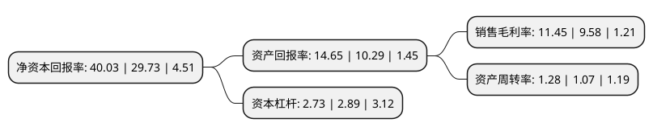

> 本页面由自动化程序生成于 2022年5月20日 01:06
> 内容可能存在错误，如有bug请提交issue至：https://github.com/Eroleice/doc-pi/issues
{.is-warning}

# 上市公司基本情况

## 基本资料

深圳信隆健康产业发展股份有限公司（以下简称“信隆健康”）成立于1991年10月28日，深圳市。于2007年01月12日在深交所中小板上市。

信隆健康注册资本36,850万元，主要产品:自行车零配件和运动健身康复器材产品。以下是详细信息：

- 公司名称: 深圳信隆健康产业发展股份有限公司
- 股票代码: 002105.SZ
- 所在地: 广东 - 深圳市
- 成立日期: 1991年10月28日
- 注册资本: 36,850万元
- 法定代表人: 廖学金
- 主营业务: 主要产品:自行车零配件和运动健身康复器材产品
- 公司官网: www.hlcorp.com
- 公司介绍: 公司专业从事自行车车把、立管、坐垫管、避震前叉等自行零配件及体育运动健身康复器材的研发、生产及销售。公司成立以来，主营业务保持稳定增长，不仅创造出世界知名品牌ZOOM，质量优良，交货及时，价格公道，信誉卓越在业界有良好的口碑。公司产品从自行车零配市场，扩展至整个体育运动健康器材市场，产品营销欧洲、美洲、中国大陆、亚洲等地区。自行车零配件的研发、生产和销售在全球处于行业领导地位，动健身康复器材产品市场占有率及销售数量逐年增长，所生产的运动健身康复器材种类繁多，功能完美。

## 股东及高管情况

上市公司第一大股东为利田发展有限公司，持股154,522,500股，占比41.93%，为上市公司实际控制人。

截至2022年03月31日，上市公司的前十大股东中，共有4名自然人股东，1名机构股东，4个产品账户，1个海外主体，其中5%以上大股东共有2名。上市公司前十大股东明细如下：

> 截至2022年03月31日，上市公司前十大股东信息如下：

| 股东名称 | 持股数量（股） | 持股比例 |
| --- | --- | --- |
| 利田发展有限公司 | 154,522,500 | 41.93% |
| FERNANDO CORPORATION | 20,926,447 | 5.68% |
| 广发证券股份有限公司-中庚小盘价值股票型证券投资基金 | 14,403,387 | 3.91% |
| 华泰证券股份有限公司-中庚价值领航混合型证券投资基金 | 9,540,509 | 2.59% |
| 平安银行股份有限公司-中庚价值灵动灵活配置混合型证券投资基金 | 8,171,212 | 2.22% |
| 陈能安 | 4,943,900 | 1.34% |
| 欧阳烛宇 | 3,228,800 | 0.88% |
| 潘业 | 3,200,000 | 0.87% |
| 平安银行股份有限公司-中庚价值品质一年持有期混合型证券投资基金 | 2,892,296 | 0.78% |
| 康辛茹 | 1,681,609 | 0.46% |

## 利润表分析

上市公司2021年总收入为26.34亿元，净利润为3.01亿元，实现盈利。

## 杜邦分析

> 数据列示周期：2021年 | 2020年 | 2019年
{.is-info}

上市公司的净资产收益率在近一年有所上升，上升幅度为34.65%，其变化情况分解如下：
- 上市公司的销售毛利率在近一年上升了19.52%，可能是生产效率的提升、商品原材料价格下跌或商品价格的上涨所致。
- 上市公司的资产周转率在近一年上升了19.63%，可能是源自于更快的销售回款或库存管理效果提升。
- 上市公司的财务杠杆比率在近一年下降了-5.54%，可能是减少负债降低财务费用。

