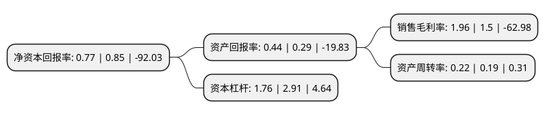

> 本页面由自动化程序生成于 2022年5月20日 01:31
> 内容可能存在错误，如有bug请提交issue至：https://github.com/Eroleice/doc-pi/issues
{.is-warning}

# 上市公司基本情况

## 基本资料

力帆科技(集团)股份有限公司（以下简称“力帆科技”）成立于1997年12月01日，重庆市。于2010年11月25日在上交所主板上市。

力帆科技注册资本450,000万元，主要产品:摩托车，摩托车发动机，乘用车，乘用车发动机，通用汽油机及终端产品(发电机组，水泵，草坪机等)。主营业务:摩托车，汽车以及通用汽油机的研发，生产及销售。以下是详细信息：

- 公司名称: 力帆科技(集团)股份有限公司
- 股票代码: 601777.SH
- 所在地: 重庆 - 重庆市
- 成立日期: 1997年12月01日
- 注册资本: 450,000万元
- 法定代表人: 徐志豪
- 主营业务: 主要产品:摩托车，摩托车发动机，乘用车，乘用车发动机，通用汽油机及终端产品(发电机组，水泵，草坪机等)主营业务:摩托车，汽车以及通用汽油机的研发，生产及销售
- 公司官网: www.lifan.com
- 公司介绍: 公司始于1992年，己发展成为以新能源产业为战略发展方向，融科研开发、发动机、摩托车和汽车的生产、销售(包括出口)为主业，并投资金融于一体的大型民营企业。力帆已十余度入选中国企业500强。力帆国家级技术中心下设汽车研究院和摩托车研究院。公司拥有博士后科研工作站，组织对油耗、噪声、振动，以及性能提升进行技术研究和技术攻关，并开展节能环保新型燃料、数字集成、虚似投计、虚拟分析等技术研究和运用。公司专利申请总量各项指标居全国同行领先地位，是重庆民营企业纳税大户。

## 股东及高管情况

上市公司第一大股东为重庆满江红股权投资基金合伙企业(有限合伙)，持股1,349,550,000股，占比29.99%，**疑似为**上市公司实际控制人。

截至2022年03月31日，上市公司的前十大股东中，共有8名机构股东，2个产品账户，其中5%以上大股东共有4名。上市公司前十大股东明细如下：

> 未能通过持股比例判定出上市公司实际控制人（持股30%以上）
> 可能存在通过间接持股、联合持股、协议控制等方式拥有实际控制权的主体，具体请参考上市公司定期公告！
{.is-warning}

> 截至2022年03月31日，上市公司前十大股东信息如下：

| 股东名称 | 持股数量（股） | 持股比例 |
| --- | --- | --- |
| 重庆满江红股权投资基金合伙企业(有限合伙) | 1,349,550,000 | 29.99% |
| 重庆江河汇企业管理有限责任公司 | 900,000,000 | 20% |
| 重庆力帆控股有限公司 | 618,542,656 | 13.75% |
| 力帆实业(集团)股份有限公司破产企业财产处置专用账户 | 253,867,055 | 5.64% |
| 中国农业银行股份有限公司重庆市分行 | 71,094,499 | 1.58% |
| 上海浦东发展银行股份有限公司重庆分行 | 50,133,194 | 1.11% |
| 浙商银行股份有限公司重庆分行 | 33,230,173 | 0.74% |
| 平安银行股份有限公司 | 30,948,646 | 0.69% |
| 渤海银行股份有限公司重庆分行 | 25,204,108 | 0.56% |
| 四川天府银行股份有限公司成都锦江支行 | 24,265,105 | 0.54% |

## 利润表分析

上市公司2021年总收入为39.77亿元，净利润为0.78亿元，实现盈利。

## 杜邦分析

> 数据列示周期：2021年 | 2020年 | 2019年
{.is-info}

上市公司的净资产收益率在近一年有所下降，下降幅度为-9.41%，其变化情况分解如下：
- 上市公司的销售毛利率在近一年上升了30.67%，可能是生产效率的提升、商品原材料价格下跌或商品价格的上涨所致。
- 上市公司的资产周转率在近一年上升了15.79%，可能是源自于更快的销售回款或库存管理效果提升。
- 上市公司的财务杠杆比率在近一年下降了-39.52%，可能是减少负债降低财务费用。

