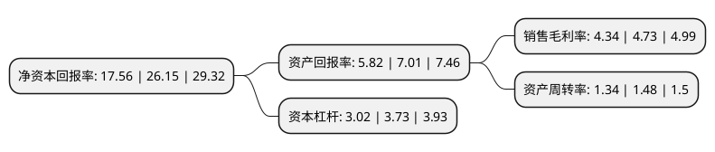

> 本页面由自动化程序生成于 2022年5月20日 01:34
> 内容可能存在错误，如有bug请提交issue至：https://github.com/Eroleice/doc-pi/issues
{.is-warning}

# 上市公司基本情况

## 基本资料

爱玛科技集团股份有限公司（以下简称“爱玛科技”）成立于1999年09月27日，天津市。于2021年06月15日在上交所主板上市。

爱玛科技注册资本41,044万元，主营业务:电动自行车的研发，生产及销售。以下是详细信息：

- 公司名称: 爱玛科技集团股份有限公司
- 股票代码: 603529.SH
- 所在地: 天津 - 天津市
- 成立日期: 1999年09月27日
- 注册资本: 41,044万元
- 法定代表人: 张剑
- 主营业务: 主营业务:电动自行车的研发，生产及销售
- 公司官网: www.aimatech.com
- 公司介绍: 公司前身为天津市泰美车业有限公司，成立于1999年9月27日。2009年7月31日，有限公司全体股东签订《天津爱玛科技股份有限公司发起人协议书》，一致同意以经审计的净资产折股的方式整体变更为股份公司，公司名称变更为“天津爱玛科技股份有限公司”。自股份公司设立以来未发生变化。公司通过对“爱玛”品牌的塑造与推广、供应链的整合以及营销网络的管理，在全国建立了较为系统而全面的营销网络。截至2017年末，公司共有经销商超过1,900家。公司对经销商采取规范的专卖店管理方法，对专卖店的选址、店面设计、装修、产品服务、产品活动等形成统一的标准和严格的要求，并为经销商提供全方位的培训和指导，提高品牌形象。经过多年的发展，公司在电动自行车行业具有较高的市场占有率，并已成为电动自行车行业龙头企业。“爱玛”商标于2011年被国家工商总局认定为中国驰名商标，爱玛品牌连续多年成为工信部科技司发布的中国品牌力指数(C-BPI)电动车行业第一品牌。

## 股东及高管情况

上市公司第一大股东为张剑，持股282,317,000股，占比68.78%，为上市公司实际控制人。

截至2022年03月31日，上市公司的前十大股东中，共有5名自然人股东，3名机构股东，2个产品账户，其中5%以上大股东共有1名。上市公司前十大股东明细如下：

> 截至2022年03月31日，上市公司前十大股东信息如下：

| 股东名称 | 持股数量（股） | 持股比例 |
| --- | --- | --- |
| 张剑 | 282,317,000 | 68.78% |
| 长兴鼎爱投资管理合伙企业(有限合伙) | 16,933,000 | 4.13% |
| 中信证券投资有限公司 | 8,400,000 | 2.05% |
| 三峡金石(武汉)股权投资基金合伙企业(有限合伙) | 3,500,001 | 0.85% |
| 金石灏沣股权投资(杭州)合伙企业(有限合伙) | 3,500,001 | 0.85% |
| 全国社保基金一一三组合 | 3,232,613 | 0.79% |
| 乔保刚 | 3,150,000 | 0.77% |
| 韩建华 | 3,150,000 | 0.77% |
| 李世爽 | 3,150,000 | 0.77% |
| 彭伟 | 3,150,000 | 0.77% |

## 利润表分析

上市公司2021年总收入为153.98亿元，净利润为6.67亿元，实现盈利。

## 杜邦分析

> 数据列示周期：2021年 | 2020年 | 2019年
{.is-info}

上市公司的净资产收益率在近一年有所下降，下降幅度为-32.85%，其变化情况分解如下：
- 上市公司的销售毛利率在近一年下降了-8.25%，可能是生产效率的下降、商品原材料价格上涨或商品价格的下跌所致。
- 上市公司的资产周转率在近一年下降了-9.46%，可能是源自于更慢的销售回款或库存管理效果下降。
- 上市公司的财务杠杆比率在近一年下降了-19.03%，可能是减少负债降低财务费用。

