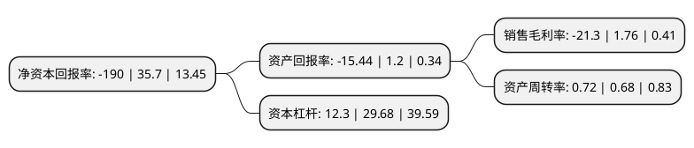

> 本页面由自动化程序生成于 2022年5月20日 01:02
> 内容可能存在错误，如有bug请提交issue至：https://github.com/Eroleice/doc-pi/issues
{.is-warning}

# 上市公司基本情况

## 基本资料

学大(厦门)教育科技集团股份有限公司（以下简称“学大教育”）成立于1992年07月02日，厦门市。于1993年11月01日在深交所主板上市。

学大教育注册资本11,776.271万元，主营业务:教育服务业。以下是详细信息：

- 公司名称: 学大(厦门)教育科技集团股份有限公司
- 股票代码: 000526.SZ
- 所在地: 福建 - 厦门市
- 成立日期: 1992年07月02日
- 注册资本: 11,776.271万元
- 法定代表人: 吴胜武
- 主营业务: 主营业务:教育服务业
- 公司官网: null
- 公司介绍: 公司主营业务为教育服务业。主要服务对象为国内K12有课外辅导需求的学生，服务模式以“一对一”教学辅导为主。公司拥有行业领先的教学管理体系和教研资源平台，在“教研+”战略的引领下，持续打造高水平的教师队伍和丰富的课程体系，不断提升教学质量和教学效果。公司建立了强大的跨境业务管理体系，通过自主开发的PPTS业务管理系统、BI业务分析等系统，全面管理全国学习中心的日常教学和运营。

## 股东及高管情况

上市公司第一大股东为西藏紫光卓远股权投资有限公司，持股15,000,000股，占比12.74%，**疑似为**上市公司实际控制人。

截至2022年03月31日，上市公司的前十大股东中，共有1名自然人股东，7名机构股东，1个产品账户，1个海外主体，其中5%以上大股东共有4名。上市公司前十大股东明细如下：

> 未能通过持股比例判定出上市公司实际控制人（持股30%以上）
> 可能存在通过间接持股、联合持股、协议控制等方式拥有实际控制权的主体，具体请参考上市公司定期公告！
{.is-warning}

> 截至2022年03月31日，上市公司前十大股东信息如下：

| 股东名称 | 持股数量（股） | 持股比例 |
| --- | --- | --- |
| 西藏紫光卓远股权投资有限公司 | 15,000,000 | 12.74% |
| 浙江台州椰林湾投资策划有限公司 | 12,438,544 | 10.56% |
| 天津安特文化传播有限公司 | 10,591,672 | 8.99% |
| 天津晋丰文化传播有限公司 | 5,995,328 | 5.09% |
| 北京紫光通信科技集团有限公司 | 4,950,438 | 4.2% |
| 天瓴(北京)投资管理有限公司-天瓴21号大类资产配置私募证券投资基金 | 4,442,670 | 3.77% |
| 紫光集团有限公司 | 2,101,181 | 1.78% |
| UBS   AG | 2,000,436 | 1.7% |
| 俞晴 | 1,500,000 | 1.27% |
| 天津瑜安企业管理合伙企业(有限合伙) | 1,299,800 | 1.1% |

## 杜邦分析

> 数据列示周期：2021年 | 2020年 | 2019年
{.is-info}

上市公司的净资产收益率在近一年有所下降，下降幅度为-632.21%，其变化情况分解如下：
- 上市公司的销售毛利率在近一年下降了-1310.23%，可能是生产效率的下降、商品原材料价格上涨或商品价格的下跌所致。
- 上市公司的资产周转率在近一年上升了5.88%，可能是源自于更快的销售回款或库存管理效果提升。
- 上市公司的财务杠杆比率在近一年下降了-58.56%，可能是减少负债降低财务费用。

