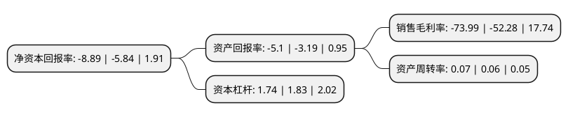

> 本页面由自动化程序生成于 2022年5月20日 01:02
> 内容可能存在错误，如有bug请提交issue至：https://github.com/Eroleice/doc-pi/issues
{.is-warning}

# 上市公司基本情况

## 基本资料

莱茵达体育发展股份有限公司（以下简称“莱茵体育”）成立于1988年03月31日，杭州市。于1994年05月09日在深交所主板上市。

莱茵体育注册资本128,922.395万元，主要业务:房地产开发与销售。以下是详细信息：

- 公司名称: 莱茵达体育发展股份有限公司
- 股票代码: 000558.SZ
- 所在地: 浙江 - 杭州市
- 成立日期: 1988年03月31日
- 注册资本: 128,922.395万元
- 法定代表人: 胥亚斌
- 主营业务: 房地产开发与销售
- 公司官网: www.lander.com.cn
- 公司介绍: 公司以“蓝天白云下让人们健康快乐地生活”为企业愿景，以“416战略”为企业发展战略，即遵循体育市场化、国际化、网络化、证券化的“四化”方针，在全球范围内布局体育空间、体育赛事、体育金融、体育教育、体育网络、体育传媒六大平台，致力于打造一个由若干企业集群组成的融合发展的体育产业生态圈。以“空间+内容”的商业模式为核心，目前已构筑起一个具备上游IP资源、中游运营服务体系、下游多渠道变现通道的莱茵体育生态圈。公司积极探索，成绩显著，已初步形成了以六大平台为核心的体育产业生态圈。未来，公司将加速实现现代卓越企业的跨越，以发展体育产业为己任，稳健布局，深耕细作，为实现“蓝天白云下让人们健康快乐地生活”的美好愿景而努力。

## 股东及高管情况

上市公司第一大股东为成都体育产业投资集团有限责任公司，持股385,477,961股，占比29.9%，**疑似为**上市公司实际控制人。

截至2022年03月31日，上市公司的前十大股东中，共有5名自然人股东，3名机构股东，2个产品账户，其中5%以上大股东共有2名。上市公司前十大股东明细如下：

> 未能通过持股比例判定出上市公司实际控制人（持股30%以上）
> 可能存在通过间接持股、联合持股、协议控制等方式拥有实际控制权的主体，具体请参考上市公司定期公告！
{.is-warning}

> 截至2022年03月31日，上市公司前十大股东信息如下：

| 股东名称 | 持股数量（股） | 持股比例 |
| --- | --- | --- |
| 成都体育产业投资集团有限责任公司 | 385,477,961 | 29.9% |
| 莱茵达控股集团有限公司 | 125,380,000 | 9.73% |
| 高靖娜 | 57,760,000 | 4.48% |
| 赵睿 | 6,000,000 | 0.47% |
| 柯敏 | 4,514,400 | 0.35% |
| 华泰证券股份有限公司 | 3,265,792 | 0.25% |
| 刘俊杰 | 3,207,050 | 0.25% |
| 吴卫东 | 3,020,000 | 0.23% |
| 中国工商银行股份有限公司-南方中证全指房地产交易型开放式指数证券投资基金 | 2,839,800 | 0.22% |
| 华夏基金-中央汇金资产管理有限责任公司-华夏基金-汇金资管单一资产管理计划 | 2,651,000 | 0.21% |

## 利润表分析

上市公司2021年总收入为1.4亿元，净利润为-1.05亿元，**未实现盈利**。

## 杜邦分析

> 数据列示周期：2021年 | 2020年 | 2019年
{.is-info}

上市公司的净资产收益率在近一年有所上升，上升幅度为52.23%，其变化情况分解如下：
- 上市公司的销售毛利率在近一年上升了41.53%，可能是生产效率的提升、商品原材料价格下跌或商品价格的上涨所致。
- 上市公司的资产周转率在近一年上升了16.67%，可能是源自于更快的销售回款或库存管理效果提升。
- 上市公司的财务杠杆比率在近一年下降了-4.92%，可能是减少负债降低财务费用。

