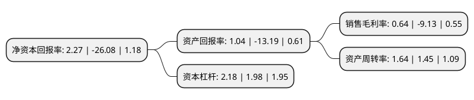

> 本页面由自动化程序生成于 2022年5月20日 01:06
> 内容可能存在错误，如有bug请提交issue至：https://github.com/Eroleice/doc-pi/issues
{.is-warning}

# 上市公司基本情况

## 基本资料

广博集团股份有限公司（以下简称“广博股份”）成立于1996年10月30日，宁波市。于2007年01月10日在深交所中小板上市。

广博股份注册资本53,427.295万元，主营业务:以纸制品文具为主的文化用品的生产和销售以下是详细信息：

- 公司名称: 广博集团股份有限公司
- 股票代码: 002103.SZ
- 所在地: 浙江 - 宁波市
- 成立日期: 1996年10月30日
- 注册资本: 53,427.295万元
- 法定代表人: 王利平
- 主营业务: 主营业务:以纸制品文具为主的文化用品的生产和销售
- 公司官网: www.guangbo.net
- 公司介绍: 公司原是一家集办公文具、印刷纸品、塑胶制品和进出口贸易等为一体的现代企业集团，自2014年底开始重大资产重组，并于2015年5月完成了对于西藏山南灵云传媒有限公司的收购。目前公司从事文具及办公用品的生产和销售以及互联网营销与服务两大业务。公司的文具以及办公用品业务具体包括各类本、账簿、相册、记事本、名片册及其它办公文具，属于日用消费品产品，直接服务于文化学习、办公及家居生活，是文教体育用品行业的重要分支。互联网营销与服务版块主要是为广告主提供广告代理、策略制定、优化建议等服务，业务涵盖导航网站服务业务、女性时尚网站品牌广告业务和特价导购业务等。

## 股东及高管情况

上市公司第一大股东为王利平，持股122,987,603股，占比23.02%，**疑似为**上市公司实际控制人。

截至2022年03月31日，上市公司的前十大股东中，共有6名自然人股东，3名机构股东，1个产品账户，其中5%以上大股东共有5名。上市公司前十大股东明细如下：

> 未能通过持股比例判定出上市公司实际控制人（持股30%以上）
> 可能存在通过间接持股、联合持股、协议控制等方式拥有实际控制权的主体，具体请参考上市公司定期公告！
{.is-warning}

> 截至2022年03月31日，上市公司前十大股东信息如下：

| 股东名称 | 持股数量（股） | 持股比例 |
| --- | --- | --- |
| 王利平 | 122,987,603 | 23.02% |
| 任杭中 | 59,201,632 | 11.08% |
| 广博控股集团有限公司 | 35,558,287 | 6.66% |
| 宁波兆晖泰商贸有限公司 | 28,104,062 | 5.26% |
| 王君平 | 27,407,786 | 5.13% |
| 上海迎水投资管理有限公司-迎水安枕飞天3号私募证券投资基金 | 2,532,800 | 0.47% |
| 赵水菊 | 2,216,300 | 0.41% |
| 蒋华英 | 1,210,000 | 0.23% |
| 王亚男 | 1,204,500 | 0.23% |
| 宁波广昇联商贸有限公司 | 1,062,000 | 0.2% |

## 利润表分析

上市公司2021年总收入为28.43亿元，净利润为0.18亿元，实现盈利。

## 杜邦分析

> 数据列示周期：2021年 | 2020年 | 2019年
{.is-info}

上市公司的净资产收益率在近一年有所下降，下降幅度为-108.7%，其变化情况分解如下：
- 上市公司的销售毛利率在近一年下降了-107.01%，可能是生产效率的下降、商品原材料价格上涨或商品价格的下跌所致。
- 上市公司的资产周转率在近一年上升了13.1%，可能是源自于更快的销售回款或库存管理效果提升。
- 上市公司的财务杠杆比率在近一年上升了10.1%，可能是增加负债扩大生产规模。

