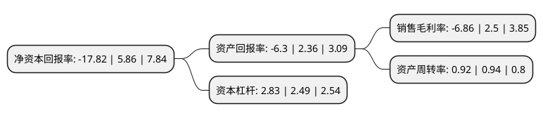

> 本页面由自动化程序生成于 2022年5月20日 01:07
> 内容可能存在错误，如有bug请提交issue至：https://github.com/Eroleice/doc-pi/issues
{.is-warning}

# 上市公司基本情况

## 基本资料

深圳齐心集团股份有限公司（以下简称“齐心集团”）成立于2000年01月12日，深圳市。于2009年10月21日在深交所中小板上市。

齐心集团注册资本73,402.01万元，办公用品，办公设备的研发，生产和销售，主要产品类别包括文件管理用品，办公设备，桌面文具等的研发，生产和销售。以下是详细信息：

- 公司名称: 深圳齐心集团股份有限公司
- 股票代码: 002301.SZ
- 所在地: 广东 - 深圳市
- 成立日期: 2000年01月12日
- 注册资本: 73,402.01万元
- 法定代表人: 陈钦鹏
- 主营业务: 办公用品，办公设备的研发，生产和销售，主要产品类别包括文件管理用品，办公设备，桌面文具等的研发，生产和销售
- 公司官网: www.qx.com
- 公司介绍: 公司是为企业提供现代办公整体解决方案的服务商，主营业务围绕大办公产业链所涵盖的硬件、软件和服务等多个领域。公司始终坚持以企业级客户需求为导向，秉持“夯实主业、打造平台、布局生态”的发展战略，构建“硬件+软件+服务”的企业级综合办公服务平台，逐步打造办公行业的企业级生态圈。基于齐心大办公服务平台，公司以卓越的产业链整合能力，为客户提供高效办公整体解决方案和服务，提供B2B、O2O、LINK、API等多种聚合平台接入模式，为客户提供一站式精准化对接，有效降低综合办公成本，提高集采效率。公司积极发展SAAS业务，通过全资收购杭州麦苗、银澎云计算，重点布局大数据营销、云视频会议；通过参股阳光印网、犀思云、神州云动和大贲科技等公司，分别进入在线印刷、云计算服务、SAAS CRM(软件即服务客户关系管理模式)和财税SAAS领域。公司通过不断完善SAAS细分领域业务布局，深化和丰富企业级大办公集成服务内容，进一步推进齐心“大办公”战略。

## 股东及高管情况

上市公司第一大股东为深圳市齐心控股有限公司，持股247,845,097股，占比33.77%，为上市公司实际控制人。

截至2022年03月31日，上市公司的前十大股东中，共有2名自然人股东，4名机构股东，4个产品账户，其中5%以上大股东共有1名。上市公司前十大股东明细如下：

> 截至2022年03月31日，上市公司前十大股东信息如下：

| 股东名称 | 持股数量（股） | 持股比例 |
| --- | --- | --- |
| 深圳市齐心控股有限公司 | 247,845,097 | 33.77% |
| 陈钦武 | 36,000,000 | 4.9% |
| 全国社保基金六零四组合 | 33,849,678 | 4.61% |
| 陈钦徽 | 21,600,000 | 2.94% |
| 泰康人寿保险有限责任公司-分红-个人分红-019L-FH002深 | 18,398,577 | 2.51% |
| 珠海格力金融投资管理有限公司 | 11,061,804 | 1.51% |
| 上海利檀投资管理有限公司-利檀诚同私募证券投资基金 | 9,970,000 | 1.36% |
| 深圳市德远投资有限公司-德远精选12号私募证券投资基金 | 8,250,000 | 1.12% |
| 全国社保基金一零三组合 | 8,000,003 | 1.09% |
| 宁波梅山保税港区东芷投资合伙企业(有限合伙) | 7,339,429 | 1% |

## 利润表分析

上市公司2021年总收入为82.36亿元，净利润为-5.66亿元，**未实现盈利**。

## 杜邦分析

> 数据列示周期：2021年 | 2020年 | 2019年
{.is-info}

上市公司的净资产收益率在近一年有所下降，下降幅度为-404.1%，其变化情况分解如下：
- 上市公司的销售毛利率在近一年下降了-374.4%，可能是生产效率的下降、商品原材料价格上涨或商品价格的下跌所致。
- 上市公司的资产周转率在近一年下降了-2.13%，可能是源自于更慢的销售回款或库存管理效果下降。
- 上市公司的财务杠杆比率在近一年上升了13.65%，可能是增加负债扩大生产规模。

