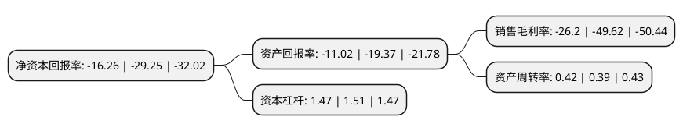

> 本页面由自动化程序生成于 2022年5月20日 01:08
> 内容可能存在错误，如有bug请提交issue至：https://github.com/Eroleice/doc-pi/issues
{.is-warning}

# 上市公司基本情况

## 基本资料

广东高乐股份有限公司（以下简称“高乐股份”）成立于1989年10月14日，揭阳市。于2010年02月03日在深交所中小板上市。

高乐股份注册资本94,720万元，主营业务:玩具及相关业务，互联网教育业务以下是详细信息：

- 公司名称: 广东高乐股份有限公司
- 股票代码: 002348.SZ
- 所在地: 广东 - 揭阳市
- 成立日期: 1989年10月14日
- 注册资本: 94,720万元
- 法定代表人: 杨旭恩
- 主营业务: 主营业务:玩具及相关业务，互联网教育业务
- 公司官网: www.高乐股份.com
- 公司介绍: 公司是玩具行业中拥有自主品牌、研发能力强、销售网络广泛、生产技术处于行业领先地位的企业之一，为国内电子电动塑胶玩具出口龙头企业之一，公司自有的“GOLDLOK”品牌享有较高市场知名度。近年来，公司在原有业务基础上实施战略转型，通过全资收购并增资高乐教育、控股收购并增资异度信息，以K12智慧教育为突破口，深入布局互联网教育平台开发运营、软硬件产品研发及教育信息化系统集成等业务，形成“玩具+互联网教育”双主营业务协同发展新格局。公司致力于通过内生增长与外延扩张双轮驱动，巩固玩具行业竞争优势，力争成为智慧教育领跑者，持续促进双主业稳健发展，不断优化资产结构和业务布局，打造一个长期可持续发展的产业集团，助力中国新生代美好生活。

## 股东及高管情况

上市公司第一大股东为兴昌塑胶五金厂有限公司，持股177,660,600股，占比18.7564%，**疑似为**上市公司实际控制人。

截至2022年03月31日，上市公司的前十大股东中，共有6名自然人股东，4名机构股东，其中5%以上大股东共有5名。上市公司前十大股东明细如下：

> 未能通过持股比例判定出上市公司实际控制人（持股30%以上）
> 可能存在通过间接持股、联合持股、协议控制等方式拥有实际控制权的主体，具体请参考上市公司定期公告！
{.is-warning}

> 截至2022年03月31日，上市公司前十大股东信息如下：

| 股东名称 | 持股数量（股） | 持股比例 |
| --- | --- | --- |
| 兴昌塑胶五金厂有限公司 | 177,660,600 | 18.7564% |
| 興昌塑膠五金廠有限公司 | 177,660,600 | 18.76% |
| 杨广城 | 77,630,868 | 8.2% |
| 杨广城 | 77,630,868 | 8.2% |
| 普宁市新鸿辉实业投资有限公司 | 51,701,101 | 5.46% |
| 陈冰纯 | 46,318,080 | 4.89% |
| 王彦成 | 8,837,600 | 0.93% |
| 普宁市园林文化用品有限公司 | 6,400,000 | 0.68% |
| 李凤燕 | 4,484,300 | 0.47% |
| 张子和 | 3,125,916 | 0.33% |

## 利润表分析

上市公司2021年总收入为4.39亿元，净利润为-1.16亿元，**未实现盈利**。

## 杜邦分析

> 数据列示周期：2021年 | 2020年 | 2019年
{.is-info}

上市公司的净资产收益率在近一年有所下降，下降幅度为-44.41%，其变化情况分解如下：
- 上市公司的销售毛利率在近一年下降了-47.2%，可能是生产效率的下降、商品原材料价格上涨或商品价格的下跌所致。
- 上市公司的资产周转率在近一年上升了7.69%，可能是源自于更快的销售回款或库存管理效果提升。
- 上市公司的财务杠杆比率在近一年下降了-2.65%，可能是减少负债降低财务费用。

