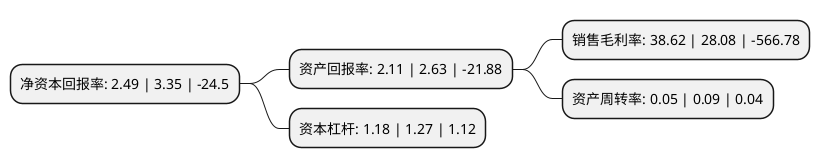

> 本页面由自动化程序生成于 2022年5月20日 01:10
> 内容可能存在错误，如有bug请提交issue至：https://github.com/Eroleice/doc-pi/issues
{.is-warning}

# 上市公司基本情况

## 基本资料

广东群兴玩具股份有限公司（以下简称“*ST群兴”）成立于1996年09月02日，汕头市。于2011年04月22日在深交所中小板上市。

*ST群兴注册资本61,872万元，电子电动玩具的研发设计，生产及销售业务。主要产品为电子电动玩具，共分五大种类，包括童车，电脑学习机，婴童玩具，电动车，玩具手机，每个种类包含多个款式及规格，当前公司玩具产品有数百个款式，产品规格总数达到1，218款。以下是详细信息：

- 公司名称: 广东群兴玩具股份有限公司
- 股票代码: 002575.SZ
- 所在地: 广东 - 汕头市
- 成立日期: 1996年09月02日
- 注册资本: 61,872万元
- 法定代表人: 张金成
- 主营业务: 电子电动玩具的研发设计，生产及销售业务主要产品为电子电动玩具，共分五大种类，包括童车，电脑学习机，婴童玩具，电动车，玩具手机，每个种类包含多个款式及规格，当前公司玩具产品有数百个款式，产品规格总数达到1，218款
- 公司官网: www.sz002575.com
- 公司介绍: 公司是国内最大的自主品牌电子电动玩具企业之一，公司的主营业务是电子电动玩具的研发设计、生产及销售业务。公司被广东省科学技术厅认定为“民营科技企业”、“广东省创新型试点企业”、“广东省工程技术研究开发中心”；公司被科学技术部认定为“国家火炬计划汕头澄海智能玩具创意设计与制造产业基地骨干企业”；公司被广东省企业联合会、广东省企业家协会认定为“广东省自主创新标杆企业”；公司被广东省经济和信息化委员会认定为“广东省省级企业技术中心”。

## 股东及高管情况

上市公司第一大股东为深圳星河数据科技有限公司，持股50,470,000股，占比8.16%，**疑似为**上市公司实际控制人。

截至2022年03月31日，上市公司的前十大股东中，共有8名自然人股东，2名机构股东，其中5%以上大股东共有1名。上市公司前十大股东明细如下：

> 未能通过持股比例判定出上市公司实际控制人（持股30%以上）
> 可能存在通过间接持股、联合持股、协议控制等方式拥有实际控制权的主体，具体请参考上市公司定期公告！
{.is-warning}

> 上市公司第一大股东持股不超过10%，请检查是否存在公司控制权风险！
{.is-danger}

> 截至2022年03月31日，上市公司前十大股东信息如下：

| 股东名称 | 持股数量（股） | 持股比例 |
| --- | --- | --- |
| 深圳星河数据科技有限公司 | 50,470,000 | 8.16% |
| 吴永海 | 29,656,292 | 4.79% |
| 郑凯松 | 28,931,100 | 4.68% |
| 张馨 | 28,753,900 | 4.65% |
| 黄锐富 | 23,831,600 | 3.85% |
| 张金成 | 17,094,000 | 2.76% |
| 北京星恒动影文化传播有限公司 | 15,000,000 | 2.42% |
| 陶悦明 | 11,591,700 | 1.87% |
| 缪顺荣 | 10,364,282 | 1.68% |
| 周茹萍 | 10,144,000 | 1.64% |

## 杜邦分析

> 数据列示周期：2021年 | 2020年 | 2019年
{.is-info}

上市公司的净资产收益率在近一年有所下降，下降幅度为-25.67%，其变化情况分解如下：
- 上市公司的销售毛利率在近一年上升了37.54%，可能是生产效率的提升、商品原材料价格下跌或商品价格的上涨所致。
- 上市公司的资产周转率在近一年下降了-44.44%，可能是源自于更慢的销售回款或库存管理效果下降。
- 上市公司的财务杠杆比率在近一年下降了-7.09%，可能是减少负债降低财务费用。

