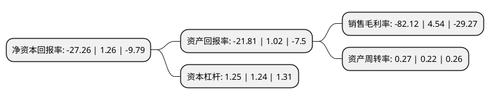

> 本页面由自动化程序生成于 2022年5月20日 01:10
> 内容可能存在错误，如有bug请提交issue至：https://github.com/Eroleice/doc-pi/issues
{.is-warning}

# 上市公司基本情况

## 基本资料

东莞勤上光电股份有限公司（以下简称“勤上股份”）成立于1994年11月07日，东莞市。于2011年11月25日在深交所中小板上市。

勤上股份注册资本150,615.669万元，主营业务是教育产业和半导体照明产业。以下是详细信息：

- 公司名称: 东莞勤上光电股份有限公司
- 股票代码: 002638.SZ
- 所在地: 广东 - 东莞市
- 成立日期: 1994年11月07日
- 注册资本: 150,615.669万元
- 法定代表人: 梁金成
- 主营业务: 主营业务是教育产业和半导体照明产业
- 公司官网: www.kingsun-china.com
- 公司介绍: 公司是国内领先的半导体照明产品和综合解决方案提供商。主营业务为LED功能照明。公司参与国家及省部委多项重大科研项目，并相继获得了广东省重大科技专项、广东省工业攻关科技计划、国家“863计划”和工信部电子信息产业基金的支持，并承担“太阳能路灯千村计划”和“半导体照明产品应用示范工程”等国家级重点项目。经过多年的沉淀与发展，公司已经奠定了在LED照明领域的行业地位，并跟随行业发展的大趋势，适时换轨、转型，合理利用自身优势，进入到能够持续为企业带来新成长动能的产业。

## 股东及高管情况

上市公司第一大股东为东莞勤上集团有限公司，持股254,965,370股，占比16.93%，**疑似为**上市公司实际控制人。

截至2022年03月31日，上市公司的前十大股东中，共有6名自然人股东，2名机构股东，2个产品账户，其中5%以上大股东共有4名。上市公司前十大股东明细如下：

> 未能通过持股比例判定出上市公司实际控制人（持股30%以上）
> 可能存在通过间接持股、联合持股、协议控制等方式拥有实际控制权的主体，具体请参考上市公司定期公告！
{.is-warning}

> 截至2022年03月31日，上市公司前十大股东信息如下：

| 股东名称 | 持股数量（股） | 持股比例 |
| --- | --- | --- |
| 东莞勤上集团有限公司 | 254,965,370 | 16.93% |
| 华夏人寿保险股份有限公司-万能产品 | 169,312,168 | 11.24% |
| 李旭亮 | 88,183,421 | 5.85% |
| 杨勇 | 82,081,128 | 5.45% |
| 李淑贤 | 70,546,737 | 4.68% |
| 梁惠棠 | 63,492,063 | 4.22% |
| 华夏人寿保险股份有限公司-自有资金 | 45,559,978 | 3.02% |
| 黄灼光 | 19,009,523 | 1.26% |
| 张晶 | 17,636,684 | 1.17% |
| 东莞勤上光电股份有限公司-第1期员工持股计划 | 12,736,507 | 0.85% |

## 杜邦分析

> 数据列示周期：2021年 | 2020年 | 2019年
{.is-info}

上市公司的净资产收益率在近一年有所下降，下降幅度为-2263.49%，其变化情况分解如下：
- 上市公司的销售毛利率在近一年下降了-1908.81%，可能是生产效率的下降、商品原材料价格上涨或商品价格的下跌所致。
- 上市公司的资产周转率在近一年上升了22.73%，可能是源自于更快的销售回款或库存管理效果提升。
- 上市公司的财务杠杆比率在近一年上升了0.81%，可能是增加负债扩大生产规模。

