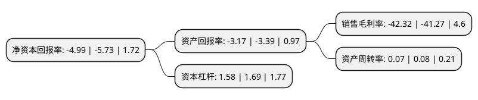

> 本页面由自动化程序生成于 2022年5月20日 01:11
> 内容可能存在错误，如有bug请提交issue至：https://github.com/Eroleice/doc-pi/issues
{.is-warning}

# 上市公司基本情况

## 基本资料

北京凯文德信教育科技股份有限公司（以下简称“凯文教育”）成立于1999年03月26日，北京市。于2012年03月09日在深交所中小板上市。

凯文教育注册资本59,828.038万元，公司主营业务为教育及教育相关产业。以下是详细信息：

- 公司名称: 北京凯文德信教育科技股份有限公司
- 股票代码: 002659.SZ
- 所在地: 北京 - 北京市
- 成立日期: 1999年03月26日
- 注册资本: 59,828.038万元
- 法定代表人: 王慰卿
- 主营业务: 公司主营业务为教育及教育相关产业
- 公司官网: www.kaiwenedu.com
- 公司介绍: 公司原是一个具有国家一级资质的国内桥梁钢结构制作领域的龙头企业。目前公司主营业务为教育及教育相关产业，未来将集中资源大力推进教育业务发展。公司紧紧围绕实体学校加上下游生态产业的战略进行布局，以实体学校+体育培训+营地教育+品牌输出为经营模式，充分利用上市公司平台，通过内部资源整合、强强联合与外部延伸并重的模式取得行业领先地位。公司以实体学校获得资源背景、品牌效应与受众群体，以体育培训、营地教育、品牌输出与上下游培训为盈利点。

## 股东及高管情况

上市公司第一大股东为八大处控股集团有限公司，持股172,519,294股，占比28.84%，**疑似为**上市公司实际控制人。

截至2022年03月31日，上市公司的前十大股东中，共有5名自然人股东，5名机构股东，其中5%以上大股东共有1名。上市公司前十大股东明细如下：

> 未能通过持股比例判定出上市公司实际控制人（持股30%以上）
> 可能存在通过间接持股、联合持股、协议控制等方式拥有实际控制权的主体，具体请参考上市公司定期公告！
{.is-warning}

> 截至2022年03月31日，上市公司前十大股东信息如下：

| 股东名称 | 持股数量（股） | 持股比例 |
| --- | --- | --- |
| 八大处控股集团有限公司 | 172,519,294 | 28.84% |
| 广州华美未来教育咨询服务有限公司 | 7,841,000 | 1.31% |
| 北京市海淀区国有资产投资经营有限公司 | 6,964,800 | 1.16% |
| 晁锦苹 | 6,907,713 | 1.15% |
| 北京京鲁兴业投资有限公司 | 6,449,754 | 1.08% |
| 江苏环宇投资发展有限公司 | 5,414,795 | 0.91% |
| 刘绍 | 4,716,400 | 0.79% |
| 陆元元 | 4,293,620 | 0.72% |
| 郑珍 | 3,614,994 | 0.6% |
| 李景涛 | 3,609,800 | 0.6% |

## 利润表分析

上市公司2021年总收入为2.84亿元，净利润为-1.21亿元，**未实现盈利**。

## 杜邦分析

> 数据列示周期：2021年 | 2020年 | 2019年
{.is-info}

上市公司的净资产收益率在近一年有所下降，下降幅度为-12.91%，其变化情况分解如下：
- 上市公司的销售毛利率在近一年上升了2.54%，可能是生产效率的提升、商品原材料价格下跌或商品价格的上涨所致。
- 上市公司的资产周转率在近一年下降了-12.5%，可能是源自于更慢的销售回款或库存管理效果下降。
- 上市公司的财务杠杆比率在近一年下降了-6.51%，可能是减少负债降低财务费用。

