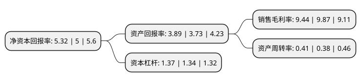

> 本页面由自动化程序生成于 2022年5月20日 01:11
> 内容可能存在错误，如有bug请提交issue至：https://github.com/Eroleice/doc-pi/issues
{.is-warning}

# 上市公司基本情况

## 基本资料

广州珠江钢琴集团股份有限公司（以下简称“珠江钢琴”）成立于1987年10月10日，广州市。于2012年05月30日在深交所中小板上市。

珠江钢琴注册资本135,832.032万元，公司集钢琴研发，生产，销售与服务为一体，倡导钢琴，数码钢琴和音乐文化教育共发展，主要从事恺撒堡，珠江，里特米勒，京珠等自主品牌钢琴的研发，生产，销售及服务，产品包含立式钢琴，三角钢琴两大系列共三百多种型号，涵盖高档，中档和普及型各系列钢琴。主要产品是钢琴以下是详细信息：

- 公司名称: 广州珠江钢琴集团股份有限公司
- 股票代码: 002678.SZ
- 所在地: 广东 - 广州市
- 成立日期: 1987年10月10日
- 注册资本: 135,832.032万元
- 法定代表人: 李建宁
- 主营业务: 公司集钢琴研发，生产，销售与服务为一体，倡导钢琴，数码钢琴和音乐文化教育共发展，主要从事恺撒堡，珠江，里特米勒，京珠等自主品牌钢琴的研发，生产，销售及服务，产品包含立式钢琴，三角钢琴两大系列共三百多种型号，涵盖高档，中档和普及型各系列钢琴主要产品是钢琴
- 公司官网: www.pearlriverpiano.com
- 公司介绍: 公司成立于1956年，是一家集钢琴、数码乐器、音乐教育、文化传媒协同发展的综合乐器文化企业，是A股整体上市的乐器文化集团，具有国际先进水平的产品创新能力和全球规模最大的钢琴产销能力，曾荣获“首批制造业单项冠军示范企业”、“国家文化产业示范基地”、“国家创新型试点企业”、“全国质量管理卓越企业”、“国家文化出口重点企业”、“国家AAAA级标准化良好行为企业”等荣誉称号，是荣获“全国质量奖”、“广东省政府质量奖”的质量效益型企业，以及荣获国际音乐制品协会“里程碑”奖、“特别贡献奖”等荣誉的民族乐器企业，已形成三大业务板块、四大产业基地的国际化运营格局，形成了实质的跨国运营企业、多元业务联动发展的综合乐器文化平台。

## 股东及高管情况

上市公司第一大股东为广州市城市建设投资集团有限公司，持股692,743,365股，占比51%，为上市公司实际控制人。

截至2022年05月18日，上市公司的前十大股东中，共有4名自然人股东，5名机构股东，1名其他股东，其中5%以上大股东共有4名。上市公司前十大股东明细如下：

> 截至2022年05月18日，上市公司前十大股东信息如下：

| 股东名称 | 持股数量（股） | 持股比例 |
| --- | --- | --- |
| 广州市城市建设投资集团有限公司 | 692,743,365 | 51% |
| 广州市城市建设投资集团有限公司 | 692,743,365 | 51% |
| 广州产业投资控股集团有限公司 | 222,776,955 | 16.4% |
| 广东省财政厅 | 101,724,480 | 7.49% |
| 广州新华城市发展产业投资企业(有限合伙) | 63,414,633 | 4.67% |
| 广州国寿城市发展产业投资企业(有限合伙) | 52,105,690 | 3.84% |
| 陈梅金 | 4,807,900 | 0.35% |
| 陈金娇 | 4,124,291 | 0.3% |
| 林赛华 | 3,947,782 | 0.29% |
| 杨平 | 3,892,823 | 0.29% |

## 利润表分析

上市公司2021年总收入为20.2亿元，净利润为1.9亿元，实现盈利。

## 杜邦分析

> 数据列示周期：2021年 | 2020年 | 2019年
{.is-info}

上市公司的净资产收益率在近一年有所上升，上升幅度为6.4%，其变化情况分解如下：
- 上市公司的销售毛利率在近一年下降了-4.36%，可能是生产效率的下降、商品原材料价格上涨或商品价格的下跌所致。
- 上市公司的资产周转率在近一年上升了7.89%，可能是源自于更快的销售回款或库存管理效果提升。
- 上市公司的财务杠杆比率在近一年上升了2.24%，可能是增加负债扩大生产规模。

