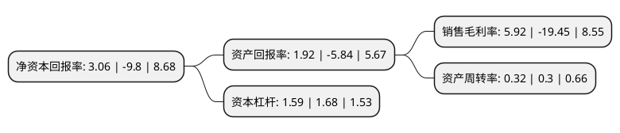

> 本页面由自动化程序生成于 2022年5月20日 01:12
> 内容可能存在错误，如有bug请提交issue至：https://github.com/Eroleice/doc-pi/issues
{.is-warning}

# 上市公司基本情况

## 基本资料

上海力盛赛车文化股份有限公司（以下简称“力盛赛车”）成立于2002年10月16日，上海市。于2017年03月24日在深交所中小板上市。

力盛赛车注册资本15,992.584万元，主要从事赛事运营，赛车队，赛车场经营与汽车活动推广业务。以下是详细信息：

- 公司名称: 上海力盛赛车文化股份有限公司
- 股票代码: 002858.SZ
- 所在地: 上海 - 上海市
- 成立日期: 2002年10月16日
- 注册资本: 15,992.584万元
- 法定代表人: 夏青
- 主营业务: 主要从事赛事运营，赛车队，赛车场经营与汽车活动推广业务
- 公司官网: www.lsracing.cn
- 公司介绍: 公司是中国领先的汽车运动运营商，是一家以赛事运营为核心、赛车场和赛车队为载体，为客户提供汽车运动全产业链服务的体育文化企业。公司主要从事赛事运营，赛车队、赛车场经营及汽车活动推广业务，公司为中国房车锦标赛、中国卡丁车锦标赛(含青少年)、中国超级跑车锦标赛的独家运营商，承办世界房车锦标赛中国站，举办华夏赛车大奖赛、POLOCUP中国挑战赛、天马论驾、TMC-房车大师挑战赛、风云赛道嘉年华，经营上海大众333车队、上海大众斯柯达红牛车队、上海星之路车队、宝俊车队以及上海天马赛车场、广东国际赛车场。

## 股东及高管情况

上市公司第一大股东为夏青，持股26,030,000股，占比16.28%，**疑似为**上市公司实际控制人。

截至2022年04月18日，上市公司的前十大股东中，共有6名自然人股东，3名机构股东，1个产品账户，其中5%以上大股东共有5名。上市公司前十大股东明细如下：

> 未能通过持股比例判定出上市公司实际控制人（持股30%以上）
> 可能存在通过间接持股、联合持股、协议控制等方式拥有实际控制权的主体，具体请参考上市公司定期公告！
{.is-warning}

> 截至2022年04月18日，上市公司前十大股东信息如下：

| 股东名称 | 持股数量（股） | 持股比例 |
| --- | --- | --- |
| 夏青 | 26,030,000 | 16.28% |
| 夏青 | 26,030,000 | 16.28% |
| 夏青 | 26,030,000 | 16.28% |
| 上海赛赛投资有限公司 | 16,650,800 | 10.4116% |
| 上海赛赛投资有限公司 | 16,277,800 | 10.1783% |
| 粤民投慧桥贰号(深圳)投资合伙企业(有限合伙) | 4,302,925 | 2.69% |
| 曹传德 | 4,225,000 | 2.64% |
| 蒙森(上海)投资管理有限公司-蒙森虎步一号私募证券投资基金 | 2,581,755 | 1.61% |
| 周学群 | 2,135,100 | 1.34% |
| 谢恺 | 1,908,800 | 1.19% |

## 利润表分析

上市公司2021年总收入为2.8亿元，净利润为0.16亿元，实现盈利。

## 杜邦分析

> 数据列示周期：2021年 | 2020年 | 2019年
{.is-info}

上市公司的净资产收益率在近一年有所下降，下降幅度为-131.22%，其变化情况分解如下：
- 上市公司的销售毛利率在近一年下降了-130.44%，可能是生产效率的下降、商品原材料价格上涨或商品价格的下跌所致。
- 上市公司的资产周转率在近一年上升了6.67%，可能是源自于更快的销售回款或库存管理效果提升。
- 上市公司的财务杠杆比率在近一年下降了-5.36%，可能是减少负债降低财务费用。

