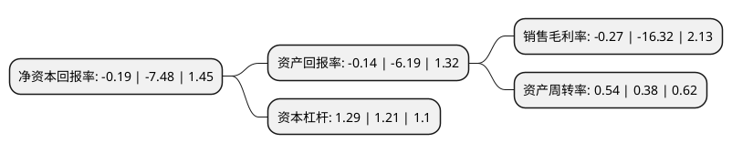

> 本页面由自动化程序生成于 2022年5月20日 01:12
> 内容可能存在错误，如有bug请提交issue至：https://github.com/Eroleice/doc-pi/issues
{.is-warning}

# 上市公司基本情况

## 基本资料

实丰文化发展股份有限公司（以下简称“实丰文化”）成立于1992年09月04日，汕头市。于2017年04月11日在深交所中小板上市。

实丰文化注册资本12,000万元，从事各类玩具的研发设计，生产与销售，主要产品包括电动遥控玩具，婴幼玩具，车模玩具，动漫游戏衍生品玩具和其他玩具等五大类，产品规格品种达1，000多种，产品出口到全球近百个国家和地区。产品从材质上分主要以塑料玩具和合金玩具为主，具体可分为电动遥控玩具，婴幼玩具，车模玩具，动漫游戏衍生品玩具和其他玩具，具备益智，装饰，科教和竞技等多种功能。以下是详细信息：

- 公司名称: 实丰文化发展股份有限公司
- 股票代码: 002862.SZ
- 所在地: 广东 - 汕头市
- 成立日期: 1992年09月04日
- 注册资本: 12,000万元
- 法定代表人: 蔡俊权
- 主营业务: 从事各类玩具的研发设计，生产与销售，主要产品包括电动遥控玩具，婴幼玩具，车模玩具，动漫游戏衍生品玩具和其他玩具等五大类，产品规格品种达1，000多种，产品出口到全球近百个国家和地区产品从材质上分主要以塑料玩具和合金玩具为主，具体可分为电动遥控玩具，婴幼玩具，车模玩具，动漫游戏衍生品玩具和其他玩具，具备益智，装饰，科教和竞技等多种功能
- 公司官网: www.sunfuntoys.com
- 公司介绍: 公司是一家集专业设计、研发、制造、销售为一体的高新技术企业，经过多年的发展，公司凭借其先进的产品制造能力和优秀的产品品质，赢得国内外客户的广泛认同，已建立覆盖全球的市场销售网络，产品远销欧美、中东、东南亚等近百个国家和地区，系列产品进入国外玩具专业连锁店、大型商超和百货公司等终端销售渠道。实丰文化非常重视国内市场营销，在行业内率先开发终端直营渠道，在国内成功已开发“华润万家”、“大润发”等几十家大型优质商超卖场，与“玩具反斗城”、“孩子王”等上百个优质客户保持密切合作关系，形成全国市场销售与服务网点的密集覆盖。公司是国家认定的高业新技术企业、广东省民营科技企业，先后获得“广东省著名商标”、“中国玩具行业十大影响力品牌”等称号。

## 股东及高管情况

上市公司第一大股东为蔡俊权，持股39,763,889股，占比33.14%，为上市公司实际控制人。

截至2022年03月31日，上市公司的前十大股东中，共有10名自然人股东，其中5%以上大股东共有3名。上市公司前十大股东明细如下：

> 截至2022年03月31日，上市公司前十大股东信息如下：

| 股东名称 | 持股数量（股） | 持股比例 |
| --- | --- | --- |
| 蔡俊权 | 39,763,889 | 33.14% |
| 蔡俊淞 | 15,001,200 | 12.5% |
| 陈乐强 | 6,750,000 | 5.63% |
| 蓝尼娜 | 3,166,100 | 2.64% |
| 蔡锦贤 | 2,655,150 | 2.21% |
| 许欢超 | 2,200,000 | 1.83% |
| 谢昭杰 | 1,176,800 | 0.98% |
| 李娟 | 968,800 | 0.81% |
| 黄锐富 | 911,800 | 0.76% |
| 唐存铎 | 876,000 | 0.73% |

## 杜邦分析

> 数据列示周期：2021年 | 2020年 | 2019年
{.is-info}

上市公司的净资产收益率在近一年有所下降，下降幅度为-97.46%，其变化情况分解如下：
- 上市公司的销售毛利率在近一年下降了-98.35%，可能是生产效率的下降、商品原材料价格上涨或商品价格的下跌所致。
- 上市公司的资产周转率在近一年上升了42.11%，可能是源自于更快的销售回款或库存管理效果提升。
- 上市公司的财务杠杆比率在近一年上升了6.61%，可能是增加负债扩大生产规模。

