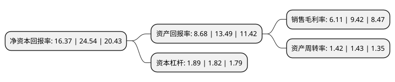

> 本页面由自动化程序生成于 2022年5月20日 01:12
> 内容可能存在错误，如有bug请提交issue至：https://github.com/Eroleice/doc-pi/issues
{.is-warning}

# 上市公司基本情况

## 基本资料

北京元隆雅图文化传播股份有限公司（以下简称“元隆雅图”）成立于1998年05月26日，北京市。于2017年06月06日在深交所中小板上市。

元隆雅图注册资本22,315.327万元，主要产品:公司主要为客户提供促销品以及与促销品有关的仓储运输和电商平台服务。主营业务:本公司是一家专业的促销品提供商。以下是详细信息：

- 公司名称: 北京元隆雅图文化传播股份有限公司
- 股票代码: 002878.SZ
- 所在地: 北京 - 北京市
- 成立日期: 1998年05月26日
- 注册资本: 22,315.327万元
- 法定代表人: 孙震
- 主营业务: 主要产品:公司主要为客户提供促销品以及与促销品有关的仓储运输和电商平台服务主营业务:本公司是一家专业的促销品提供商
- 公司官网: www.ylyato.com
- 公司介绍: 公司是国内卓越的创新型整合营销服务机构。公司以创意研发带动企业发展，以整合营销提升竞争优势，为客户的市场活动提供全面系统的解决方案。公司以设计研发、采购管理与市场终端服务体系作为三大地基工程，以营销策划、物料销售为主营业务，带动整合营销传播、体验营销设计和市场终端执行等全方位专业服务。在配合客户收集整理大量零售市场调研数据的同时，公司对中国零售终端市场进行深度分析思考，积极倡导“战略+执行”的一体化服务模式，将线下整合营销服务提升到战略高度。公司与客户资源共享、优势互补，为客户市场营销策略起到了极大的提升作用，通过与诸多世界五百强企业交互促进，公司专业的服务团队，丰富的运作经验，强大的资质与信誉成为公司业务拓展的基石。

## 股东及高管情况

上市公司第一大股东为元隆雅图(北京)投资有限公司，持股93,840,413股，占比42.05%，为上市公司实际控制人。

截至2022年03月31日，上市公司的前十大股东中，共有7名自然人股东，1名机构股东，1个产品账户，1个海外主体，其中5%以上大股东共有2名。上市公司前十大股东明细如下：

> 截至2022年03月31日，上市公司前十大股东信息如下：

| 股东名称 | 持股数量（股） | 持股比例 |
| --- | --- | --- |
| 元隆雅图(北京)投资有限公司 | 93,840,413 | 42.05% |
| 孙震 | 30,359,620 | 13.6% |
| 李素芹 | 9,826,000 | 4.4% |
| 王威 | 4,769,235 | 2.14% |
| 饶秀丽 | 2,114,940 | 0.95% |
| 刘迎彬 | 1,972,883 | 0.88% |
| 高华-汇丰-GOLDMAN, SACHS & CO.LLC | 1,164,372 | 0.52% |
| 王升 | 1,146,220 | 0.51% |
| 中国建设银行股份有限公司-银河文体娱乐主题灵活配置混合型证券投资基金 | 999,980 | 0.45% |
| 边雨辰 | 916,900 | 0.41% |

## 利润表分析

上市公司2021年总收入为22.85亿元，净利润为1.39亿元，实现盈利。

## 杜邦分析

> 数据列示周期：2021年 | 2020年 | 2019年
{.is-info}

上市公司的净资产收益率在近一年有所下降，下降幅度为-33.29%，其变化情况分解如下：
- 上市公司的销售毛利率在近一年下降了-35.14%，可能是生产效率的下降、商品原材料价格上涨或商品价格的下跌所致。
- 上市公司的资产周转率在近一年下降了-0.7%，可能是源自于更慢的销售回款或库存管理效果下降。
- 上市公司的财务杠杆比率在近一年上升了3.85%，可能是增加负债扩大生产规模。

