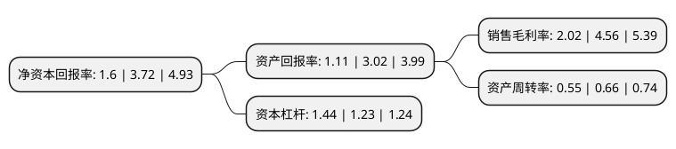

> 本页面由自动化程序生成于 2022年5月20日 01:13
> 内容可能存在错误，如有bug请提交issue至：https://github.com/Eroleice/doc-pi/issues
{.is-warning}

# 上市公司基本情况

## 基本资料

青岛英派斯健康科技股份有限公司（以下简称“英派斯”）成立于2004年06月23日，青岛市。于2017年09月15日在深交所中小板上市。

英派斯注册资本12,000万元，主营业务:一直从事健身器材的开发，制造与销售业务。主要产品:全品类，多系列健身器材，包括自主品牌IMPULSE。以下是详细信息：

- 公司名称: 青岛英派斯健康科技股份有限公司
- 股票代码: 002899.SZ
- 所在地: 山东 - 青岛市
- 成立日期: 2004年06月23日
- 注册资本: 12,000万元
- 法定代表人: 丁利荣
- 主营业务: 主营业务:一直从事健身器材的开发，制造与销售业务主要产品:全品类，多系列健身器材，包括自主品牌IMPULSE
- 公司官网: www.impulsefitness.com
- 公司介绍: 公司是一家专注于全品类、多系列健身器材开发、制造、销售及品牌化运营的健身器材品牌厂商，致力于打造兼具功能性、科技感与安全性的各式健身器材，满足消费者多样化的健身需求，塑造“值得信赖的健身专家”的企业与品牌形象。公司自主品牌IMPULSE现已拥有功能、价格差异化区隔的多条产品线，涵盖室内有氧器械、室内力量器械以及室外健身路径、笼式足球等各式产品，能够为健身俱乐部、星级酒店、企事业单位等商用客户提供多品类、成系列、一站式的健身器材整体解决方案，亦能覆盖广泛家庭用户差异化的需求。公司先后被认定为“国家认定企业技术中心”、“国家火炬计划重点高新技术企业”、“山东省省级工业设计中心”，以及新型健身器材产业技术创新战略联盟核心成员。

## 股东及高管情况

上市公司第一大股东为海南江恒实业投资有限公司，持股40,662,000股，占比33.89%，为上市公司实际控制人。

截至2022年04月11日，上市公司的前十大股东中，共有3名自然人股东，5名机构股东，2个产品账户，其中5%以上大股东共有3名。上市公司前十大股东明细如下：

> 截至2022年04月11日，上市公司前十大股东信息如下：

| 股东名称 | 持股数量（股） | 持股比例 |
| --- | --- | --- |
| 海南江恒实业投资有限公司 | 40,662,000 | 33.89% |
| 海南江恒实业投资有限公司 | 40,662,000 | 33.89% |
| 殷富中国投资有限公司 | 6,277,800 | 5.23% |
| 南通得一投资中心(有限合伙) | 4,555,200 | 3.8% |
| 湖南文化旅游创业投资基金企业(有限合伙) | 2,533,700 | 2.11% |
| 青岛青英企业管理咨询中心(有限合伙) | 1,933,900 | 1.61% |
| 何娜 | 876,300 | 0.73% |
| 陈宝兰 | 655,800 | 0.55% |
| 深圳华博万里私募证券基金管理有限公司-万里价值2号私募证券投资基金 | 404,800 | 0.34% |
| 陈丽琼 | 311,600 | 0.26% |

## 利润表分析

上市公司2021年总收入为8.64亿元，净利润为0.17亿元，实现盈利。

## 杜邦分析

> 数据列示周期：2021年 | 2020年 | 2019年
{.is-info}

上市公司的净资产收益率在近一年有所下降，下降幅度为-56.99%，其变化情况分解如下：
- 上市公司的销售毛利率在近一年下降了-55.7%，可能是生产效率的下降、商品原材料价格上涨或商品价格的下跌所致。
- 上市公司的资产周转率在近一年下降了-16.67%，可能是源自于更慢的销售回款或库存管理效果下降。
- 上市公司的财务杠杆比率在近一年上升了17.07%，可能是增加负债扩大生产规模。

