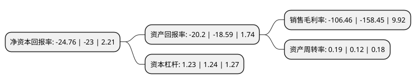

> 本页面由自动化程序生成于 2022年5月20日 01:14
> 内容可能存在错误，如有bug请提交issue至：https://github.com/Eroleice/doc-pi/issues
{.is-warning}

# 上市公司基本情况

## 基本资料

恒信东方文化股份有限公司（以下简称“恒信东方”）成立于2001年11月03日，北京市。于2010年05月20日在深交所创业板上市。

恒信东方注册资本60,711.582万元，CG/VR内容生产，儿童产业链开发运营，LBE(Location Based Entertainment)城市新娱乐，互联网视频应用产品及服务，移动信息产品的销售与服务业务以下是详细信息：

- 公司名称: 恒信东方文化股份有限公司
- 股票代码: 300081.SZ
- 所在地: 北京 - 北京市
- 成立日期: 2001年11月03日
- 注册资本: 60,711.582万元
- 法定代表人: 王冰
- 主营业务: CG/VR内容生产，儿童产业链开发运营，LBE(Location Based Entertainment)城市新娱乐，互联网视频应用产品及服务，移动信息产品的销售与服务业务
- 公司官网: www.hxgro.com
- 公司介绍: 公司依托CG、VR、IP等三大基础核心能力，支撑AI合家欢平台、场地(梦幻)新娱乐(LBE/VR)、云视频运营服务等业务版块的布局与发展。打通内容2C环节，实现内容产品与用户的线上线下联接，完成“上游IP获取+中游内容生产+下游市场渠道”全产业链布局。公司的业务范围主要包括CG/VR内容生产、儿童产业链开发运营、LBE(Location Based Entertainment)城市新娱乐、互联网视频应用产品及服务、移动信息产品的销售与服务业务。公司断加强技术创新和技术升级，在CG&CV及VR、OTT的应用中继续向前。截至目前，公司拥有发明专利、注册计算机软件著作、作品登记以及注册商标数百项。

## 股东及高管情况

上市公司第一大股东为孟宪民，持股104,811,566股，占比17.26%，**疑似为**上市公司实际控制人。

截至2022年03月31日，上市公司的前十大股东中，共有5名自然人股东，2名机构股东，3个产品账户，其中5%以上大股东共有2名。上市公司前十大股东明细如下：

> 未能通过持股比例判定出上市公司实际控制人（持股30%以上）
> 可能存在通过间接持股、联合持股、协议控制等方式拥有实际控制权的主体，具体请参考上市公司定期公告！
{.is-warning}

> 截至2022年03月31日，上市公司前十大股东信息如下：

| 股东名称 | 持股数量（股） | 持股比例 |
| --- | --- | --- |
| 孟宪民 | 104,811,566 | 17.26% |
| 孟宪民 | 104,099,128 | 17.15% |
| 王冰 | 24,411,166 | 4.02% |
| 西藏瑞华资本管理有限公司 | 15,294,117 | 2.52% |
| 裴军 | 12,110,810 | 1.99% |
| 上海浦东发展银行股份有限公司-中欧创新未来18个月封闭运作混合型证券投资基金 | 11,086,300 | 1.83% |
| 李文植 | 8,588,242 | 1.41% |
| 中国银河证券股份有限公司 | 7,529,411 | 1.24% |
| 湖南轻盐创业投资管理有限公司-轻盐智选8号私募证券投资基金 | 6,941,176 | 1.14% |
| 金鹰基金-工商银行-万向信托-万向信托-星辰50号事务管理类单一资金信托 | 6,223,595 | 1.03% |

## 利润表分析

上市公司2021年总收入为4.86亿元，净利润为-5.19亿元，**未实现盈利**。

## 杜邦分析

> 数据列示周期：2021年 | 2020年 | 2019年
{.is-info}

上市公司的净资产收益率在近一年有所上升，上升幅度为7.65%，其变化情况分解如下：
- 上市公司的销售毛利率在近一年下降了-32.81%，可能是生产效率的下降、商品原材料价格上涨或商品价格的下跌所致。
- 上市公司的资产周转率在近一年上升了58.33%，可能是源自于更快的销售回款或库存管理效果提升。
- 上市公司的财务杠杆比率在近一年下降了-0.81%，可能是减少负债降低财务费用。

