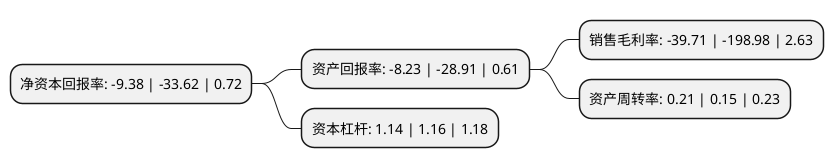

> 本页面由自动化程序生成于 2022年5月20日 01:16
> 内容可能存在错误，如有bug请提交issue至：https://github.com/Eroleice/doc-pi/issues
{.is-warning}

# 上市公司基本情况

## 基本资料

三盛智慧教育科技股份有限公司（以下简称“三盛教育”）成立于2003年09月03日，北京市。于2011年12月29日在深交所创业板上市。

三盛教育注册资本37,430.646万元，主要业务:智能教育装备及服务领域。以下是详细信息：

- 公司名称: 三盛智慧教育科技股份有限公司
- 股票代码: 300282.SZ
- 所在地: 北京 - 北京市
- 成立日期: 2003年09月03日
- 注册资本: 37,430.646万元
- 法定代表人: 林荣滨
- 主营业务: 智能教育装备及服务领域
- 公司官网: www.ssedu.com
- 公司介绍: 公司是国家级高新技术企业、北京市专利示范单位，总部位于北京市海淀区中关村软件园。公司目前布局三大业务板块：智慧教育板块、智能教育装备板块和教育服务板块业务。公司将依托三盛集团相关资源，加速公司在教育服务领域的业务落地，打造集智慧教育整体解决方案及教育内容服务提供商为一体的综合教育产业集团。同时大力拓展教育服务业务，构建智慧教育生态圈，成为一家一流教育上市公司。公司聚焦智慧教育服务与个性化学习领域，旗下自主研发的产品体系覆盖智慧教育全领域，为用户提供基于智慧教育云平台的线上线下一站式咨询设计、建设、应用和推广运营的全流程智慧教育整体运营服务。公司掌握红外触摸屏和光学触摸屏设计及制造的完整技术体系，是全球少数具有完全自主知识产权的触摸屏企业之一，目前公司拥有触摸领域专利近300余项，在该领域处于国内领先地位，为教育、金融、交通、零售、娱乐、电信、医疗、工控等多个行业提供的信息交互解决方案。

## 股东及高管情况

上市公司第一大股东为福建卓丰投资合伙企业(有限合伙)，持股101,800,318股，占比27.2%，**疑似为**上市公司实际控制人。

截至2022年03月31日，上市公司的前十大股东中，共有8名自然人股东，2名机构股东，其中5%以上大股东共有1名。上市公司前十大股东明细如下：

> 未能通过持股比例判定出上市公司实际控制人（持股30%以上）
> 可能存在通过间接持股、联合持股、协议控制等方式拥有实际控制权的主体，具体请参考上市公司定期公告！
{.is-warning}

> 截至2022年03月31日，上市公司前十大股东信息如下：

| 股东名称 | 持股数量（股） | 持股比例 |
| --- | --- | --- |
| 福建卓丰投资合伙企业(有限合伙) | 101,800,318 | 27.2% |
| 王文清 | 12,575,786 | 3.36% |
| 黄晋晋 | 5,889,060 | 1.57% |
| 刘胜坤 | 4,649,200 | 1.24% |
| 刘昕 | 3,066,940 | 0.82% |
| 上海迎睿投资管理有限公司 | 2,931,228 | 0.78% |
| 王超 | 2,773,000 | 0.74% |
| 王俊 | 2,758,100 | 0.74% |
| 王伟 | 2,595,150 | 0.69% |
| 李松 | 2,584,316 | 0.69% |

## 杜邦分析

> 数据列示周期：2021年 | 2020年 | 2019年
{.is-info}

上市公司的净资产收益率在近一年有所下降，下降幅度为-72.1%，其变化情况分解如下：
- 上市公司的销售毛利率在近一年下降了-80.04%，可能是生产效率的下降、商品原材料价格上涨或商品价格的下跌所致。
- 上市公司的资产周转率在近一年上升了40%，可能是源自于更快的销售回款或库存管理效果提升。
- 上市公司的财务杠杆比率在近一年下降了-1.72%，可能是减少负债降低财务费用。

