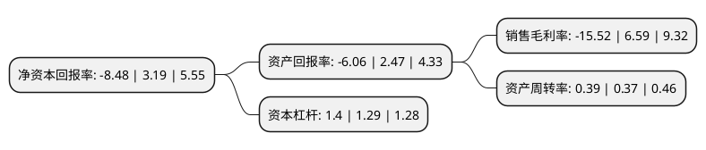

> 本页面由自动化程序生成于 2022年5月20日 01:16
> 内容可能存在错误，如有bug请提交issue至：https://github.com/Eroleice/doc-pi/issues
{.is-warning}

# 上市公司基本情况

## 基本资料

海伦钢琴股份有限公司（以下简称“海伦钢琴”）成立于2001年06月15日，宁波市。于2012年06月19日在深交所创业板上市。

海伦钢琴注册资本25,288.878万元，公司的主营业务为钢琴及其核心部件码克的研发，生产和销售。主要产品包括立式钢琴，三角钢琴，码克等。以下是详细信息：

- 公司名称: 海伦钢琴股份有限公司
- 股票代码: 300329.SZ
- 所在地: 浙江 - 宁波市
- 成立日期: 2001年06月15日
- 注册资本: 25,288.878万元
- 法定代表人: 陈海伦
- 主营业务: 公司的主营业务为钢琴及其核心部件码克的研发，生产和销售主要产品包括立式钢琴，三角钢琴，码克等
- 公司官网: www.hailunpiano.com
- 公司介绍: 公司是一家专业生产钢琴的国家重点火炬计划实施高新技术企业，为中国乐器协会副理事长单位。公司主要从事钢琴的研发、制造、销售与服务，同时加大智能钢琴的研究与开发，拓展艺术教育培训产业等。目前，公司主要产品包括立式钢琴、三角钢琴、智能钢琴一代，拥有的自有品牌有“海伦”、“文德隆”，合作品牌有有“弗尔里希”、“佩卓夫”、“罗瑟”、“齐默曼”。公司还率先开启国内自主品牌钢琴与动漫联手，与迪士尼共同研发海伦·迪士尼系列钢琴，首批推出两个型号(DH2F、DH2M)，将迪士尼动漫形象米奇与米妮素材融入钢琴造型。智能钢琴一代已推出“6+1”智能钢琴教室产品，结合具有趣味性、专业性的迪士尼海伦钢琴教程，推进线上线下教育培训共同发展。

## 股东及高管情况

上市公司第一大股东为宁波北仑海伦投资有限公司，持股69,316,800股，占比27.41%，**疑似为**上市公司实际控制人。

截至2022年03月31日，上市公司的前十大股东中，共有7名自然人股东，3名机构股东，其中5%以上大股东共有2名。上市公司前十大股东明细如下：

> 未能通过持股比例判定出上市公司实际控制人（持股30%以上）
> 可能存在通过间接持股、联合持股、协议控制等方式拥有实际控制权的主体，具体请参考上市公司定期公告！
{.is-warning}

> 截至2022年03月31日，上市公司前十大股东信息如下：

| 股东名称 | 持股数量（股） | 持股比例 |
| --- | --- | --- |
| 宁波北仑海伦投资有限公司 | 69,316,800 | 27.41% |
| 四季香港投资有限公司 | 42,931,400 | 16.98% |
| 黄万鹏 | 3,100,000 | 1.23% |
| 陈国良 | 929,000 | 0.37% |
| 郭红霞 | 800,000 | 0.32% |
| 宁波大榭开发区同心企业管理服务有限公司 | 575,980 | 0.23% |
| 金海芬 | 540,000 | 0.21% |
| 朱香尽 | 537,600 | 0.21% |
| 喻强 | 424,300 | 0.17% |
| 秦涛 | 369,466 | 0.15% |

## 利润表分析

上市公司2021年总收入为5.21亿元，净利润为-0.82亿元，**未实现盈利**。

## 杜邦分析

> 数据列示周期：2021年 | 2020年 | 2019年
{.is-info}

上市公司的净资产收益率在近一年有所下降，下降幅度为-365.83%，其变化情况分解如下：
- 上市公司的销售毛利率在近一年下降了-335.51%，可能是生产效率的下降、商品原材料价格上涨或商品价格的下跌所致。
- 上市公司的资产周转率在近一年上升了5.41%，可能是源自于更快的销售回款或库存管理效果提升。
- 上市公司的财务杠杆比率在近一年上升了8.53%，可能是增加负债扩大生产规模。

