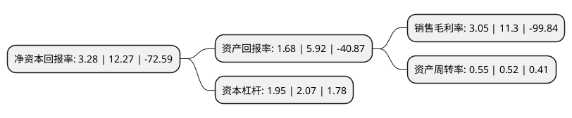

> 本页面由自动化程序生成于 2022年5月20日 01:17
> 内容可能存在错误，如有bug请提交issue至：https://github.com/Eroleice/doc-pi/issues
{.is-warning}

# 上市公司基本情况

## 基本资料

全通教育集团(广东)股份有限公司（以下简称“全通教育”）成立于2005年06月09日，中山市。于2014年01月21日在深交所创业板上市。

全通教育注册资本63,366.342万元，综合利用移动通信和互联网技术手段，采用与基础运营商合作发展的模式，构建信息化系统平台，为中小学校(幼儿园)及学生家长提供即时，便捷，高效的沟通互动服务，推动家庭教育和学校教育二者间的良性配合，满足家长对于关心子女健康成长，提升教育有效性的需要，同时在统一业务体系下，为学生提供学习辅导，学习资源等产品。以下是详细信息：

- 公司名称: 全通教育集团(广东)股份有限公司
- 股票代码: 300359.SZ
- 所在地: 广东 - 中山市
- 成立日期: 2005年06月09日
- 注册资本: 63,366.342万元
- 法定代表人: 庄文瑀
- 主营业务: 综合利用移动通信和互联网技术手段，采用与基础运营商合作发展的模式，构建信息化系统平台，为中小学校(幼儿园)及学生家长提供即时，便捷，高效的沟通互动服务，推动家庭教育和学校教育二者间的良性配合，满足家长对于关心子女健康成长，提升教育有效性的需要，同时在统一业务体系下，为学生提供学习辅导，学习资源等产品
- 公司官网: www.qtone.cn
- 公司介绍: 公司是从事家校互动信息服务的专业运营机构，从属于家庭教育信息服务领域。公司致力于教育信息化及信息服务多年，以K12学段家校互动服务起步，业务逐步发展至涵盖K12教育、家庭教育及教师继续教育不同领域。公司已与多个省级基础运营商和地市级基础运营商建立了密切持续的合作关系，先后获得“市级企业技术中心”“广东省高新技术企业”“广东省软件和集成电路产业100强培育企业”等30多项荣誉。公司是国内领先的国家火炬计划重点高新技术企业和通过CMMI5级的企业。

## 股东及高管情况

上市公司第一大股东为南昌经济技术开发区中文旭顺企业管理合伙企业(有限合伙)，持股94,424,974股，占比14.9%，**疑似为**上市公司实际控制人。

截至2022年03月31日，上市公司的前十大股东中，共有4名自然人股东，6名机构股东，其中5%以上大股东共有4名。上市公司前十大股东明细如下：

> 未能通过持股比例判定出上市公司实际控制人（持股30%以上）
> 可能存在通过间接持股、联合持股、协议控制等方式拥有实际控制权的主体，具体请参考上市公司定期公告！
{.is-warning}

> 截至2022年03月31日，上市公司前十大股东信息如下：

| 股东名称 | 持股数量（股） | 持股比例 |
| --- | --- | --- |
| 南昌经济技术开发区中文旭顺企业管理合伙企业(有限合伙) | 94,424,974 | 14.9% |
| 陈炽昌 | 68,117,511 | 10.75% |
| 中山市交通发展集团有限公司 | 58,219,874 | 9.19% |
| 中山教育科技股份有限公司 | 32,800,000 | 5.18% |
| 林小雅 | 12,271,669 | 1.94% |
| 孝昌恒瑞天华投资中心(有限合伙) | 10,626,993 | 1.68% |
| 北京顺业恒通资产管理有限公司 | 9,500,000 | 1.5% |
| 鹿星月 | 7,500,000 | 1.18% |
| 北京丰昆科技企业(有限合伙) | 7,381,351 | 1.16% |
| 朱敏 | 5,050,700 | 0.8% |

## 利润表分析

上市公司2021年总收入为7.22亿元，净利润为0.22亿元，实现盈利。

## 杜邦分析

> 数据列示周期：2021年 | 2020年 | 2019年
{.is-info}

上市公司的净资产收益率在近一年有所下降，下降幅度为-73.27%，其变化情况分解如下：
- 上市公司的销售毛利率在近一年下降了-73.01%，可能是生产效率的下降、商品原材料价格上涨或商品价格的下跌所致。
- 上市公司的资产周转率在近一年上升了5.77%，可能是源自于更快的销售回款或库存管理效果提升。
- 上市公司的财务杠杆比率在近一年下降了-5.8%，可能是减少负债降低财务费用。

