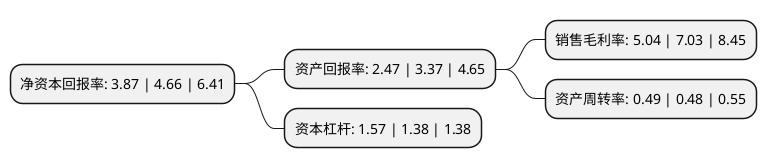

> 本页面由自动化程序生成于 2022年5月20日 01:19
> 内容可能存在错误，如有bug请提交issue至：https://github.com/Eroleice/doc-pi/issues
{.is-warning}

# 上市公司基本情况

## 基本资料

江苏金陵体育器材股份有限公司（以下简称“金陵体育”）成立于2004年03月25日，苏州市。于2017年05月09日在深交所创业板上市。

金陵体育注册资本12,874.708万元，主营业务为体育器材和场馆设施的研发，生产，销售以及体育赛事服务，主要产品包括球类器材，田径器材，其他体育器材，场馆设施等。以下是详细信息：

- 公司名称: 江苏金陵体育器材股份有限公司
- 股票代码: 300651.SZ
- 所在地: 江苏 - 苏州市
- 成立日期: 2004年03月25日
- 注册资本: 12,874.708万元
- 法定代表人: 李春荣
- 主营业务: 主营业务为体育器材和场馆设施的研发，生产，销售以及体育赛事服务，主要产品包括球类器材，田径器材，其他体育器材，场馆设施等
- 公司官网: www.jlsports.com
- 公司介绍: 公司是一家在A股上市的高端体育装备制造企业。作为行业领先的高端体育装备和体育设施系统集成服务商，公司坚持精益求精、持续创新、开放合作，专注于体育装备的研发制造以及体育资源的整合服务，以体育器材、场馆建设、全民健身、赛事保障为核心业务，致力于向客户提供更高品质的体育装备和运动环境。公司是国际篮联官方技术合作伙伴、国际排联合作伙伴，中国体育总局重点支持的骨干企业，国家体育产业示范单位、中国体育用品联合会副主席单位、中国文教体育用品协会副理事长单位、全国守合同重信用企业、江苏省高新技术企业；是篮球架、田径器材等多项国家标准和行业标准的主要起草人，众多产品通过国际篮联、国际排联、国际田联、国际手联认证。

## 股东及高管情况

上市公司第一大股东为李春荣，持股24,411,700股，占比18.96%，**疑似为**上市公司实际控制人。

截至2022年03月31日，上市公司的前十大股东中，共有9名自然人股东，1个产品账户，其中5%以上大股东共有3名。上市公司前十大股东明细如下：

> 未能通过持股比例判定出上市公司实际控制人（持股30%以上）
> 可能存在通过间接持股、联合持股、协议控制等方式拥有实际控制权的主体，具体请参考上市公司定期公告！
{.is-warning}

> 截至2022年03月31日，上市公司前十大股东信息如下：

| 股东名称 | 持股数量（股） | 持股比例 |
| --- | --- | --- |
| 李春荣 | 24,411,700 | 18.96% |
| 李剑刚 | 24,255,880 | 18.84% |
| 李剑峰 | 21,101,066 | 16.39% |
| 施美华 | 3,371,950 | 2.62% |
| 陈秀玲 | 1,433,000 | 1.11% |
| 隋英鹏 | 1,344,316 | 1.04% |
| 黄宇娟 | 1,193,800 | 0.93% |
| 林亨 | 935,600 | 0.73% |
| 谢晓兵 | 910,400 | 0.71% |
| 中国农业银行股份有限公司-鹏华医药科技股票型证券投资基金 | 679,268 | 0.53% |

## 利润表分析

上市公司2021年总收入为5.47亿元，净利润为0.27亿元，实现盈利。

## 杜邦分析

> 数据列示周期：2021年 | 2020年 | 2019年
{.is-info}

上市公司的净资产收益率在近一年有所下降，下降幅度为-16.95%，其变化情况分解如下：
- 上市公司的销售毛利率在近一年下降了-28.31%，可能是生产效率的下降、商品原材料价格上涨或商品价格的下跌所致。
- 上市公司的资产周转率在近一年上升了2.08%，可能是源自于更快的销售回款或库存管理效果提升。
- 上市公司的财务杠杆比率在近一年上升了13.77%，可能是增加负债扩大生产规模。

