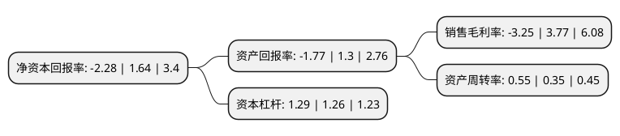

> 本页面由自动化程序生成于 2022年5月20日 01:19
> 内容可能存在错误，如有bug请提交issue至：https://github.com/Eroleice/doc-pi/issues
{.is-warning}

# 上市公司基本情况

## 基本资料

创业黑马科技集团股份有限公司（以下简称“创业黑马”）成立于2011年11月16日，北京市。于2017年08月10日在深交所创业板上市。

创业黑马注册资本10,920.898万元，主营业务为创业服务，具体为通过线上线下相结合的商业模式，向创业群体提供包含创业资讯，线下活动，会员服务，创业辅导培训，公关等在内的多样化服务。以下是详细信息：

- 公司名称: 创业黑马科技集团股份有限公司
- 股票代码: 300688.SZ
- 所在地: 北京 - 北京市
- 成立日期: 2011年11月16日
- 注册资本: 10,920.898万元
- 法定代表人: 牛文文
- 主营业务: 主营业务为创业服务，具体为通过线上线下相结合的商业模式，向创业群体提供包含创业资讯，线下活动，会员服务，创业辅导培训，公关等在内的多样化服务
- 公司官网: www.iheima.com
- 公司介绍: 创业黑马创立于2008年，2017年8月10日登录创业板，创业黑马主要服务于国内中小创企业，已实现从企业加速服务到企业服务的延伸。通过多年的创业创新服务经验，打造出多元化的企业服务平台，为企业提供企业加速服务、城市拓展服务、科创服务、营销服务、投融资服务等一系列的企业服务。创业黑马公司获得众多中小企业的认可，累计服务覆盖超10万家企业，已沉淀形成创始人社群资源。公司凭借自身企业成长方法论的专有知识，将中小企业的企业服务需求标准化，使得公司的企业服务更贴合中小企业的需求，为行业内知名孵化机构。创业黑马公司是国家级高新技术企业，获颁《高新技术企业证书》，为国内首批认定的中关村国家自主创新示范区创新型孵化器，是工信部认定的国家级中小企业公共服务示范平台。

## 股东及高管情况

上市公司第一大股东为牛文文，持股28,110,124股，占比25.74%，**疑似为**上市公司实际控制人。

截至2022年03月31日，上市公司的前十大股东中，共有3名自然人股东，3名机构股东，1个产品账户，3个海外主体，其中5%以上大股东共有2名。上市公司前十大股东明细如下：

> 未能通过持股比例判定出上市公司实际控制人（持股30%以上）
> 可能存在通过间接持股、联合持股、协议控制等方式拥有实际控制权的主体，具体请参考上市公司定期公告！
{.is-warning}

> 截至2022年03月31日，上市公司前十大股东信息如下：

| 股东名称 | 持股数量（股） | 持股比例 |
| --- | --- | --- |
| 牛文文 | 28,110,124 | 25.74% |
| 蓝创文化传媒(天津)合伙企业(有限合伙) | 10,244,174 | 9.38% |
| 安吉嘉乐文化传媒交流中心(有限合伙) | 4,752,714 | 4.35% |
| 张海峰 | 1,603,417 | 1.47% |
| MORGAN STANLEY & CO. INTERNATIONAL PLC. | 926,700 | 0.85% |
| UBS   AG | 795,888 | 0.73% |
| 深圳温莎资本管理有限公司-铂诺人工智能简毅2号私募证券投资基金 | 776,000 | 0.71% |
| 高华-汇丰-GOLDMAN, SACHS & CO.LLC | 541,900 | 0.5% |
| 上海劲邦股权投资管理有限公司-青岛劲邦劲智创业投资合伙企业(有限合伙) | 503,600 | 0.46% |
| 邓鑫 | 447,000 | 0.41% |

## 利润表分析

上市公司2021年总收入为3.39亿元，净利润为-0.12亿元，**未实现盈利**。

## 杜邦分析

> 数据列示周期：2021年 | 2020年 | 2019年
{.is-info}

上市公司的净资产收益率在近一年有所下降，下降幅度为-239.02%，其变化情况分解如下：
- 上市公司的销售毛利率在近一年下降了-186.21%，可能是生产效率的下降、商品原材料价格上涨或商品价格的下跌所致。
- 上市公司的资产周转率在近一年上升了57.14%，可能是源自于更快的销售回款或库存管理效果提升。
- 上市公司的财务杠杆比率在近一年上升了2.38%，可能是增加负债扩大生产规模。

