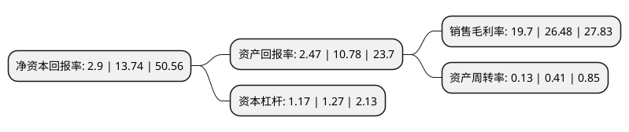

> 本页面由自动化程序生成于 2022年5月20日 01:21
> 内容可能存在错误，如有bug请提交issue至：https://github.com/Eroleice/doc-pi/issues
{.is-warning}

# 上市公司基本情况

## 基本资料

北京锋尚世纪文化传媒股份有限公司（以下简称“锋尚文化”）成立于2002年07月30日，北京市。于2020年08月24日在深交所创业板上市。

锋尚文化注册资本13,726.211万元，公司以创意设计为核心，业务范围涵盖大型文化演艺活动，文化旅游演艺，景观艺术照明及演绎等多个领域的创意，设计及制作服务。以下是详细信息：

- 公司名称: 北京锋尚世纪文化传媒股份有限公司
- 股票代码: 300860.SZ
- 所在地: 北京 - 北京市
- 成立日期: 2002年07月30日
- 注册资本: 13,726.211万元
- 法定代表人: 沙晓岚
- 主营业务: 公司以创意设计为核心，业务范围涵盖大型文化演艺活动，文化旅游演艺，景观艺术照明及演绎等多个领域的创意，设计及制作服务
- 公司官网: www.fssjart.com
- 公司介绍: 公司自成立以来，主要从事国内外文化演艺活动的策划、艺术创意设计、制作；剧院演出场所灯光音响工程设计、制作、器材租赁等业务；其中包括国家级大型活动灯光工程、地标性景观灯光秀、大型项目水秀灯光秀、舞台演出灯光设计和制作、器材租赁。公司于2006年获得ISO9001国际质量管理体系认证；同时公司拥有中国演艺设备技术协会演出场馆设备专业委员会评定的“专业灯光工程综合技术能力等级一级资质”；中国演出行业协会颁布的“舞美工程企业综合技术壹级资质”。

## 股东及高管情况

上市公司第一大股东为沙晓岚，持股57,457,799股，占比41.86%，为上市公司实际控制人。

截至2022年03月31日，上市公司的前十大股东中，共有5名自然人股东，2名机构股东，2个产品账户，1个海外主体，其中5%以上大股东共有4名。上市公司前十大股东明细如下：

> 截至2022年03月31日，上市公司前十大股东信息如下：

| 股东名称 | 持股数量（股） | 持股比例 |
| --- | --- | --- |
| 沙晓岚 | 57,457,799 | 41.86% |
| 王芳韵 | 17,812,500 | 12.98% |
| 和谐成长二期(义乌)投资中心(有限合伙) | 14,035,266 | 10.23% |
| 西藏晟蓝文化传播合伙企业(有限合伙) | 12,027,000 | 8.76% |
| 上海浦东发展银行股份有限公司-中欧创新未来18个月封闭运作混合型证券投资基金 | 1,031,190 | 0.75% |
| 香港中央结算有限公司(陆股通) | 417,137 | 0.3% |
| 段海瑞 | 403,460 | 0.29% |
| 陈海江 | 350,000 | 0.25% |
| 李勃 | 260,000 | 0.19% |
| 中国银行股份有限公司-招商国企改革主题混合型证券投资基金 | 229,100 | 0.17% |

## 利润表分析

上市公司2021年总收入为4.66亿元，净利润为0.91亿元，实现盈利。

## 杜邦分析

> 数据列示周期：2021年 | 2020年 | 2019年
{.is-info}

上市公司的净资产收益率在近一年有所下降，下降幅度为-78.89%，其变化情况分解如下：
- 上市公司的销售毛利率在近一年下降了-25.6%，可能是生产效率的下降、商品原材料价格上涨或商品价格的下跌所致。
- 上市公司的资产周转率在近一年下降了-68.29%，可能是源自于更慢的销售回款或库存管理效果下降。
- 上市公司的财务杠杆比率在近一年下降了-7.87%，可能是减少负债降低财务费用。

