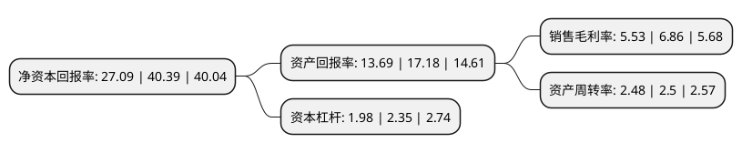

> 本页面由自动化程序生成于 2022年5月20日 01:22
> 内容可能存在错误，如有bug请提交issue至：https://github.com/Eroleice/doc-pi/issues
{.is-warning}

# 上市公司基本情况

## 基本资料

久祺股份有限公司（以下简称“久祺股份”）成立于2000年10月06日，杭州市。于2021年08月12日在深交所创业板上市。

久祺股份注册资本19,424万元，主要从事自行车整车及其零部件和相关衍生产品的设计，研发，生产和销售，主要产品包括儿童自行车，成人自行车，助力电动自行车等整车及相关配件产品。以下是详细信息：

- 公司名称: 久祺股份有限公司
- 股票代码: 300994.SZ
- 所在地: 浙江 - 杭州市
- 成立日期: 2000年10月06日
- 注册资本: 19,424万元
- 法定代表人: 李政
- 主营业务: 主要从事自行车整车及其零部件和相关衍生产品的设计，研发，生产和销售，主要产品包括儿童自行车，成人自行车，助力电动自行车等整车及相关配件产品
- 公司官网: www.joykie.com
- 公司介绍: 公司主要从事自行车整车及其零部件和相关衍生产品的设计、研发、生产和销售。经过二十年的发展，公司成为国内主要的自行车产品出口商之一，产品远销全球五大洲80多个国家和地区，致力于将自行车产品的“中国制造”销往世界各地，为全球客户“一站式”提供全尺寸、多系列的自行车及相关产品。公司以“绿色运动、健康生活”为企业宗旨，以环保、安全、符合力学原理及人体机能构造工学的产品为核心，以实现用户身体机能得到健康锻炼，满足消费者的健身休闲、代步出行、竞技娱乐等绿色低碳的工作生活需求。公司在长期的设计研发工作中积累了大量的知识产权，共获得57项专利，包括12项发明专利、29项实用新型专利和16项外观设计专利，获14项浙江省科技厅颁发的“浙江省科学技术成果”证书，并获得“浙江专利示范企业”、“市级企业技术中心”、“省级高新技术企业研究开发中心”、“浙江省科技型企业”、“湖州市科技成果转化二等奖”等荣誉称号。

## 股东及高管情况

上市公司第一大股东为李政，持股64,681,800股，占比33.3%，为上市公司实际控制人。

截至2022年03月31日，上市公司的前十大股东中，共有3名自然人股东，4名机构股东，3个产品账户，其中5%以上大股东共有3名。上市公司前十大股东明细如下：

> 截至2022年03月31日，上市公司前十大股东信息如下：

| 股东名称 | 持股数量（股） | 持股比例 |
| --- | --- | --- |
| 李政 | 64,681,800 | 33.3% |
| 卢志勇 | 35,573,000 | 18.31% |
| 李宇光 | 29,105,200 | 14.98% |
| 宁波梅山保税港区永焱企业管理合伙企业(有限合伙) | 5,360,000 | 2.76% |
| 宁波梅山保税港区永忻企业管理合伙企业(有限合伙) | 4,530,000 | 2.33% |
| 上海广沣投资管理有限公司 | 3,000,000 | 1.54% |
| 宁波梅山保税港区永峣企业管理合伙企业(有限合伙) | 2,140,000 | 1.1% |
| 中国农业银行股份有限公司-富国价值优势混合型证券投资基金 | 1,574,920 | 0.81% |
| 北京银行股份有限公司-景顺长城景颐双利债券型证券投资基金 | 1,372,545 | 0.71% |
| 太平人寿保险有限公司-传统-普通保险产品-022L-CT001深 | 1,309,975 | 0.67% |

## 利润表分析

上市公司2021年总收入为37.09亿元，净利润为2.05亿元，实现盈利。

## 杜邦分析

> 数据列示周期：2021年 | 2020年 | 2019年
{.is-info}

上市公司的净资产收益率在近一年有所下降，下降幅度为-32.93%，其变化情况分解如下：
- 上市公司的销售毛利率在近一年下降了-19.39%，可能是生产效率的下降、商品原材料价格上涨或商品价格的下跌所致。
- 上市公司的资产周转率在近一年下降了-0.8%，可能是源自于更慢的销售回款或库存管理效果下降。
- 上市公司的财务杠杆比率在近一年下降了-15.74%，可能是减少负债降低财务费用。

