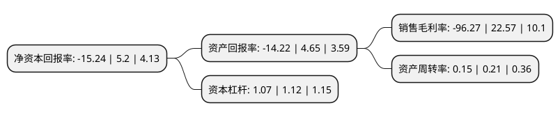

> 本页面由自动化程序生成于 2022年5月20日 01:27
> 内容可能存在错误，如有bug请提交issue至：https://github.com/Eroleice/doc-pi/issues
{.is-warning}

# 上市公司基本情况

## 基本资料

国新文化控股股份有限公司（以下简称“国新文化”）成立于1992年09月09日，上海市。于1993年03月16日在上交所主板上市。

国新文化注册资本44,693.689万元，含氟聚合物，CFC替代品，氟致冷剂，清洗剂，发泡剂。以下是详细信息：

- 公司名称: 国新文化控股股份有限公司
- 股票代码: 600636.SH
- 所在地: 上海 - 上海市
- 成立日期: 1992年09月09日
- 注册资本: 44,693.689万元
- 法定代表人: 王东兴
- 主营业务: 含氟聚合物，CFC替代品，氟致冷剂，清洗剂，发泡剂
- 公司官网: www.crhc-culture.com
- 公司介绍: 百年大计，教育为本。作为中国国新控股有限责任公司成员企业，国新文化控股股份有限公司(股票代码：600636)是中央企业中唯一一家以文化教育为主业的公司。国新文化以推动教育均衡发展、提升我国教育信息化水平为使命，专注于智慧课堂、智慧校园、区域智慧教育的建设、运营与服务，全力助推国家教育信息化创新升级。旗下全资子公司广州市奥威亚电子科技有限公司是国内专业的视频互动和智慧教学方案提供商。自2005年成立以来，专注于应用信息技术和人性化、智能化的创新设计，秉持为教育事业奉献的赤诚,奥威亚足迹印在中国广袤大地，项目覆盖全国，东至吉林延边、西至新疆喀什、北至大兴安岭、南至三亚及港澳，成功服务30,000多个学校和教育单位，为缩小我国区域、城乡教育差距，促进教育公平作出了卓越贡献。

## 股东及高管情况

上市公司第一大股东为中国文化产业发展集团有限公司，持股110,216,220股，占比24.66%，**疑似为**上市公司实际控制人。

截至2022年03月31日，上市公司的前十大股东中，共有6名自然人股东，4名机构股东，其中5%以上大股东共有2名。上市公司前十大股东明细如下：

> 未能通过持股比例判定出上市公司实际控制人（持股30%以上）
> 可能存在通过间接持股、联合持股、协议控制等方式拥有实际控制权的主体，具体请参考上市公司定期公告！
{.is-warning}

> 截至2022年03月31日，上市公司前十大股东信息如下：

| 股东名称 | 持股数量（股） | 持股比例 |
| --- | --- | --- |
| 中国文化产业发展集团有限公司 | 110,216,220 | 24.66% |
| 上海华谊(集团)公司 | 51,845,405 | 11.6% |
| 姚世娴 | 15,466,368 | 3.46% |
| 中央汇金资产管理有限责任公司 | 11,981,300 | 2.68% |
| 樟树市睿科投资管理中心(有限合伙) | 9,521,117 | 2.13% |
| 关本立 | 5,349,801 | 1.2% |
| 俞晴 | 2,700,000 | 0.6% |
| 钟子春 | 2,674,900 | 0.6% |
| 叶叙群 | 2,252,576 | 0.5% |
| 张剑平 | 1,643,400 | 0.37% |

## 利润表分析

上市公司2021年总收入为4.44亿元，净利润为-4.28亿元，**未实现盈利**。

## 杜邦分析

> 数据列示周期：2021年 | 2020年 | 2019年
{.is-info}

上市公司的净资产收益率在近一年有所下降，下降幅度为-393.08%，其变化情况分解如下：
- 上市公司的销售毛利率在近一年下降了-526.54%，可能是生产效率的下降、商品原材料价格上涨或商品价格的下跌所致。
- 上市公司的资产周转率在近一年下降了-28.57%，可能是源自于更慢的销售回款或库存管理效果下降。
- 上市公司的财务杠杆比率在近一年下降了-4.46%，可能是减少负债降低财务费用。

