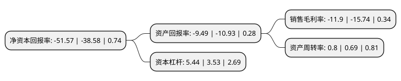

> 本页面由自动化程序生成于 2022年5月20日 01:28
> 内容可能存在错误，如有bug请提交issue至：https://github.com/Eroleice/doc-pi/issues
{.is-warning}

# 上市公司基本情况

## 基本资料

上海新南洋昂立教育科技股份有限公司（以下简称“昂立教育”）成立于1983年08月04日，上海市。于1993年06月14日在上交所主板上市。

昂立教育注册资本28,654.883万元，主营业务:教育培训。以下是详细信息：

- 公司名称: 上海新南洋昂立教育科技股份有限公司
- 股票代码: 600661.SH
- 所在地: 上海 - 上海市
- 成立日期: 1983年08月04日
- 注册资本: 28,654.883万元
- 法定代表人: 周传有
- 主营业务: 主营业务:教育培训
- 公司官网: www.onlyedu.com
- 公司介绍: 公司成立于1992年12月，公司依托上海交通大学在科研、教育、人才和信息等方面的优势，积极探索转型发展之路，逐步形成了以教育培训业务为核心，现代制造业、服务业为辅的业务构架。作为首家以教育培训为主营业务的国内主板上市公司，公司创导终身教育理念，聚焦主营业务发展，逐步形成了覆盖K12教育、职业教育、国际教育、幼儿教育等领域的终身教育产业链，力争成为国内最优秀的教育培训服务提供商。近年来，公司积极制定滚动发展战略规划，进一步将资源和精力向教育主营业务集中，逐步实施对其他板块业务的调整和转型。同时积极创新与改善管理体系，推进大事业部的运行模式,先后成立了K12教育、职业教育、国际教育、幼儿教育、资管投资、综合业务六大事业部，切实提升和加强公司对各业务的管控力。

## 股东及高管情况

上市公司第一大股东为上海长甲投资有限公司，持股24,019,215股，占比8.38%，**疑似为**上市公司实际控制人。

截至2022年03月31日，上市公司的前十大股东中，共有1名自然人股东，7名机构股东，1个产品账户，1名其他股东，其中5%以上大股东共有5名。上市公司前十大股东明细如下：

> 未能通过持股比例判定出上市公司实际控制人（持股30%以上）
> 可能存在通过间接持股、联合持股、协议控制等方式拥有实际控制权的主体，具体请参考上市公司定期公告！
{.is-warning}

> 上市公司第一大股东持股不超过10%，请检查是否存在公司控制权风险！
{.is-danger}

> 截至2022年03月31日，上市公司前十大股东信息如下：

| 股东名称 | 持股数量（股） | 持股比例 |
| --- | --- | --- |
| 上海长甲投资有限公司 | 24,019,215 | 8.38% |
| 中金投资(集团)有限公司 | 23,988,074 | 8.37% |
| 上海交大产业投资管理(集团)有限公司 | 23,329,600 | 8.14% |
| 宁波梅山保税港区长甲宏泰投资中心(有限合伙) | 21,647,285 | 7.55% |
| 上海中金资本投资有限公司 | 15,749,077 | 5.5% |
| 上海交大企业管理中心 | 12,756,930 | 4.45% |
| 上海东方基础建设发展有限公司 | 11,411,971 | 3.98% |
| 上海恒石投资管理有限公司 | 7,567,997 | 2.64% |
| 张小纳 | 5,858,394 | 2.04% |
| 富诚海富资管-中国银行-富诚海富通光昂集合资产管理计划 | 5,730,800 | 2% |

## 利润表分析

上市公司2021年总收入为15.87亿元，净利润为-1.89亿元，**未实现盈利**。

## 杜邦分析

> 数据列示周期：2021年 | 2020年 | 2019年
{.is-info}

上市公司的净资产收益率在近一年有所上升，上升幅度为33.67%，其变化情况分解如下：
- 上市公司的销售毛利率在近一年下降了-24.4%，可能是生产效率的下降、商品原材料价格上涨或商品价格的下跌所致。
- 上市公司的资产周转率在近一年上升了15.94%，可能是源自于更快的销售回款或库存管理效果提升。
- 上市公司的财务杠杆比率在近一年上升了54.11%，可能是增加负债扩大生产规模。

