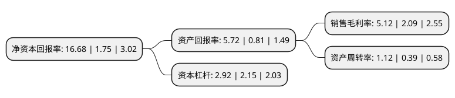

> 本页面由自动化程序生成于 2022年5月20日 01:28
> 内容可能存在错误，如有bug请提交issue至：https://github.com/Eroleice/doc-pi/issues
{.is-warning}

# 上市公司基本情况

## 基本资料

上海外服控股集团股份有限公司（以下简称“外服控股”）成立于1992年02月01日，上海市。于1993年06月14日在上交所主板上市。

外服控股注册资本226,327.945万元，出租汽车服务及其相关业务，旅游服务。以下是详细信息：

- 公司名称: 上海外服控股集团股份有限公司
- 股票代码: 600662.SH
- 所在地: 上海 - 上海市
- 成立日期: 1992年02月01日
- 注册资本: 226,327.945万元
- 法定代表人: 李栋
- 主营业务: 出租汽车服务及其相关业务，旅游服务
- 公司官网: www.fsg.com.cn
- 公司介绍: 公司是一家以出租车运营为主业务的上海本地公用事业龙头。主要经营出租汽车运营、汽车租赁、汽车服务、旅游、房地产开发等业务。公司以“乘客至上、信誉第一”为宗旨，是我国首家通过ISO9002质量体系认证的出租汽车公司。公司还是上海最大的汽车租赁企业，致力为各类大型会务与赛事，知名企事业单位，高星级宾馆等客户，提供高档会务和商务用车服务。同时承接婚庆、旅游用车业务、以及青年自驾族亲睐的便捷经济型租赁业务。公司控股公司-强生汽车修理公司，是上海汽修行业知名品牌，几十年来始终以技术精湛、质量过硬享誉沪上，规模位居上海汽修行业第一。公司拥有的“翡翠公主”号游轮，被改造为黄浦江上第一艘餐饮游轮，受到中外宾客的欢迎。公司先后被授予全国文明服务示范窗口、全国用户满意服务企业、上海市文明单位、上海服务名牌、上海著名商标、上海市安全生产标兵单位、上海市社会治安先进单位、上海计量物价信得过单位等荣誉称号。

## 股东及高管情况

上市公司第一大股东为上海东浩实业(集团)有限公司，持股1,631,262,135股，占比72.08%，为上市公司实际控制人。

截至2022年03月31日，上市公司的前十大股东中，共有5名自然人股东，4名机构股东，1个产品账户，其中5%以上大股东共有1名。上市公司前十大股东明细如下：

> 截至2022年03月31日，上市公司前十大股东信息如下：

| 股东名称 | 持股数量（股） | 持股比例 |
| --- | --- | --- |
| 上海东浩实业(集团)有限公司 | 1,631,262,135 | 72.08% |
| 上海久事(集团)有限公司 | 52,698,685 | 2.33% |
| 徐圣华 | 14,247,201 | 0.63% |
| 中国工商银行股份有限公司-中证上海国企交易型开放式指数证券投资基金 | 9,057,827 | 0.4% |
| 吉林省外国企业服务有限公司 | 7,300,000 | 0.32% |
| 张国峰 | 6,850,001 | 0.3% |
| 老凤祥股份有限公司 | 6,000,000 | 0.27% |
| 丁兰芳 | 6,000,000 | 0.27% |
| 周学群 | 5,681,467 | 0.25% |
| 蔡晓睿 | 5,093,930 | 0.23% |

## 利润表分析

上市公司2021年总收入为114.53亿元，净利润为5.86亿元，实现盈利。

## 杜邦分析

> 数据列示周期：2021年 | 2020年 | 2019年
{.is-info}

上市公司的净资产收益率在近一年有所上升，上升幅度为853.14%，其变化情况分解如下：
- 上市公司的销售毛利率在近一年上升了144.98%，可能是生产效率的提升、商品原材料价格下跌或商品价格的上涨所致。
- 上市公司的资产周转率在近一年上升了187.18%，可能是源自于更快的销售回款或库存管理效果提升。
- 上市公司的财务杠杆比率在近一年上升了35.81%，可能是增加负债扩大生产规模。

