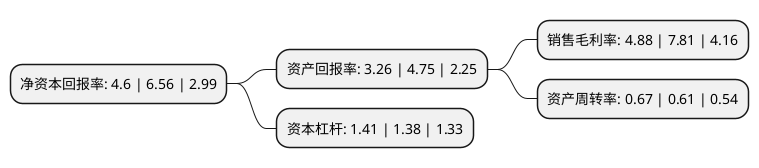

> 本页面由自动化程序生成于 2022年5月20日 01:28
> 内容可能存在错误，如有bug请提交issue至：https://github.com/Eroleice/doc-pi/issues
{.is-warning}

# 上市公司基本情况

## 基本资料

上海凤凰企业(集团)股份有限公司（以下简称“上海凤凰”）成立于1993年12月29日，上海市。于1993年10月08日在上交所主板上市。

上海凤凰注册资本51,529.426万元，主营收入为自行车及零件(含电动车)，医疗器械，酒店服务，房屋租赁等以下是详细信息：

- 公司名称: 上海凤凰企业(集团)股份有限公司
- 股票代码: 600679.SH
- 所在地: 上海 - 上海市
- 成立日期: 1993年12月29日
- 注册资本: 51,529.426万元
- 法定代表人: 周永超
- 主营业务: 主营收入为自行车及零件(含电动车)，医疗器械，酒店服务，房屋租赁等
- 公司官网: www.phoenix.com.cn
- 公司介绍: 公司由“凤凰股份”变更而来，公司业务也从自行车制造逐步转向自行车车业、土地开发建设、准金融的三个产业板块。公司作为金山区国资委下属的唯一一家上市公司，公司依托金山区域经济发展的平台，拓展公司开发建设项目，加快公司主营业务的整合，培育提升新的经济增长点，促进公司健康发展。公司主营凤凰自行车整车业务具有完善的品牌管理、生产研发和产品销售体系，生产销售的凤凰牌自行车系列产品，不仅远销欧美拉非等国际市场，更是国内家喻户晓的著名畅销产品。2015年公司完成重大资产重组项目，通过购入自行车零部件生产企业华久辐条，推动公司的自行车业务从整车向上游零部件延伸，进一步增强了公司自行车业务的经营规模和竞争能力。公司还设立小额贷款公司和担保公司，探索发展准金融业务，为公司的健康持续发展，培育新的产业和经济增长点。

## 股东及高管情况

上市公司第一大股东为上海市金山区国有资产监督管理委员会，持股117,354,739股，占比22.77%，**疑似为**上市公司实际控制人。

截至2022年03月31日，上市公司的前十大股东中，共有4名自然人股东，3名机构股东，2个产品账户，1名其他股东，其中5%以上大股东共有2名。上市公司前十大股东明细如下：

> 未能通过持股比例判定出上市公司实际控制人（持股30%以上）
> 可能存在通过间接持股、联合持股、协议控制等方式拥有实际控制权的主体，具体请参考上市公司定期公告！
{.is-warning}

> 截至2022年03月31日，上市公司前十大股东信息如下：

| 股东名称 | 持股数量（股） | 持股比例 |
| --- | --- | --- |
| 上海市金山区国有资产监督管理委员会 | 117,354,739 | 22.77% |
| 江苏美乐投资有限公司 | 64,743,722 | 12.56% |
| 天津富士达科技有限公司 | 22,400,702 | 4.35% |
| 嘉兴星旅嘉景股权投资合伙企业(有限合伙) | 12,267,098 | 2.38% |
| 宋学昌 | 8,931,458 | 1.73% |
| 窦佩珍 | 6,804,920 | 1.32% |
| 华夏磐益一年定期开放混合型证券投资基金 | 5,311,442 | 1.03% |
| 汪荣生 | 4,992,401 | 0.97% |
| 王翔宇 | 4,619,980 | 0.9% |
| 上海国企改革发展股权投资基金合伙企业(有限合伙) | 2,423,240 | 0.47% |

## 利润表分析

上市公司2021年总收入为20.57亿元，净利润为1亿元，实现盈利。

## 杜邦分析

> 数据列示周期：2021年 | 2020年 | 2019年
{.is-info}

上市公司的净资产收益率在近一年有所下降，下降幅度为-29.88%，其变化情况分解如下：
- 上市公司的销售毛利率在近一年下降了-37.52%，可能是生产效率的下降、商品原材料价格上涨或商品价格的下跌所致。
- 上市公司的资产周转率在近一年上升了9.84%，可能是源自于更快的销售回款或库存管理效果提升。
- 上市公司的财务杠杆比率在近一年上升了2.17%，可能是增加负债扩大生产规模。

