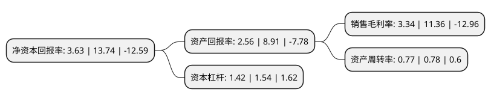

> 本页面由自动化程序生成于 2022年5月20日 01:29
> 内容可能存在错误，如有bug请提交issue至：https://github.com/Eroleice/doc-pi/issues
{.is-warning}

# 上市公司基本情况

## 基本资料

中路股份有限公司（以下简称“中路股份”）成立于1995年01月12日，上海市。于1994年01月28日在上交所主板上市。

中路股份注册资本32,144.791万元，自行车，康体设备以下是详细信息：

- 公司名称: 中路股份有限公司
- 股票代码: 600818.SH
- 所在地: 上海 - 上海市
- 成立日期: 1995年01月12日
- 注册资本: 32,144.791万元
- 法定代表人: 陈闪
- 主营业务: 自行车，康体设备
- 公司官网: www.cnforever.com
- 公司介绍: 公司生产经营“永久牌”自行车和“中路牌”全自动保龄设备，是我国品牌历史悠久、生产颇具规模、产品类型齐全、市场占有领先的两轮车产品和康体产品的上市公司。公司以康体绿色产业为基础，以推动公司全体股东价值最大化为核心经营目标，依托地处上海市浦东新区航空港和深水港两大物流基地间的地理优势，兴建了集制造、销售、研发、服务、物流、展示等综合功能于一体的现代化出口生产基地，实现以产品、制造产业为支撑，同时积极拓展其他领域的经营格局。公司产品业已向绿色、环保、科技型方向的延伸，如今已形成以自行车、电动自行车、公共自行车租赁服务系统、轮椅车等为核心的两轮车产品群和以保龄设备、天然乳胶制品、塑胶铺面材料、全自动棋牌设备等为核心的康体产品群，以及对拟上市公司、上市公司参照投资、技术咨询、资产经营等多项业务，成为产品规模化，质量更高化、管理专业化，产业多元化、经济集约化的现代企业。

## 股东及高管情况

上市公司第一大股东为上海中路(集团)有限公司，持股98,084,334股，占比30.51%，为上市公司实际控制人。

截至2022年03月31日，上市公司的前十大股东中，共有9名自然人股东，1名机构股东，其中5%以上大股东共有1名。上市公司前十大股东明细如下：

> 截至2022年03月31日，上市公司前十大股东信息如下：

| 股东名称 | 持股数量（股） | 持股比例 |
| --- | --- | --- |
| 上海中路(集团)有限公司 | 98,084,334 | 30.51% |
| 张源 | 6,507,600 | 2.02% |
| 卢倩 | 3,676,500 | 1.14% |
| 李晋颖 | 3,600,000 | 1.12% |
| 丁维新 | 2,610,400 | 0.81% |
| 胡海存 | 2,327,600 | 0.72% |
| 戴煜中 | 2,211,800 | 0.69% |
| 马淑环 | 2,096,600 | 0.65% |
| 沈雨清 | 2,018,440 | 0.63% |
| 戴蓉仪 | 1,892,900 | 0.59% |

## 利润表分析

上市公司2021年总收入为7.22亿元，净利润为0.24亿元，实现盈利。

## 杜邦分析

> 数据列示周期：2021年 | 2020年 | 2019年
{.is-info}

上市公司的净资产收益率在近一年有所下降，下降幅度为-73.58%，其变化情况分解如下：
- 上市公司的销售毛利率在近一年下降了-70.6%，可能是生产效率的下降、商品原材料价格上涨或商品价格的下跌所致。
- 上市公司的资产周转率在近一年下降了-1.28%，可能是源自于更慢的销售回款或库存管理效果下降。
- 上市公司的财务杠杆比率在近一年下降了-7.79%，可能是减少负债降低财务费用。

