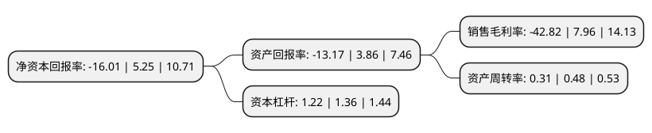

> 本页面由自动化程序生成于 2022年5月20日 01:34
> 内容可能存在错误，如有bug请提交issue至：https://github.com/Eroleice/doc-pi/issues
{.is-warning}

# 上市公司基本情况

## 基本资料

江西沐邦高科股份有限公司（以下简称“沐邦高科”）成立于2003年08月18日，南昌市。于2015年12月09日在上交所主板上市。

沐邦高科注册资本34,263.451万元，以研发，生产和销售自主品牌“邦宝”，“叻产，销售精密非金属模具为主营业务。主要产品为:益智玩具和精密非金属模具，其中益智玩具包括积木玩具(适合3岁以上消费群)，婴幼儿玩具(适合0-3岁消费群)。精密非金属模具也是公司生产益智玩具的重要工装，益智玩具的质量依赖于模具的精密程度。以下是详细信息：

- 公司名称: 江西沐邦高科股份有限公司
- 股票代码: 603398.SH
- 所在地: 江西 - 南昌市
- 成立日期: 2003年08月18日
- 注册资本: 34,263.451万元
- 法定代表人: 廖志远
- 主营业务: 以研发，生产和销售自主品牌“邦宝”，“叻产，销售精密非金属模具为主营业务主要产品为:益智玩具和精密非金属模具，其中益智玩具包括积木玩具(适合3岁以上消费群)，婴幼儿玩具(适合0-3岁消费群)精密非金属模具也是公司生产益智玩具的重要工装，益智玩具的质量依赖于模具的精密程度
- 公司官网: www.banbao.com
- 公司介绍: 公司是专业从事益智教玩具、婴幼教玩具的研发、设计、生产、销售、服务为一体的中外合资高新技术企业。公司创造出适合1-99岁老少咸宜的积木教玩具产品。邦宝作为“广东省著名商标”产品，远销欧美、中东、东亚等多个国家和地区，深受国内外客户的一致信赖。根据广东省玩具协会资料显示，公司是国内专业制造塑胶积木的龙头企业之一。与国内其他积木生产企业相比，公司的优势主要体现在自有品牌、模具设计与制造、益智玩具研发设计、产品质量、工艺技术、生产规模等方面。未来，公司努力将“邦宝”打造为国内外领先、影响力居前的优秀积木品牌，树立中国积木品牌知名度，并开发出体现品牌价值的衍生产品，提升品牌在全球的影响力。

## 股东及高管情况

上市公司第一大股东为汕头市邦领贸易有限公司，持股83,956,210股，占比24.5%，**疑似为**上市公司实际控制人。

截至2022年03月31日，上市公司的前十大股东中，共有5名自然人股东，4名机构股东，1个产品账户，其中5%以上大股东共有2名。上市公司前十大股东明细如下：

> 未能通过持股比例判定出上市公司实际控制人（持股30%以上）
> 可能存在通过间接持股、联合持股、协议控制等方式拥有实际控制权的主体，具体请参考上市公司定期公告！
{.is-warning}

> 截至2022年03月31日，上市公司前十大股东信息如下：

| 股东名称 | 持股数量（股） | 持股比例 |
| --- | --- | --- |
| 汕头市邦领贸易有限公司 | 83,956,210 | 24.5% |
| 邦领国际有限公司 | 81,381,348 | 23.75% |
| 郑泳麟 | 9,253,677 | 2.7% |
| 汕头市中楷创业投资合伙企业(有限合伙) | 8,300,080 | 2.42% |
| 林蔚山 | 7,620,000 | 2.22% |
| 汕头市和盛昌投资有限公司 | 3,634,960 | 1.06% |
| 李晓明 | 3,566,700 | 1.04% |
| 浙江朔盈资产管理有限公司-朔盈持行2号私募证券投资基金 | 3,155,006 | 0.92% |
| 何文彬 | 2,615,731 | 0.76% |
| 章志坚 | 2,008,320 | 0.59% |

## 利润表分析

上市公司2021年总收入为3.22亿元，净利润为-1.39亿元，**未实现盈利**。

## 杜邦分析

> 数据列示周期：2021年 | 2020年 | 2019年
{.is-info}

上市公司的净资产收益率在近一年有所下降，下降幅度为-404.95%，其变化情况分解如下：
- 上市公司的销售毛利率在近一年下降了-637.94%，可能是生产效率的下降、商品原材料价格上涨或商品价格的下跌所致。
- 上市公司的资产周转率在近一年下降了-35.42%，可能是源自于更慢的销售回款或库存管理效果下降。
- 上市公司的财务杠杆比率在近一年下降了-10.29%，可能是减少负债降低财务费用。

