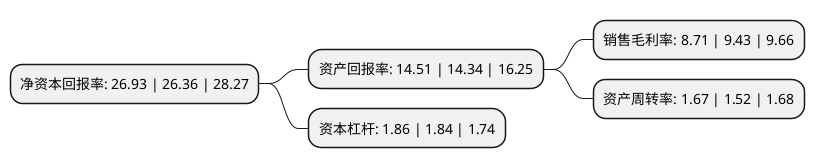

> 本页面由自动化程序生成于 2022年5月20日 01:36
> 内容可能存在错误，如有bug请提交issue至：https://github.com/Eroleice/doc-pi/issues
{.is-warning}

# 上市公司基本情况

## 基本资料

上海晨光文具股份有限公司（以下简称“晨光股份”）成立于2008年07月18日，上海市。于2015年01月27日在上交所主板上市。

晨光股份注册资本92,774.559万元，主要从事晨光品牌书写工具，学生文具，办公文具等产品的设计，研发，制造和销售。以下是详细信息：

- 公司名称: 上海晨光文具股份有限公司
- 股票代码: 603899.SH
- 所在地: 上海 - 上海市
- 成立日期: 2008年07月18日
- 注册资本: 92,774.559万元
- 法定代表人: 陈湖文
- 主营业务: 主要从事晨光品牌书写工具，学生文具，办公文具等产品的设计，研发，制造和销售
- 公司官网: www.mg-pen.com
- 公司介绍: 公司是一家整合创意价值与服务优势，专注于文具产业的综合文具公司，致力于提供高性价比的文具用品，产品涵盖书写工具、学生文具、办公文具及其他相关产品四大领域。主要从事‘M&G晨光’品牌书写工具、学生文具、办公文具等产品的设计、研发、制造和销售。‘M&G晨光’为国内文具第一品牌，圆珠笔第一品牌。公司首创“层层投入、层层分享”的“晨光伙伴金字塔”营销模式，与各级经销商(合作伙伴)共同建立了“稳定、共赢”的分销体系，同时，公司率先在国内文具行业成功地规模化开展零售终端的品牌销售管理与特许经营管理。公司注重技术研发及设计创新，研发中心已被认证为上海市制笔工程技术研究中心和上海市认定企业技术中心。

## 股东及高管情况

上市公司第一大股东为晨光控股(集团)有限公司，持股536,000,000股，占比57.77%，为上市公司实际控制人。

截至2022年03月31日，上市公司的前十大股东中，共有3名自然人股东，3名机构股东，3个产品账户，1个海外主体，其中5%以上大股东共有2名。上市公司前十大股东明细如下：

> 截至2022年03月31日，上市公司前十大股东信息如下：

| 股东名称 | 持股数量（股） | 持股比例 |
| --- | --- | --- |
| 晨光控股(集团)有限公司 | 536,000,000 | 57.77% |
| 香港中央结算有限公司(陆股通) | 52,343,082 | 5.64% |
| 中国工商银行股份有限公司-景顺长城新兴成长混合型证券投资基金 | 27,999,893 | 3.02% |
| 中国银行股份有限公司-景顺长城鼎益混合型证券投资基金(LOF) | 14,671,302 | 1.58% |
| 上海科迎投资管理事务所(有限合伙) | 14,662,558 | 1.58% |
| 上海杰葵投资管理事务所(有限合伙) | 14,493,900 | 1.56% |
| 陈湖雄 | 13,609,300 | 1.47% |
| 陈湖文 | 13,609,300 | 1.47% |
| 安本标准投资管理(亚洲)有限公司-安本标准-中国A股股票基金 | 9,095,692 | 0.98% |
| 陈雪玲 | 8,100,000 | 0.87% |

## 利润表分析

上市公司2021年总收入为176.07亿元，净利润为15.33亿元，实现盈利。

## 杜邦分析

> 数据列示周期：2021年 | 2020年 | 2019年
{.is-info}

上市公司的净资产收益率在近一年有所上升，上升幅度为2.16%，其变化情况分解如下：
- 上市公司的销售毛利率在近一年下降了-7.64%，可能是生产效率的下降、商品原材料价格上涨或商品价格的下跌所致。
- 上市公司的资产周转率在近一年上升了9.87%，可能是源自于更快的销售回款或库存管理效果提升。
- 上市公司的财务杠杆比率在近一年上升了1.09%，可能是增加负债扩大生产规模。

