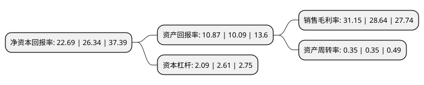

> 本页面由自动化程序生成于 2022年5月20日 01:36
> 内容可能存在错误，如有bug请提交issue至：https://github.com/Eroleice/doc-pi/issues
{.is-warning}

# 上市公司基本情况

## 基本资料

上海行动教育科技股份有限公司（以下简称“行动教育”）成立于2006年03月27日，上海市。于2021年04月21日在上交所主板上市。

行动教育注册资本8,434.186万元，主营业务为企业管理培训，管理咨询服务以及相关图书音像制品销售。以下是详细信息：

- 公司名称: 上海行动教育科技股份有限公司
- 股票代码: 605098.SH
- 所在地: 上海 - 上海市
- 成立日期: 2006年03月27日
- 注册资本: 8,434.186万元
- 法定代表人: 李践
- 主营业务: 主营业务为企业管理培训，管理咨询服务以及相关图书音像制品销售
- 公司官网: www.xdjy100.com
- 公司介绍: 公司的主营业务为企业管理培训、管理咨询服务以及相关图书音像制品销售。定位于“提升企业竞争力的云智力平台”，主要致力于为企业提供全生命周期的生态化知识服务和智力支持平台，目前，公司的主要业务包括管理培训业务、管理咨询业务、图书音像制品销售业务等。

## 股东及高管情况

上市公司第一大股东为李践，持股26,333,165股，占比31.22%，为上市公司实际控制人。

截至2022年03月31日，上市公司的前十大股东中，共有3名自然人股东，4名机构股东，3个产品账户，其中5%以上大股东共有4名。上市公司前十大股东明细如下：

> 截至2022年03月31日，上市公司前十大股东信息如下：

| 股东名称 | 持股数量（股） | 持股比例 |
| --- | --- | --- |
| 李践 | 26,333,165 | 31.22% |
| 上海蓝效商务咨询合伙企业(有限合伙) | 16,075,313 | 19.06% |
| 上海云盾商务咨询合伙企业(有限合伙) | 8,728,309 | 10.35% |
| 上海云效投资管理中心(有限合伙) | 5,634,325 | 6.68% |
| 中国银行股份有限公司-华夏行业景气混合型证券投资基金 | 1,848,703 | 2.19% |
| 李维腾 | 1,808,000 | 2.14% |
| 中国建设银行股份有限公司-广发科技创新混合型证券投资基金 | 893,616 | 1.06% |
| 罗春萍 | 781,445 | 0.93% |
| 北京国泰远景投资管理有限公司 | 746,950 | 0.89% |
| 中国银行股份有限公司-富国积极成长一年定期开放混合型证券投资基金 | 627,492 | 0.74% |

## 利润表分析

上市公司2021年总收入为5.55亿元，净利润为1.72亿元，实现盈利。

## 杜邦分析

> 数据列示周期：2021年 | 2020年 | 2019年
{.is-info}

上市公司的净资产收益率在近一年有所下降，下降幅度为-13.86%，其变化情况分解如下：
- 上市公司的销售毛利率在近一年上升了8.76%，可能是生产效率的提升、商品原材料价格下跌或商品价格的上涨所致。
- 上市公司的资产周转率在近一年下降了0%，可能是源自于更慢的销售回款或库存管理效果下降。
- 上市公司的财务杠杆比率在近一年下降了-19.92%，可能是减少负债降低财务费用。

