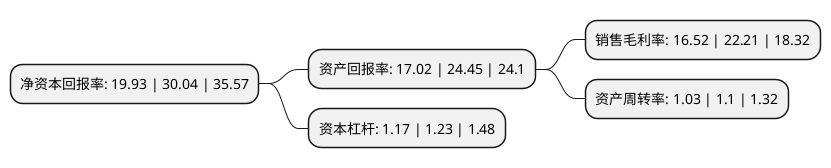

> 本页面由自动化程序生成于 2022年5月20日 01:36
> 内容可能存在错误，如有bug请提交issue至：https://github.com/Eroleice/doc-pi/issues
{.is-warning}

# 上市公司基本情况

## 基本资料

江苏共创人造草坪股份有限公司（以下简称“共创草坪”）成立于2004年01月16日，淮安市。于2020年09月30日在上交所主板上市。

共创草坪注册资本40,251.4万元，主要从事人造草坪的研发，生产和销售以下是详细信息：

- 公司名称: 江苏共创人造草坪股份有限公司
- 股票代码: 605099.SH
- 所在地: 江苏 - 淮安市
- 成立日期: 2004年01月16日
- 注册资本: 40,251.4万元
- 法定代表人: 王强翔
- 主营业务: 主要从事人造草坪的研发，生产和销售
- 公司官网: www.ccgrass.cn
- 公司介绍: 公司是全球生产和销售规模最大的人造草坪企业。公司拥有一支在高分子化合物材料、工艺流程设计等方面经验丰富的研发团队，在人造草坪行业新技术、新工艺领域进行了前瞻性的研发布局。公司已建立起全球化的销售网络，产品远销美洲、欧洲、亚洲、大洋洲等120多个国家和地区。公司是国家标准《体育用人造草》(GB/T20394-2013)的起草单位，是中国体育用品业联合会人造草专业委员会第一届主任委员单位。公司雄厚的技术实力、良好的供应能力和优异的产品质量获得市场的高度认可,是FIFA(国际足联)6家全球人造草坪优选供应商之一。公司还是World Rugby8家全球人造草坪优选供应商之一、FIH(国际曲联)8家全球人造草坪优选供应商之一。公司运动草产品应用于英国切尔西足球俱乐部、希腊奥林匹亚克斯足球俱乐部、FIFA U17世界杯、第28届及第29届世界大学生运动会、上海卢湾区体育中心、清华大学、厦门大学等众多国内外专业俱乐部、高端体育赛事和高校场地。此外，公司休闲草产品与Polyloom公司、Syn-Turf公司、Tuff Turf公司等专业的休闲草铺装或批发龙头长期合作，产品已进入法国家乐福集团、法国安达屋集团、澳大利亚Bunnings Warehouse等众多全球或区域的连锁建材超市。

## 股东及高管情况

上市公司第一大股东为王强翔，持股219,517,200股，占比54.54%，为上市公司实际控制人。

截至2022年03月31日，上市公司的前十大股东中，共有5名自然人股东，2名机构股东，3个产品账户，其中5%以上大股东共有2名。上市公司前十大股东明细如下：

> 截至2022年03月31日，上市公司前十大股东信息如下：

| 股东名称 | 持股数量（股） | 持股比例 |
| --- | --- | --- |
| 王强翔 | 219,517,200 | 54.54% |
| 江苏百斯特投资集团有限公司 | 63,730,800 | 15.83% |
| 王淮平 | 17,703,000 | 4.4% |
| 马莉 | 17,703,000 | 4.4% |
| 王强众 | 17,703,000 | 4.4% |
| 葛兰英 | 17,703,000 | 4.4% |
| 淮安创享企业管理中心(有限合伙) | 5,940,000 | 1.48% |
| 中国工商银行股份有限公司-中欧价值智选回报混合型证券投资基金 | 5,674,613 | 1.41% |
| 长江金色扬帆2号股票型养老金产品-交通银行股份有限公司 | 1,848,062 | 0.46% |
| 中欧基金-农业银行-中国太平洋人寿股票相对收益型产品(保额分红)委托投资计划 | 1,745,524 | 0.43% |

## 利润表分析

上市公司2021年总收入为23.01亿元，净利润为3.8亿元，实现盈利。

## 杜邦分析

> 数据列示周期：2021年 | 2020年 | 2019年
{.is-info}

上市公司的净资产收益率在近一年有所下降，下降幅度为-33.66%，其变化情况分解如下：
- 上市公司的销售毛利率在近一年下降了-25.62%，可能是生产效率的下降、商品原材料价格上涨或商品价格的下跌所致。
- 上市公司的资产周转率在近一年下降了-6.36%，可能是源自于更慢的销售回款或库存管理效果下降。
- 上市公司的财务杠杆比率在近一年下降了-4.88%，可能是减少负债降低财务费用。

