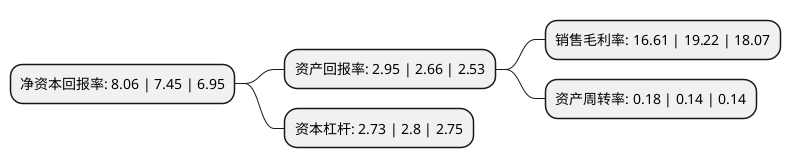

> 本页面由自动化程序生成于 2022年5月20日 01:02
> 内容可能存在错误，如有bug请提交issue至：https://github.com/Eroleice/doc-pi/issues
{.is-warning}

# 上市公司基本情况

## 基本资料

中节能太阳能股份有限公司（以下简称“太阳能”）成立于1993年04月12日，重庆市。于1996年02月08日在深交所主板上市。

太阳能注册资本300,709.803万元，主营业务:以太阳能光伏电站的投资运营为主。以下是详细信息：

- 公司名称: 中节能太阳能股份有限公司
- 股票代码: 000591.SZ
- 所在地: 重庆 - 重庆市
- 成立日期: 1993年04月12日
- 注册资本: 300,709.803万元
- 法定代表人: 曹华斌
- 主营业务: 主营业务:以太阳能光伏电站的投资运营为主
- 公司官网: www.cecsec.cn
- 公司介绍: 公司是中国节能环保集团有限公司的控股子公司，是目前中国最大的太阳能投资运营商之一和国内第一家以太阳能发电为主业的上市公司。公司业务以太阳能光伏电站的投资运营为主，主要产品为电力，该产品主要出售给国家电网；同时，公司还从事太阳能电池组件的生产销售，产品主要用于对外销售。公司具备强大的项目开发建设和运营管理能力，积累了丰富的投资经验，目前包括地面及分布式电站、滩涂及沙漠电站、光伏建筑一体化项目、光伏农业等多种光伏电站模式的项目已遍布中国多个省、市、自治区，总装机容量超过4吉瓦，成为中国国内装机容量最大的光伏企业。公司拥有优秀的技术人才、科学的维护管理机制、完善的企业文化体系，秉承高水平的运营管理能力和“拼搏奉献、求实创新、雷厉风行、团结协作”的阳光精神，旨在为人类奉献更多绿色电力，以国内市场为龙头，以光伏应用为依托，不断进行模式创新，持续推进技术进步，重点打造基于太阳能产业的资本运营平台和资源配置平台。

## 股东及高管情况

上市公司第一大股东为中国节能环保集团有限公司，持股940,183,123股，占比31.27%，为上市公司实际控制人。

截至2022年03月31日，上市公司的前十大股东中，共有1名自然人股东，7名机构股东，1个产品账户，1个海外主体，其中5%以上大股东共有1名。上市公司前十大股东明细如下：

> 截至2022年03月31日，上市公司前十大股东信息如下：

| 股东名称 | 持股数量（股） | 持股比例 |
| --- | --- | --- |
| 中国节能环保集团有限公司 | 940,183,123 | 31.27% |
| 深圳市中节投华禹投资有限公司 | 103,125,264 | 3.43% |
| 重庆市涪陵国有资产投资经营集团有限公司 | 90,200,000 | 3% |
| 香港中央结算有限公司(陆股通) | 40,844,264 | 1.36% |
| 重庆太极实业(集团)股份有限公司 | 29,725,000 | 0.99% |
| 常州东方锦鸿建设发展有限公司 | 29,607,343 | 0.98% |
| 中国银行股份有限公司-华泰柏瑞中证光伏产业交易型开放式指数证券投资基金 | 24,235,840 | 0.81% |
| 上海欧擎北源投资管理合伙企业(有限合伙) | 23,998,914 | 0.8% |
| 俞正福 | 19,710,000 | 0.66% |
| 上海欧擎北能投资管理合伙企业(有限合伙) | 16,797,271 | 0.56% |

## 利润表分析

上市公司2021年总收入为70.15亿元，净利润为11.65亿元，实现盈利。

## 杜邦分析

> 数据列示周期：2021年 | 2020年 | 2019年
{.is-info}

上市公司的净资产收益率在近一年有所上升，上升幅度为8.19%，其变化情况分解如下：
- 上市公司的销售毛利率在近一年下降了-13.58%，可能是生产效率的下降、商品原材料价格上涨或商品价格的下跌所致。
- 上市公司的资产周转率在近一年上升了28.57%，可能是源自于更快的销售回款或库存管理效果提升。
- 上市公司的财务杠杆比率在近一年下降了-2.5%，可能是减少负债降低财务费用。

