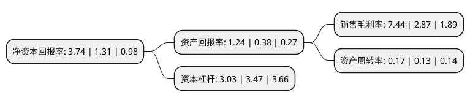

> 本页面由自动化程序生成于 2022年5月20日 01:04
> 内容可能存在错误，如有bug请提交issue至：https://github.com/Eroleice/doc-pi/issues
{.is-warning}

# 上市公司基本情况

## 基本资料

宁夏银星能源股份有限公司（以下简称“银星能源”）成立于1998年06月28日，银川市。于1998年09月15日在深交所主板上市。

银星能源注册资本70,611.9万元，主营业务:新能源发电，新能源装备制造和检测检修服务。以下是详细信息：

- 公司名称: 宁夏银星能源股份有限公司
- 股票代码: 000862.SZ
- 所在地: 宁夏 - 银川市
- 成立日期: 1998年06月28日
- 注册资本: 70,611.9万元
- 法定代表人: 高原
- 主营业务: 主营业务:新能源发电，新能源装备制造和检测检修服务
- 公司官网: yxny.chinalco.com.cn
- 公司介绍: 公司是中铝集团公司旗下中铝宁夏能源集团控股的上市公司，是宁夏第一家从事风力发电的企业(贺兰山)，也是最早引领宁夏光伏发电的领跑企业，拥有国家级新型工业化产业示范基地，目前主要从事新能源发电、新能源装备制造和检测检修服务三大主营业务。其中：新能源发电产业主要包括风力发电和太阳能光伏发电；新能源装备制造产业包括风电设备制造和光伏发电设备制造两条产业链；检测检修业务主要针对新能源发电检修、安装、运维服务，煤炭、火电检修服务等，具备新能源发电项目工程安装、风机检修、齿轮箱检修以及煤炭火电的检修能力。公司是宁夏最早从事新能源发电的企业，培养了一批优质的新能源人才队伍，在新能源项目前期、建设、运营和检修维护等方面具有丰富的经验，在从事风电检修运维方面具有一定的竞争力。公司已建成了西北地区最大的风机塔筒生产基地，具有规模优势，同时，银川地区位处西北地区中心地带，公司业务范围辐射内蒙、青海、甘肃、陕西等省份，具有运输成本优势。公司将通过做强新能源发电产业，优化装备制造产业，提升检修服务能力和融资能力，打造成为中铝能源板块新能源发展和资本运作平台，成为一家盈利能力强、富有市场竞争力的新能源上市公司。

## 股东及高管情况

上市公司第一大股东为中铝宁夏能源集团有限公司，持股284,089,900股，占比40.23%，为上市公司实际控制人。

截至2022年03月31日，上市公司的前十大股东中，共有5名自然人股东，3名机构股东，2个产品账户，其中5%以上大股东共有1名。上市公司前十大股东明细如下：

> 截至2022年03月31日，上市公司前十大股东信息如下：

| 股东名称 | 持股数量（股） | 持股比例 |
| --- | --- | --- |
| 中铝宁夏能源集团有限公司 | 284,089,900 | 40.23% |
| 上海浦东发展银行股份有限公司-中欧创新未来18个月封闭运作混合型证券投资基金 | 15,295,459 | 2.17% |
| 阿拉丁能源集团有限公司 | 12,000,000 | 1.7% |
| 沈亚芬 | 6,382,400 | 0.9% |
| 中国工商银行-华安安信消费服务股票型证券投资基金 | 4,627,500 | 0.66% |
| 李川城 | 3,402,860 | 0.48% |
| 罗成 | 2,383,321 | 0.34% |
| 陈莉 | 2,136,900 | 0.3% |
| 朱明 | 1,900,000 | 0.27% |
| 中山市比奇布林教育科技有限公司 | 1,754,700 | 0.25% |

## 利润表分析

上市公司2021年总收入为13.59亿元，净利润为1.01亿元，实现盈利。

## 杜邦分析

> 数据列示周期：2021年 | 2020年 | 2019年
{.is-info}

上市公司的净资产收益率在近一年有所上升，上升幅度为185.5%，其变化情况分解如下：
- 上市公司的销售毛利率在近一年上升了159.23%，可能是生产效率的提升、商品原材料价格下跌或商品价格的上涨所致。
- 上市公司的资产周转率在近一年上升了30.77%，可能是源自于更快的销售回款或库存管理效果提升。
- 上市公司的财务杠杆比率在近一年下降了-12.68%，可能是减少负债降低财务费用。

