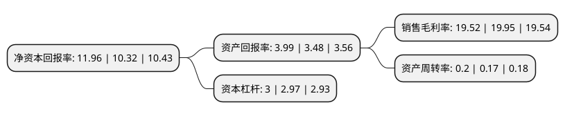

> 本页面由自动化程序生成于 2022年5月20日 01:05
> 内容可能存在错误，如有bug请提交issue至：https://github.com/Eroleice/doc-pi/issues
{.is-warning}

# 上市公司基本情况

## 基本资料

龙源电力集团股份有限公司（以下简称“龙源电力”）成立于1993年01月27日，北京市。于2022年01月24日在深交所主板上市。

龙源电力注册资本838,196.316万元，龙源电力主要从事风电场的设计，开发，建设，管理和运营。同时，还经营火电，太阳能，潮汐，生物质，地热等其他发电项目;向风电场提供咨询，维修，保养，培训及其他专业服务。以下是详细信息：

- 公司名称: 龙源电力集团股份有限公司
- 股票代码: 001289.SZ
- 所在地: 北京 - 北京市
- 成立日期: 1993年01月27日
- 注册资本: 838,196.316万元
- 法定代表人: 李忠军
- 主营业务: 龙源电力主要从事风电场的设计，开发，建设，管理和运营同时，还经营火电，太阳能，潮汐，生物质，地热等其他发电项目;向风电场提供咨询，维修，保养，培训及其他专业服务
- 公司官网: www.clypg.com.cn
- 公司介绍: 龙源电力集团股份有限公司最早前身为龙源电力技术开发公司，成立于1993年1月，隶属于国家能源部。1999年6月，龙源、中能、福霖三家公司合并重组为龙源电力集团公司。2002年底，公司在电力体制改革中划归中国国电集团公司。2009年7月，经国务院国资委批准，公司正式改制为龙源电力集团股份有限公司。同年12月10日，公司在香港成功上市，成为首家在境外上市的国有新能源发电企业，并以177亿元人民币IPO的骄人成绩被誉为“中国新能源第一股”。公司主要从事风电场的设计、开发、建设、管理和运营。同时，还经营火电、太阳能、潮汐、生物质、地热等其他发电项目；向风电场提供咨询、维修、保养、培训及其他专业服务。

## 股东及高管情况

上市公司第一大股东为国家能源投资集团有限责任公司，持股4,602,432,800股，占比54.91%，为上市公司实际控制人。

截至2022年03月31日，上市公司的前十大股东中，共有3名自然人股东，3名机构股东，2个产品账户，2个海外主体，其中5%以上大股东共有2名。上市公司前十大股东明细如下：

> 截至2022年03月31日，上市公司前十大股东信息如下：

| 股东名称 | 持股数量（股） | 持股比例 |
| --- | --- | --- |
| 国家能源投资集团有限责任公司 | 4,602,432,800 | 54.91% |
| 香港中央结算(代理人)有限公司 | 3,335,356,727 | 39.79% |
| 内蒙古平庄煤业(集团)有限责任公司 | 212,238,141 | 2.53% |
| 国家能源集团辽宁电力有限公司 | 93,927,200 | 1.12% |
| 陈琼枝 | 4,804,313 | 0.06% |
| 万飞凰 | 4,474,650 | 0.05% |
| 深圳市石泉投资管理有限公司-石泉宏观对冲私募证券投资基金 | 4,288,517 | 0.05% |
| 交通银行股份有限公司-浦银安盛新经济结构灵活配置混合型证券投资基金 | 3,319,758 | 0.04% |
| 香港中央结算有限公司(陆股通) | 2,993,706 | 0.04% |
| 刘德宏 | 2,930,745 | 0.03% |

## 利润表分析

上市公司2021年总收入为372.08亿元，净利润为72.63亿元，实现盈利。

## 杜邦分析

> 数据列示周期：2021年 | 2020年 | 2019年
{.is-info}

上市公司的净资产收益率在近一年有所上升，上升幅度为15.89%，其变化情况分解如下：
- 上市公司的销售毛利率在近一年下降了-2.16%，可能是生产效率的下降、商品原材料价格上涨或商品价格的下跌所致。
- 上市公司的资产周转率在近一年上升了17.65%，可能是源自于更快的销售回款或库存管理效果提升。
- 上市公司的财务杠杆比率在近一年上升了1.01%，可能是增加负债扩大生产规模。

